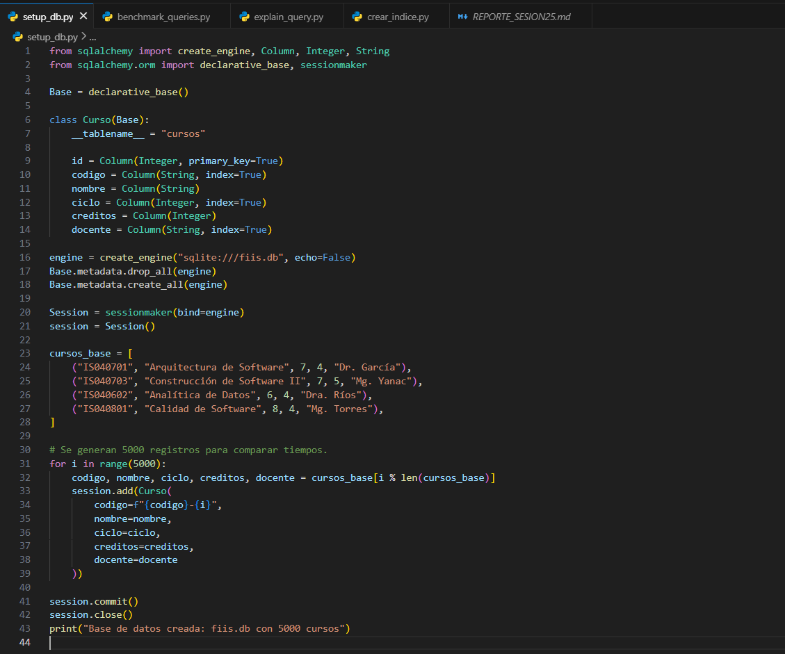
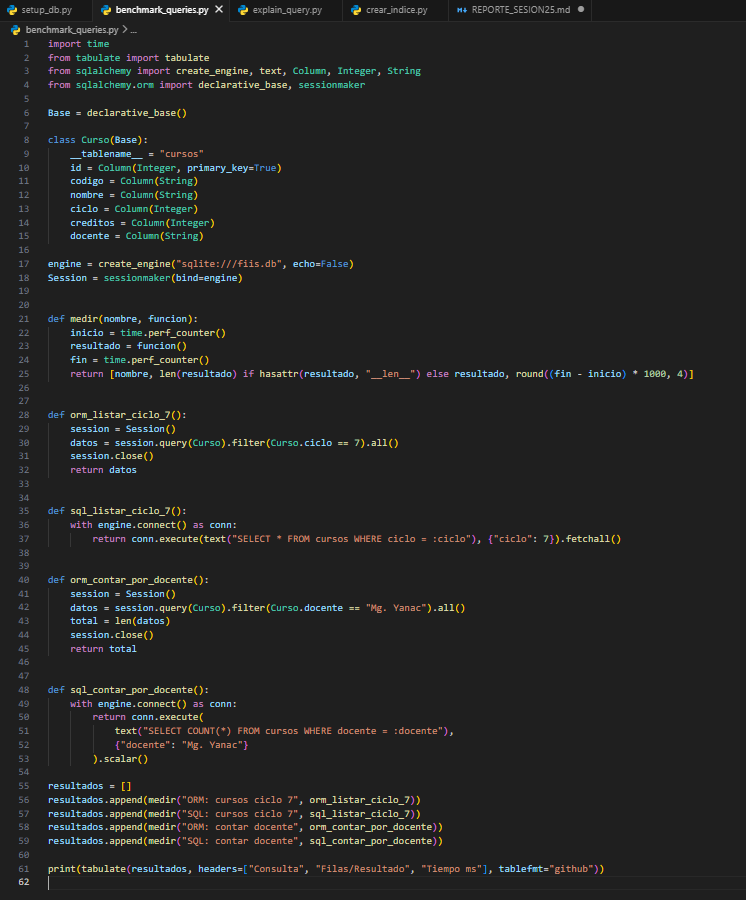
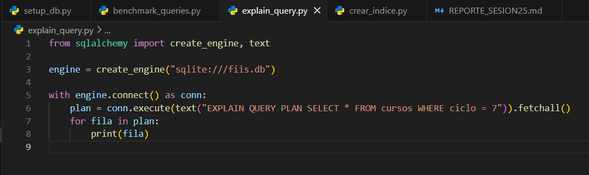
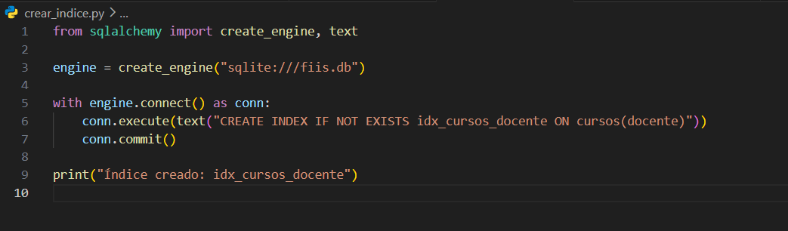
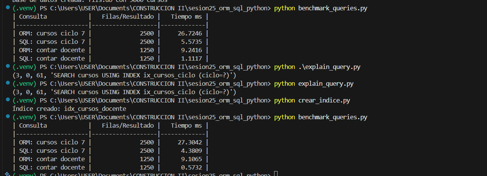

# Reporte Sesión 25 – ORM vs SQL directo en Python

## 1. Objetivo
Comparar consultas ORM y SQL directo.

## 2. Consultas evaluadas
- Cursos por ciclo
- Conteo por docente

## 3. Resultados
| Consulta | Resultado | Tiempo ms | Observación |
|---|---:|---:|---|
| ORM ciclo 7 | 2500 | 27.3042 | Consulta mediante ORM; convierte filas en objetos Python, por eso tiene mayor costo. |
| SQL ciclo 7 | 2500 | 4.3809 | Consulta SQL directa; fue más rápida al devolver filas directamente. |
| ORM docente | 1250 | 9.1065 | Recupera registros mediante ORM y realiza el conteo desde Python. |
| SQL docente | 1250 | 0.5732 | Usa SQL directo y aprovecha el índice creado sobre docente. |

## 4. Interpretación de resultados

En la primera ejecución del benchmark se observa que las consultas realizadas con SQL directo fueron más rápidas que las consultas realizadas mediante ORM.

Para la consulta de cursos del ciclo 7, el ORM obtuvo un tiempo aproximado de 26.7246 ms, mientras que SQL directo obtuvo 5.5735 ms. Ambos devolvieron 2500 registros, pero SQL fue más rápido porque accede directamente a la base de datos y devuelve filas simples. En cambio, ORM convierte cada fila en objetos de Python, lo que genera mayor costo de procesamiento.

En la consulta por docente, el ORM obtuvo 9.2416 ms, mientras que SQL directo obtuvo 1.1117 ms. Esto demuestra que SQL directo es más eficiente para consultas agregadas o de conteo, ya que puede realizar la operación directamente en la base de datos.

Luego se ejecutó `explain_query.py`, cuyo resultado fue:

`SEARCH cursos USING INDEX ix_cursos_ciclo (ciclo=?)`

Esto indica que SQLite está utilizando un índice sobre la columna `ciclo`. Gracias a este índice, la base de datos no necesita recorrer toda la tabla para encontrar los cursos del ciclo 7, sino que puede buscar de forma más rápida.

Después se ejecutó `crear_indice.py`, que creó el índice `idx_cursos_docente` sobre la columna `docente`. Al volver a ejecutar el benchmark, se observa una mejora especialmente en la consulta SQL por docente: pasó de 1.1117 ms a 0.5732 ms.

Esto demuestra que los índices ayudan a mejorar el rendimiento de las consultas filtradas, sobre todo cuando se busca por columnas específicas como `docente` o `ciclo`.

En conclusión, ORM conviene cuando se busca productividad, facilidad de mantenimiento y trabajo orientado a objetos. SQL directo conviene cuando se necesita mayor rendimiento, control de la consulta o realizar operaciones más optimizadas directamente en la base de datos.

## 5. Evidencias
- Código `setup_db.py`. 
- Código `benchmark_queries.py`. 
- Código `explain_query.py` y `crear_indice.py`.  
- Reporte `REPORTE_SESION25.md` con tiempos e interpretación.
- Captura de ejecución del benchmark. 
- Commit y push en rama propia.
