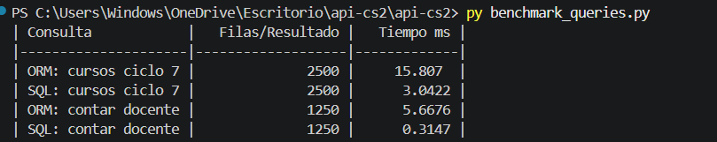

# Reporte Sesión 25 – ORM vs SQL directo en Python

## 1. Objetivo
Comparar consultas ORM y SQL directo.

SQL muestra resultados excelente debido a que procesó los datos y los mostro en poco tiempo de respuestas
mientras que ORM tard un 5 o hasta 12 ms mas que SQL

## 2. Consultas evaluadas
- Cursos por ciclo = 7
- Conteo por docente = Filas/Resultado 1250

## 3. Resultados
| Consulta            |   Filas/Resultado |   Tiempo ms |
|---------------------|-------------------|-------------|
| ORM: cursos ciclo 7 |              2500 |     15.807  |
| SQL: cursos ciclo 7 |              2500 |      3.0422 |
| ORM: contar docente |              1250 |      5.6676 |
| SQL: contar docente |              1250 |      0.3147 |

## 4. Interpretación
Responder: ¿cuándo conviene ORM y cuándo SQL directo?

## 5. Evidencias
- Captura de benchmark_queries.py
    1. 
- Captura de explain_query.py
    1. 
- Commit de Git
