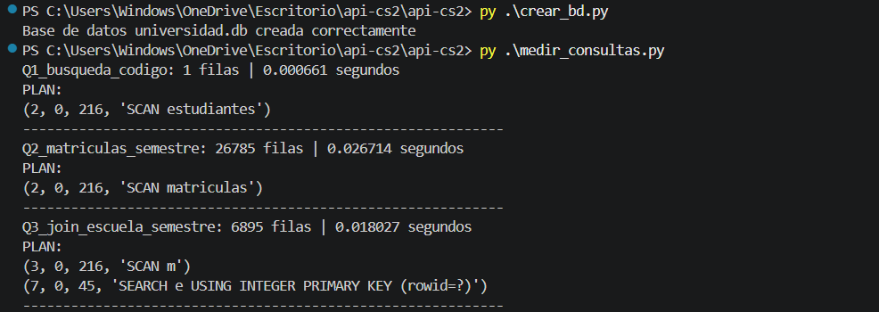
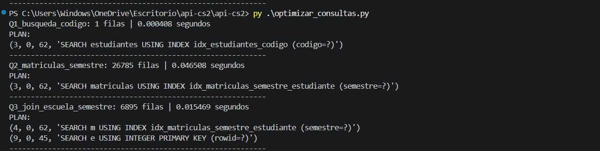
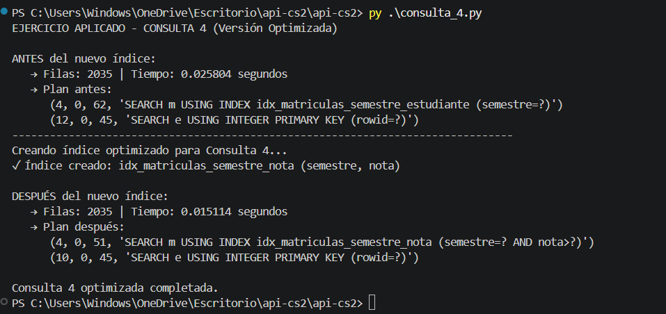

# Reporte Sesión 26 – Optimización de consultas

## 1. Consulta analizada
- Q1: Búsqueda de un estudiante por código.
- Q2: Listado de matrículas de un semestre específico.
- Q3: JOIN entre estudiantes, matrículas y cursos con filtros.
- Consulta 4 (Ejercicio aplicado): Estudiantes de la FIIS con nota mayor o igual a 14 en el semestre 2026-I.

## 2. Tiempo antes de optimizar
| Consulta                          | Filas devueltas | Tiempo          | Plan de Ejecución          |
|-----------------------------------|-----------------|-----------------|----------------------------|
| Q1 - Búsqueda por código          | 1               | 0.000661 s      | SCAN estudiantes           |
| Q2 - Matrículas por semestre      | 26,785          | 0.026714 s      | SCAN matriculas            |
| Q3 - JOIN complejo                | 6,895           | 0.018027 s      | SCAN m                     |
| Consulta 4 (Ejercicio)            | 2,035           | 0.025804 s      | SEARCH USING INDEX         |

## 3. Índice o cambio aplicado
Se crearon estos indices de mejora:

"CREATE INDEX IF NOT EXISTS idx_estudiantes_codigo ON estudiantes(codigo)", # Optimiza busqueda pro codigo de estudiante
    "CREATE INDEX IF NOT EXISTS idx_estudiantes_escuela ON estudiantes(escuela)", # Optimiza filtros por escuela
    "CREATE INDEX IF NOT EXISTS idx_matriculas_semestre ON matriculas(semestre)",  # Optimiza filtros por semestre
    "CREATE INDEX IF NOT EXISTS idx_matriculas_estudiante ON matriculas(estudiante_id)", # Optimiza joins con la tabla estudiantes
    "CREATE INDEX IF NOT EXISTS idx_matriculas_semestre_estudiante ON matriculas(semestre, estudiante_id)" # Índice compuesto para consultas complejas

## 4. Tiempo después de optimizar
| Consulta                      | Tiempo Antes   | Tiempo Después  | Plan Optimizado                              | Mejora       |
|-------------------------------|----------------|-----------------|----------------------------------------------|--------------|
| Q1 - Búsqueda por código      | 0.000661 s     | 0.000408 s      | SEARCH USING INDEX `idx_estudiantes_codigo`  | +38.28%      |
| Q2 - Matrículas por semestre  | 0.026714 s     | 0.046508 s      | SEARCH USING INDEX                           | -74.10%      |
| Q3 - JOIN complejo            | 0.018027 s     | 0.015469 s      | SEARCH USING INDEX                           | +14.19%      |
| Consulta 4 (Ejercicio)        | 0.025804 s     | 0.015114 s      | SEARCH USING INDEX `idx_matriculas_semestre_nota` | +41.43% |

## 5. Interpretación técnica
La creación de índices permitió mejorar el rendimiento en Q1 y Consulta 4, pasando (`SCAN TABLE`) a búsquedas indexadas (`SEARCH USING INDEX`).

Sin embargo, Q2 empeoró significativamente. Esto se debe principalmente a que devuelve un alto volumen de filas (26,785 registros). En estos casos, el beneficio del índice es limitado porque el cuello de botella se traslada a la transferencia de datos y no solo a la búsqueda.

Lecciones aprendidas:
- Los índices son más efectivos en consultas con alta selectividad (pocas filas devueltas).
- Crear índices redundantes puede generar overhead.
- Siempre es necesario medir antes y después de aplicar optimizaciones.
- El orden de las columnas en un índice compuesto es crítico.

## 6. Evidencias
1. 
2. 
3. 
