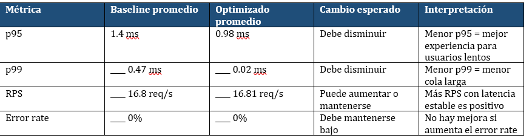

## 1. Objetivo
Comparar el rendimiento de /benchmark/baseline y /benchmark/optimizado bajo condiciones equivalentes.

## 2. Ambiente de prueba
- Equipo:Lenovo LOQ15
- Sistema operativo:Windows 11
- Java:17
- Spring Boot:3.5.16
- Herramienta de carga:k6
- Fecha y hora:10:00p.m

## 3. Diseño del benchmark
- Usuarios virtuales: 20 usuarios virtuales (VUs).
- Duración: 90 segundos por ejecución.
- Ramp-up: Incremento progresivo desde 1 hasta 20 usuarios virtuales durante el inicio de la prueba.
- Número de repeticiones: 3 ejecuciones por cada versión (baseline y optimizada).
- Endpoints evaluados:
GET /rendimiento/productos/base
GET /rendimiento/productos/optimizado

## 4. Resultados resumidos

## 5. Análisis
- ¿Qué métrica cambió más?
- ¿La mejora fue consistente en las 3 ejecuciones?
si fue consistent
- ¿Hubo errores?
- ¿Existe evidencia suficiente para recomendar el cambio?

## 6. Conclusión técnica
Indique si se recomienda mantener la versión optimizada, repetir la prueba o buscar otro cuello de botella.

## 7. Evidencias
- Capturas de ejecución k6
- CSV generado
- Comandos usados
- Commit y rama