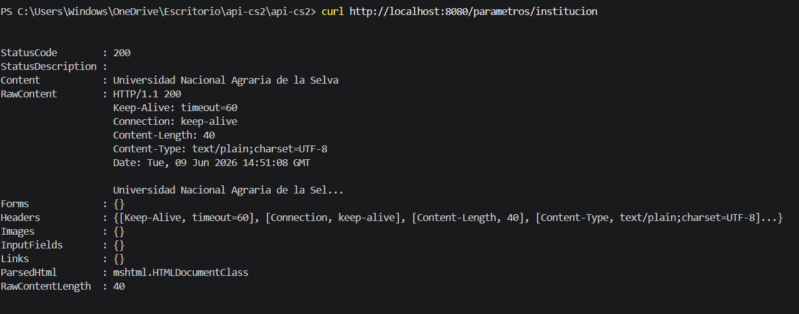
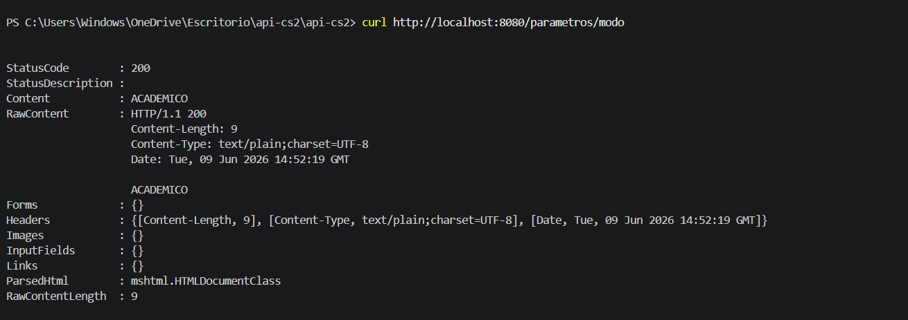
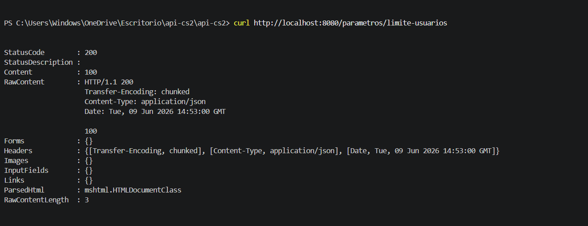
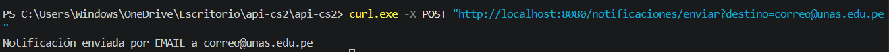
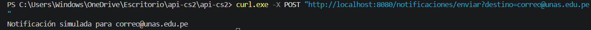
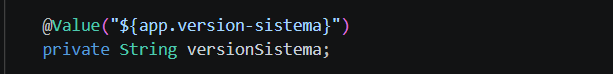
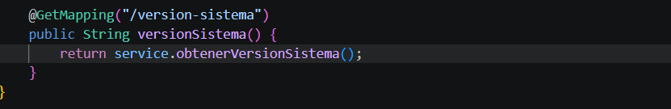
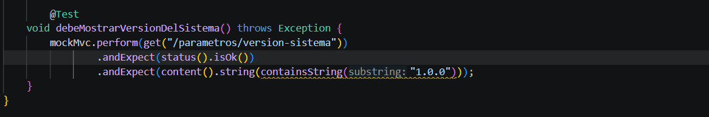

# Sesión 19 - Configuración y Parametrización

## Comando para correr sistema
mvn spring-boot:run

## Funcionamiento por CURL
curl http://localhost:8080/parametros/institucion

curl http://localhost:8080/parametros/modo

curl http://localhost:8080/parametros/limite-usuarios

## EMAIL

app.notificacion.proveedor=email

curl.exe -X POST "http://localhost:8080/notificaciones/enviar?destino=correo@unas.edu.pe"

## MOCK

app.notificacion.proveedor=mock

curl.exe -X POST "http://localhost:8080/notificaciones/enviar?destino=correo@unas.edu.pe"

## Ejercicio Aplicado
ParametroService.java
    Agregado:
    
    Mapping:
    
    Test:
    

## Funcionamiento Evidencia
