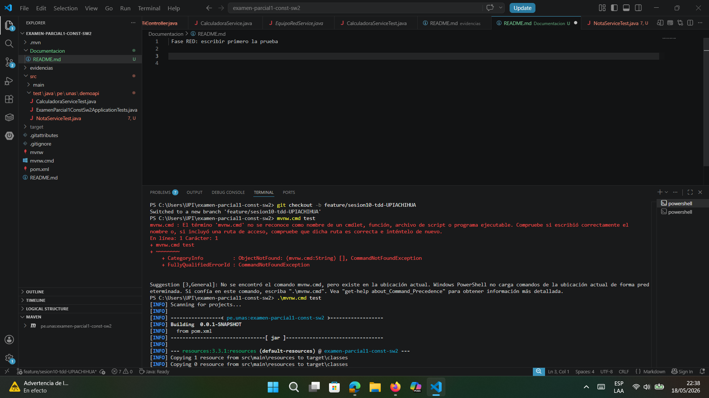
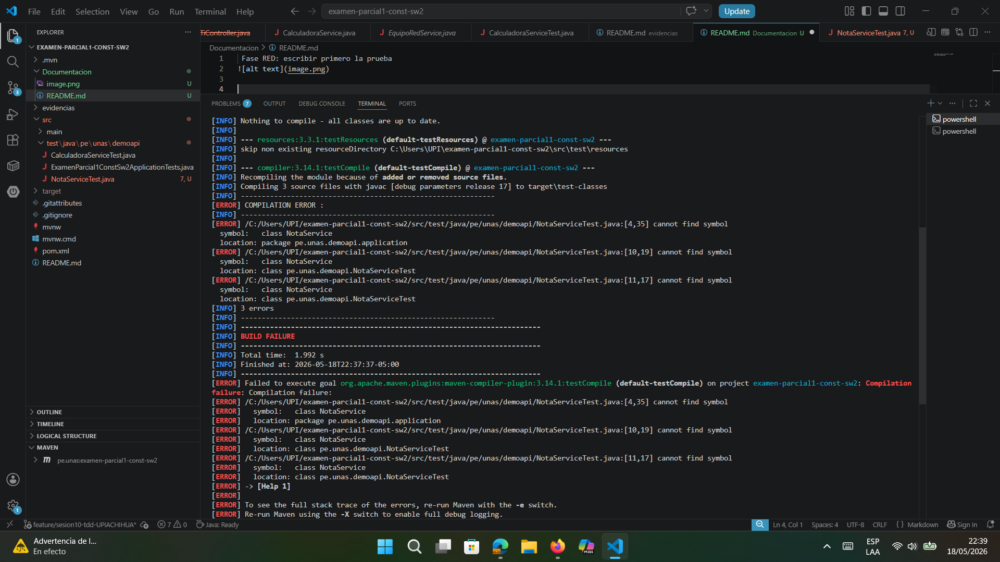
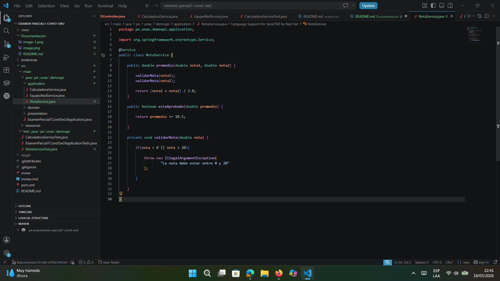
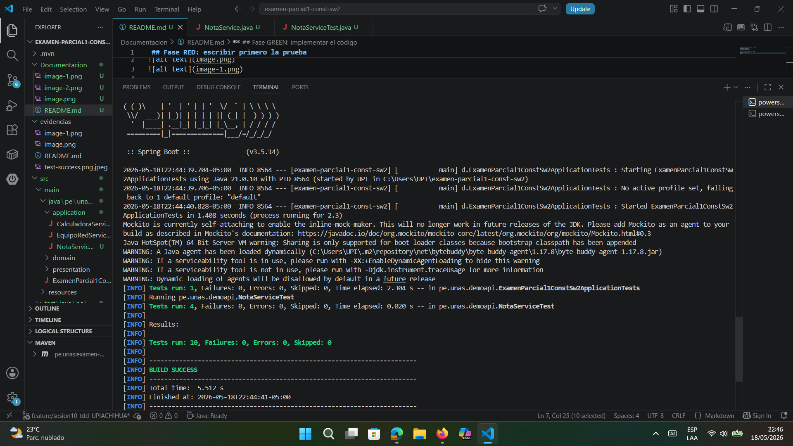
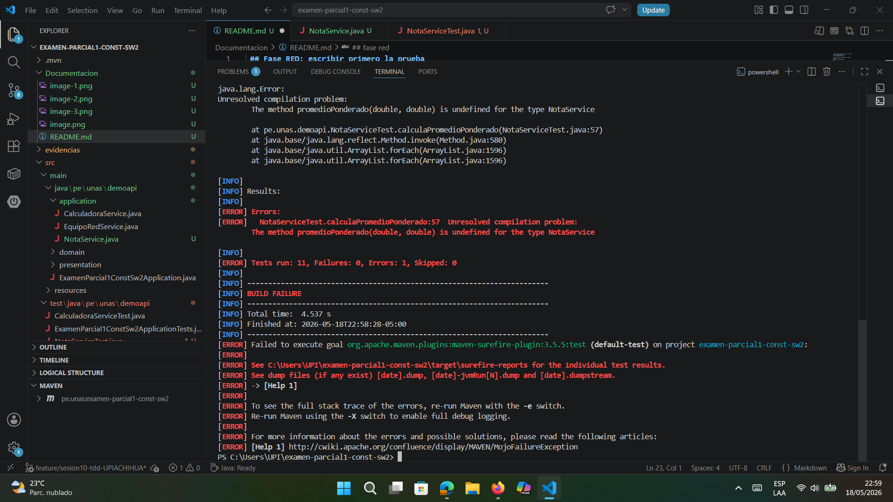
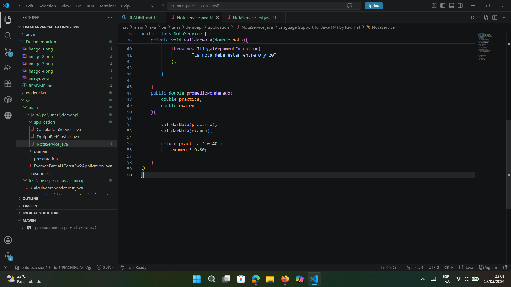
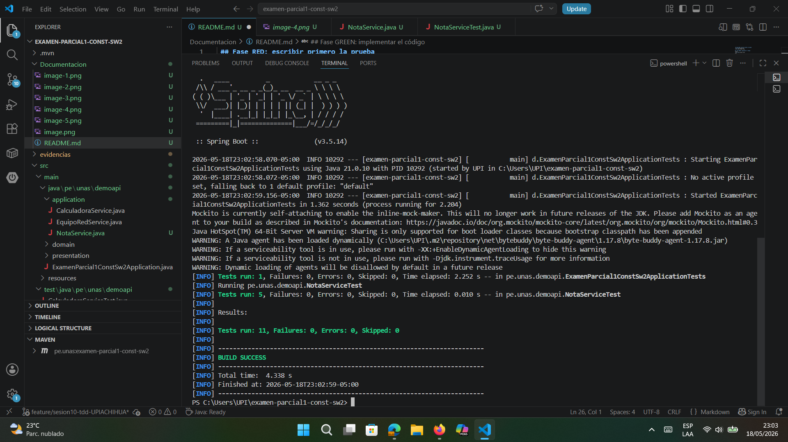

 ## Fase RED: escribir primero la prueba

##  Fase GREEN: implementar el código
código

test  

## Fase REFACTOR: mejorar sin romper pruebas 
codigo 

test 

## Ejercicio aplicado: nuevo ciclo TDD 
 ## fase red 
test 

##  Fase GREEN: implementar el código
código

test 

