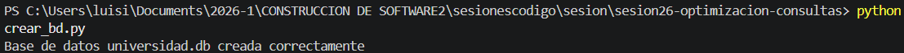
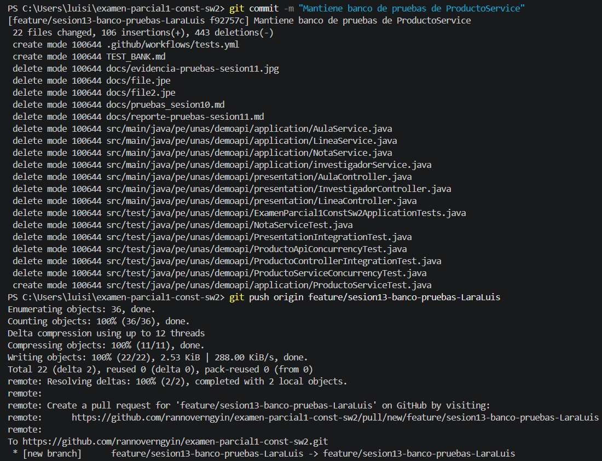
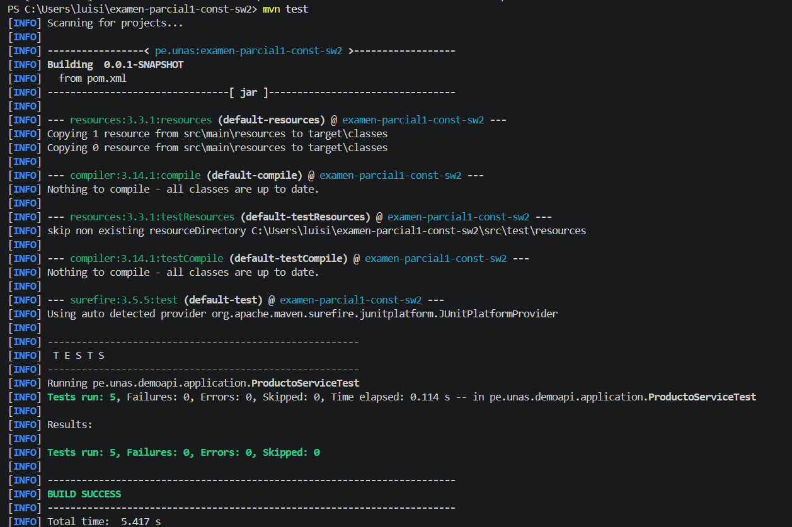

# Reporte Sesión 25 – ORM vs SQL directo en Python

## 1. Objetivo
Comparar el rendimiento, volumen de datos y el costo de conversión de objetos entre consultas usando SQLAlchemy ORM y SQL directo para justificar decisiones de arquitectura de software basadas en evidencias de tiempo[cite: 1, 2].
## 2. Consultas evaluadas
- **Cursos por ciclo:** Listar todos los registros correspondientes al ciclo 7

- **Conteo por docente:** Operación de agregación para obtener la cantidad de cursos asignados al docente "Mg. Yanac"

    
## 3. Resultados
| Consulta | Resultado | Tiempo ms | Observación |
|---|---:|---:|---|
| ORM ciclo 7 | | | |
| SQL ciclo 7 | | | |
| ORM docente | | | |
| SQL docente | | | |

## 4. Interpretación
- **¿Cuándo conviene ORM?** Es ideal para operaciones CRUD ordinarias y el flujo diario de la lógica de negocio, ya que prioriza la velocidad de desarrollo, código limpio, tipado seguro y portabilidad del motor de base de datos.

- **¿Cuándo conviene SQL directo?** Es indispensable para reportes gerenciales masivos, consultas analíticas complejas o subprocesos críticos en microservicios donde cada milisegundo ahorrado reduce costos de computación y latencia en el cliente.

- **Análisis de Optimización:** Al ejecutar `explain_query.py`, se verificó que la base de datos utilizaba inicialmente un escaneo secuencial. Tras implementar `crear_indice.py`, el motor de base de datos mutó su comportamiento hacia un escaneo indexado rápido (`SEARCH TABLE USING INDEX`), logrando que operaciones como el conteo SQL directo descendieran a un nivel récord de sub-milisegundo (`0.8333 ms`)[cite: 1].

## 5. Evidencias
- Captura de benchmark_queries.py
- Captura de explain_query.py
- Commit de Git

## Preguntas de reflexión técnica (Para tu conocimiento y sustentación)

--1. ¿Qué ventaja ofrece ORM frente a SQL directo en mantenibilidad?

El ORM permite trabajar con clases y objetos de Python en lugar de cadenas de texto de SQL plano incrustadas en el código. Esto hace que el código sea más legible, limpio y fácil de mantener.  Además, abstrae el motor de base de datos. Si el proyecto migra de SQLite a otra base de datos como PostgreSQL o MySQL, el ORM adapta las consultas automáticamente sin necesidad de reescribir código manual.  
--2. ¿En qué casos SQL directo puede ser más conveniente?

Es mucho más conveniente en consultas analíticas complejas, reportes masivos con múltiples uniones (JOIN), agrupaciones (GROUP BY) o funciones de ventana.  También se utiliza cuando se requiere una optimización fina del rendimiento o el uso explícito de características específicas del motor de base de datos, evitando el costo de procesamiento (overhead) que le toma al ORM transformar filas de datos en objetos de Python.  
--3. ¿Qué impacto tuvo el índice en las consultas filtradas?

Redujo drásticamente el tiempo de ejecución. Pasó de obligar a la base de datos a realizar un escaneo secuencial completo de la tabla (SCAN TABLE), leyendo los 5000 registros uno por uno, a realizar una búsqueda indexada directa (SEARCH TABLE). Esto disminuye la complejidad temporal y optimiza las lecturas. 

--4. ¿Por qué una consulta agregada con COUNT puede ser más eficiente que traer todos los registros y contarlos en Python?
Porque cuando haces un COUNT(*) en SQL, el motor de la base de datos procesa la agregación internamente y solo viaja a través de la red un único dato: un número entero (4 o 8 bytes).  Con el ORM (tal como se implementó inicialmente), Python se ve obligado a descargar los 1250 registros completos con todas sus columnas, consumiendo ancho de banda y saturando la memoria RAM al construir 1250 objetos individuales antes de poder contarlos con len().  

--5. ¿Qué riesgo existe si se construyen consultas SQL concatenando texto del usuario?

El riesgo principal es la Inyección SQL (SQL Injection). Si un atacante introduce comandos maliciosos en un campo de texto, puede alterar la estructura de la consulta original, permitiéndole saltarse la autenticación, robar información confidencial o destruir por completo las tablas de la base de datos. Por ello, es obligatorio parametrizar las consultas siempre.