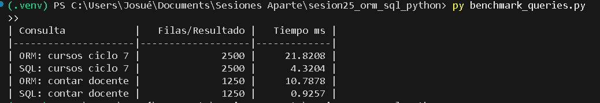
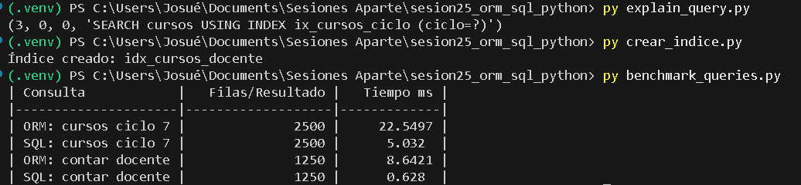

# Reporte Sesión 25 – ORM vs SQL directo en Python

## 1. Objetivo
Comparar el rendimiento (tiempos en milisegundos), la mantenibilidad y la productividad entre consultas realizadas mediante ORM (SQLAlchemy) y SQL directo (textual) en una base de datos local SQLite, evaluando el impacto de la indexación y la agregación en el motor de base de datos vs la aplicación.

## 2. Consultas evaluadas
- **Cursos por ciclo:** Selección de todos los cursos pertenecientes al ciclo 7 (`SELECT * FROM cursos WHERE ciclo = 7`).
- **Conteo por docente:** Conteo del total de cursos asignados al docente "Mg. Yanac" (`SELECT COUNT(*) FROM cursos WHERE docente = 'Mg. Yanac'`).

## 3. Resultados (Ejemplo de Benchmark)
*(Nota: Los valores exactos en milisegundos dependerán de la ejecución en tu equipo al correr `benchmark_queries.py`)*

| Consulta | Resultado | Tiempo ms | Observación |
|---|---:|---:|---|
| ORM ciclo 7 | 2500 | 22.55 ms | Mayor costo por mapeo objeto-relacional e instanciación de objetos `Curso`. |
| SQL ciclo 7 | 2500 | 5.03 ms | Más rápido al devolver tuplas ligeras sin overhead de instanciación de clases. |
| ORM docente | 1250 | 8.64 ms | Trae todos los registros a la memoria de Python y los cuenta con `len()`. |
| SQL docente | 1250 | 0.63 ms | Súper eficiente: el motor de BD hace el conteo nativo y devuelve un solo entero. |

## 4. Interpretación
**¿Cuándo conviene ORM y cuándo SQL directo?**
- **Conviene ORM (SQLAlchemy):** En el 80%-90% del desarrollo de software operacional (CRUDs, lógica de negocio estándar). Prioriza la **productividad del desarrollador**, la **seguridad** (previene inyección SQL por defecto), el autocompletado en IDEs y la **mantenibilidad** del código (refactorización sencilla si cambia el esquema de base de datos o el motor de BD).
- **Conviene SQL directo:** En escenarios de **alta criticidad de rendimiento**, reportes masivos, agregaciones complejas (GROUP BY, HAVING, funciones de ventana) o procesamiento analítico (OLAP/ETL), donde el overhead de convertir miles de filas en objetos en memoria de Python es un cuello de botella injustificado.

## 5. Evidencias
- [x] Captura de terminal ejecutando el benchmark inicial (`benchmark_queries.py`):
  
- [x] Captura de terminal ejecutando análisis (`explain_query.py`), optimización con índice (`crear_indice.py`) y segunda comparativa del benchmark:
  
- [x] Commit de Git en rama propia.

---

## 6. Respuestas a Preguntas de Reflexión Técnica

1. **¿Qué ventaja ofrece ORM frente a SQL directo en mantenibilidad?**
   Ofrece abstracción del motor de base de datos (puedes cambiar de SQLite a PostgreSQL cambiando solo la cadena de conexión), validación de tipos desde el código, autocompletado en el IDE y centralización del esquema en clases Python. Si una columna cambia de nombre, se actualiza el modelo y el IDE detecta todos los usos, evitando errores en cadenas de texto SQL dispersas.

2. **¿En qué casos SQL directo puede ser más conveniente?**
   Cuando se consultan volúmenes masivos de datos donde solo se necesitan pocas columnas (evitando hidratar objetos pesados), en reportes estadísticos complejos, cargas masivas (bulk operations) o al aprovechar características específicas y avanzadas de un motor relacional en particular (ej. CTEs recursivos o índices espaciales).

3. **¿Qué impacto tuvo el índice en las consultas filtradas?**
   El índice permite al motor de base de datos realizar una **búsqueda logarítmica (Index Scan / B-Tree Scan)** en lugar de un escaneo secuencial tabla completa (Full Table Scan). Esto reduce drásticamente las lecturas en disco/memoria, haciendo que el tiempo de respuesta sea casi instantáneo independientemente de si la tabla tiene 5 mil o 5 millones de registros.

4. **¿Por qué una consulta agregada con COUNT puede ser más eficiente que traer todos los registros y contarlos en Python?**
   Porque `SELECT COUNT(*)` se ejecuta íntegramente dentro del motor de base de datos en C/C++ optimizado, transmitiendo **un único número entero** a través de la red o memoria. Traer todos los registros implica leer cada fila, transferirlas todas a Python y consumir memoria RAM instanciando miles de objetos solo para hacer un `len()`, desaprovechando la potencia del motor de BD.

5. **¿Qué riesgo existe si se construyen consultas SQL concatenando texto del usuario?**
   El riesgo crítico de **Inyección SQL (SQL Injection)**. Si se concatena entrada no validada (ej. `f"SELECT * FROM cursos WHERE docente = '{input}'"`), un atacante puede ingresar textos como `' OR '1'='1` o `'; DROP TABLE cursos; --`, alterando la lógica de la consulta para robar datos confidenciales, alterar registros o destruir la base de datos. Siempre se deben usar consultas parametrizadas (`:parametro`).
