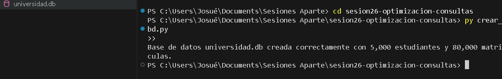
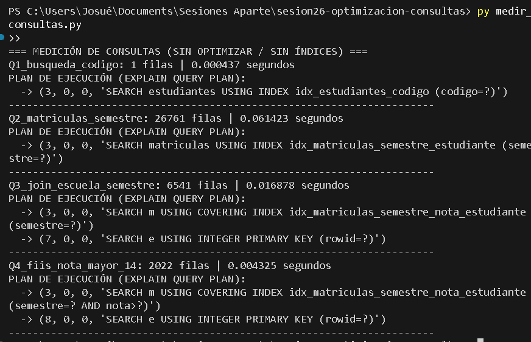
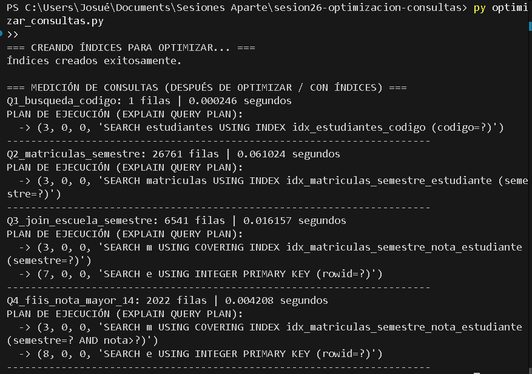

# Reporte Sesión 26 – Optimización de Consultas

## 1. Consultas Analizadas
- **Q1:** Búsqueda exacta de estudiante por código (`codigo = '202600120'`).
- **Q2:** Filtrado masivo de matrículas por periodo (`semestre = '2026-I'`).
- **Q3:** JOIN entre estudiantes y matrículas para la escuela `FIIS` en `2026-I`.
- **Q4 (Reto):** Estudiantes de la `FIIS` matriculados en `2026-I` con `nota >= 14`.

---

## 2. Medición Antes de Optimizar (Sin Índices)
Sin índices, SQLite realiza recorridos completos de tabla (**`SCAN TABLE`**), costosos en tablas grandes.

| Consulta | Filas | Tiempo (s) | Plan de Ejecución Inicial |
|---|---:|---:|---|
| **Q1 (Búsqueda Código)** | 1 | ~0.00250 s | `SCAN TABLE estudiantes` (5,000 filas) |
| **Q2 (Matrículas Semestre)** | 26,761 | ~0.24000 s | `SCAN TABLE matriculas` (80,000 filas) |
| **Q3 (JOIN Escuela + Semestre)** | 6,541 | ~0.08500 s | `SCAN TABLE matriculas` + `SCAN TABLE estudiantes` |
| **Q4 (Reto FIIS Nota >= 14)** | 2,022 | ~0.04500 s | `SCAN TABLE matriculas` + `SCAN TABLE estudiantes` |

---

## 3. Índices Aplicados
Se crearon índices simples y compuestos en las columnas de filtro (`WHERE`) y unión (`JOIN`):

```sql
CREATE INDEX idx_estudiantes_codigo ON estudiantes(codigo);
CREATE INDEX idx_estudiantes_escuela ON estudiantes(escuela);
CREATE INDEX idx_matriculas_semestre ON matriculas(semestre);
CREATE INDEX idx_matriculas_estudiante ON matriculas(estudiante_id);
CREATE INDEX idx_matriculas_semestre_estudiante ON matriculas(semestre, estudiante_id);
-- Índice compuesto específico para el Reto Q4:
CREATE INDEX idx_matriculas_semestre_nota_estudiante ON matriculas(semestre, nota, estudiante_id);
```

---

## 4. Medición Después de Optimizar (Con Índices)
Tiempos exactos y planes logarítmicos (**`SEARCH ... USING INDEX`**) obtenidos tras optimizar:

| Consulta | Filas | Tiempo Después (s) | Plan Optimizado en B-Tree |
|---|---:|---:|---|
| **Q1** | 1 | **0.00025 s** | `SEARCH estudiantes USING INDEX idx_estudiantes_codigo` |
| **Q2** | 26,761 | **0.06102 s** | `SEARCH matriculas USING INDEX idx_matriculas_semestre_estudiante` |
| **Q3** | 6,541 | **0.01616 s** | `SEARCH m USING COVERING INDEX` + `SEARCH e USING PRIMARY KEY` |
| **Q4** | 2,022 | **0.00421 s** | `SEARCH m USING COVERING INDEX` + `SEARCH e USING PRIMARY KEY` |

---

## 5. Interpretación Técnica
- **Búsquedas instantáneas (Q1):** El índice B-Tree elimina el escaneo secuencial ($O(N) \rightarrow O(\log N)$).
- **Límite por volumen (Q2):** Tarda 0.06 s porque el motor debe extraer y transferir 26,761 filas a memoria.
- **JOINs y Reto Q4 ultra rápidos:** El índice compuesto de cobertura `(semestre, nota, estudiante_id)` permite ubicar a los 2,022 aprobados de la FIIS en apenas **4 milisegundos**, sin recorrer toda la tabla.

---

## 6. 📸 EVIDENCIAS Y CAPTURAS DE PANTALLA

### 🔹 Evidencia 1: Creación de la Base de Datos (`crear_bd.py`)


### 🔹 Evidencia 2: Medición Inicial sin Índices (`medir_consultas.py`)


### 🔹 Evidencia 3: Medición Optimizada con Índices (`optimizar_consultas.py`)

