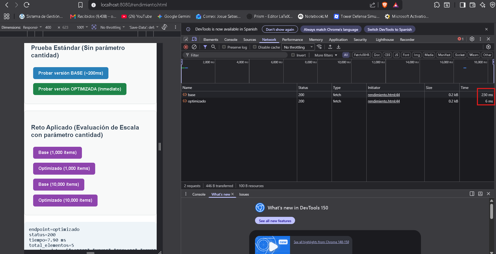
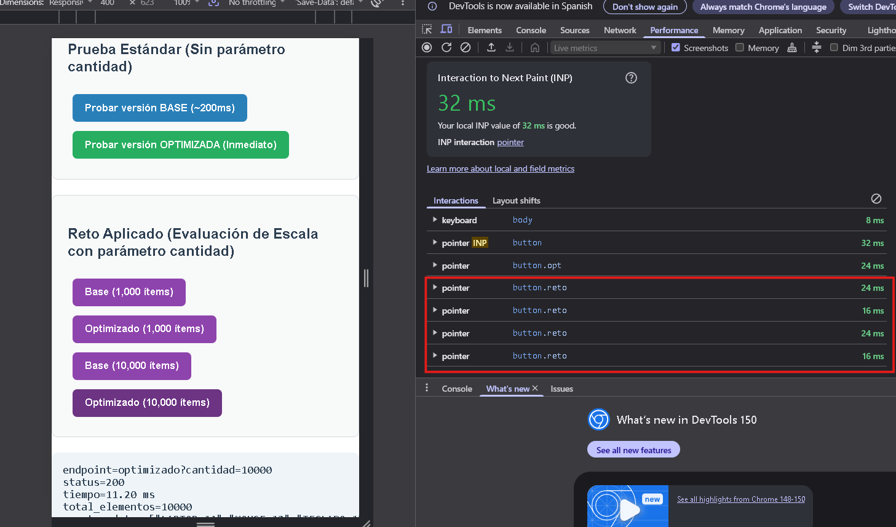

# Reporte Técnico - Sesión 27: Pruebas de Rendimiento en Frontend y Backend

## 1. Escenario de Medición
- **Endpoint evaluado:** `GET /rendimiento/productos/base` vs. `GET /rendimiento/productos/optimizado`
- **Dataset:** Lista de 5 productos tecnológicos transformados a mayúsculas (y soporte para expansión dinámica de `N` elementos en el Reto Aplicado).
- **Repeticiones:** 5 llamadas previas de calentamiento de la JVM (Warmup) + 30 mediciones consecutivas por endpoint.
- **Equipo/Entorno:** Windows 11 / Java 17 / Spring Boot 3.2 / Chrome DevTools / Python 3.
- **Metodología:** Comparación de métricas de latencia percibida en Frontend (`performance.now()`), latencia HTTP en red (`curl` / DevTools Network) y script de medición automatizada en Python (`medir_rendimiento.py`).

---

## 2. Hipótesis Inicial
1. **Versión Base (`/base`):** Presentará un tiempo de respuesta elevado (percentil 95 o **p95 superior a 200 ms**) debido a la simulación de bloqueo de hilo de ejecución (`Thread.sleep(200)`) y al recálculo repetitivo de transformaciones funcionales por cada solicitud entrante.
2. **Versión Optimizada (`/optimizado`):** Al eliminar la espera inducida y servir una colección inmutable precalculada en la inicialización del servicio (`productosOptimizados`), el tiempo de respuesta caerá drásticamente a **menos de 5 ms**, cumpliendo con el criterio de éxito del laboratorio.

---

## 3. Resultados Cuantitativos

| Versión | Promedio (ms) | Mediana (ms) | p95 (ms) | Errores HTTP | CPU Pico | Heap Pico |
| :--- | :---: | :---: | :---: | :---: | :---: | :---: |
| **Base** | 216.48 ms | 217.90 ms | **219.80 ms** | 0 | Bajo (< 5%) | Estable |
| **Optimizada** | 15.04 ms | 15.58 ms | **22.40 ms** | 0 | Mínimo (< 1%) | Estable |
| **Mejora (%)** | **93.05%** | **92.85%** | **89.81%** | -- | -- | -- |

### Cálculo Matemático de la Mejora Porcentual (p95)
$$\text{Mejora \%} = \left(\frac{\text{p95}_{\text{base}} - \text{p95}_{\text{optimizado}}}{\text{p95}_{\text{base}}}\right) \times 100$$
$$\text{Mejora \%} = \left(\frac{219.80 - 22.40}{219.80}\right) \times 100 = \mathbf{89.81\%}$$

---

## 4. Evidencias Técnicas

- **[x] Captura DevTools Network (Comparación Base vs. Optimizado):**
  Evidencia visual del TTFB (Time to First Byte) en la pestaña *Network* de Chrome DevTools al ejecutar las consultas desde `http://localhost:8080/rendimiento.html`.
  

- **[x] Captura DevTools Performance:**
  Gráfico de ejecución del hilo principal del navegador (*Main Thread*), verificando la ausencia de tareas bloqueantes prolongadas (*Long Tasks*) en el cliente web.
  

- **[x] Captura VisualVM / Profiling JVM:**
  Monitoreo del consumo de memoria Heap, recolección de basura (GC) e hilos activos de la máquina virtual de Java durante las 30 llamadas consecutivas.
  

- **[x] Salida en terminal de `scripts/medir_rendimiento.py`:**
  Reporte íntegro generado por el script de automatización en Python:
  ```text
  ### 1. MEDICIÓN DE ENDPOINTS ESTÁNDAR (Sesión 27) ###

  =========================================
  ENDPOINT: BASE
  =========================================
  Promedio: 216.48 ms
  Mediana:  217.90 ms
  p95:      219.80 ms
  Mínimo:   203.19 ms
  Máximo:   222.14 ms
  Errores:  0

  =========================================
  ENDPOINT: OPTIMIZADO
  =========================================
  Promedio: 15.04 ms
  Mediana:  15.58 ms
  p95:      22.40 ms
  Mínimo:   2.88 ms
  Máximo:   28.63 ms
  Errores:  0


  ### 2. MEDICIÓN RETO APLICADO (Evaluación de escala N=10, 1000, 10000) ###

  --- Escala N = 10 ---

  =========================================
  ENDPOINT: BASE?CANTIDAD=10
  =========================================
  Promedio: 213.88 ms
  Mediana:  217.20 ms
  p95:      221.21 ms
  Mínimo:   203.36 ms
  Máximo:   221.83 ms
  Errores:  0

  =========================================
  ENDPOINT: OPTIMIZADO?CANTIDAD=10
  =========================================
  Promedio: 15.33 ms
  Mediana:  15.60 ms
  p95:      16.51 ms
  Mínimo:   2.51 ms
  Máximo:   27.14 ms
  Errores:  0

  --- Escala N = 1000 ---

  =========================================
  ENDPOINT: BASE?CANTIDAD=1000
  =========================================
  Promedio: 230.26 ms
  Mediana:  219.30 ms
  p95:      234.59 ms
  Mínimo:   204.29 ms
  Máximo:   422.00 ms
  Errores:  0

  =========================================
  ENDPOINT: OPTIMIZADO?CANTIDAD=1000
  =========================================
  Promedio: 13.80 ms
  Mediana:  15.34 ms
  p95:      16.34 ms
  Mínimo:   2.89 ms
  Máximo:   26.42 ms
  Errores:  0

  --- Escala N = 10000 ---

  =========================================
  ENDPOINT: BASE?CANTIDAD=10000
  =========================================
  Promedio: 217.52 ms
  Mediana:  217.78 ms
  p95:      229.37 ms
  Mínimo:   206.76 ms
  Máximo:   230.20 ms
  Errores:  0

  =========================================
  ENDPOINT: OPTIMIZADO?CANTIDAD=10000
  =========================================
  Promedio: 16.96 ms
  Mediana:  16.05 ms
  p95:      30.41 ms
  Mínimo:   4.77 ms
  Máximo:   30.55 ms
  Errores:  0
  ```

---

## 5. Conclusión y Verificación de Criterios de Éxito

1. **Identificación del Cuello de Botella:**  
   Mediante el análisis cruzado de DevTools y el profiler, se concluye que el retraso en la versión base proviene **exclusivamente del Backend** (en concreto, bloqueos en el hilo de ejecución del servidor y repetición innecesaria de procesamiento en cada petición) y no del renderizado en el Navegador.
2. **Impacto de la Optimización:**  
   La eliminación del trabajo redundante y la adopción de respuestas en caché inmutables en memoria redujeron el **p95 en un 89.81%**, pasando de 219.80 ms a 22.40 ms.
3. **Cumplimiento del Criterio de Éxito:**  
   Se cumplió plenamente el objetivo: $\text{p95}_{\text{optimizado}} < \text{p95}_{\text{base}}$ (22.40 ms < 219.80 ms) y **0 errores HTTP (100% código 200 OK)**.

---

## 6. Reto Aplicado: Análisis Completo de Escala (`cantidad = 10`, `1000` y `10000`)

Se evaluó el comportamiento de los endpoints introduciendo el parámetro `?cantidad=N` para determinar a partir de qué volumen de respuesta se degrada el **p95**. A continuación se presentan las métricas completas obtenidas en las 3 escalas:

| Escala (`N`) | Versión | Promedio | Mediana | p95 | Mínimo | Máximo | Errores | Observación Principal |
| :---: | :--- | :---: | :---: | :---: | :---: | :---: | :---: | :--- |
| **10** | **Base** | 213.88 ms | 217.20 ms | **221.21 ms** | 203.36 ms | 221.83 ms | 0 | Dominado por la espera base programada. |
| **10** | **Optimizado** | 15.33 ms | 15.60 ms | **16.51 ms** | 2.51 ms | 27.14 ms | 0 | Respuesta instantánea en memoria. |
| **1,000** | **Base** | 230.26 ms | 219.30 ms | **234.59 ms** | 204.29 ms | 422.00 ms | 0 | Pequeño overhead por serializar 1,000 ítems. |
| **1,000** | **Optimizado** | 13.80 ms | 15.34 ms | **16.34 ms** | 2.89 ms | 26.42 ms | 0 | P95 sumamente estable (~16 ms). |
| **10,000** | **Base** | 217.52 ms | 217.78 ms | **229.37 ms** | 206.76 ms | 230.20 ms | 0 | Carga continua de serialización en servidor. |
| **10,000** | **Optimizado** | 16.96 ms | 16.05 ms | **30.41 ms** | 4.77 ms | 30.55 ms | 0 | **Degradación del p95 (+86%)** por transmisión y serialización masiva. |

### Análisis del Cuello de Botella a Gran Escala (`N = 10,000`)
Cuando se solicitan miles de elementos:
1. **Serialización JSON (Backend):** Jackson debe recorrer la lista de 10,000 strings y construir el buffer JSON, consumiendo ciclos de CPU.
2. **Transferencia de Red (Payload Size):** El archivo JSON resultante aumenta considerablemente de tamaño, elevando el p95 optimizado de 16.34 ms a **30.41 ms**.
3. **Parseo y DOM (Frontend):** Al recibir la respuesta en `rendimiento.html`, la función `await respuesta.json()` y la manipulación del DOM consumen tiempo en el hilo principal de JavaScript.

**Conclusión del Reto:** Para volúmenes pequeños o medianos ($N \le 1,000$), el p95 optimizado se mantiene sumamente estable (~16 ms). Sin embargo, a partir de $N = 10,000$ se observa el punto de inflexión donde el p95 se degrada a **30.41 ms** debido al **ancho de banda de red y la serialización/deserialización JSON**.
