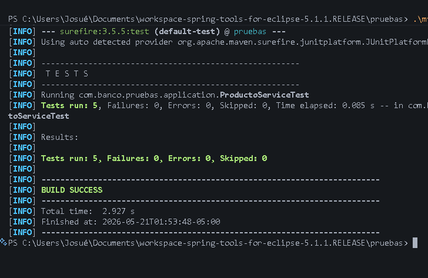
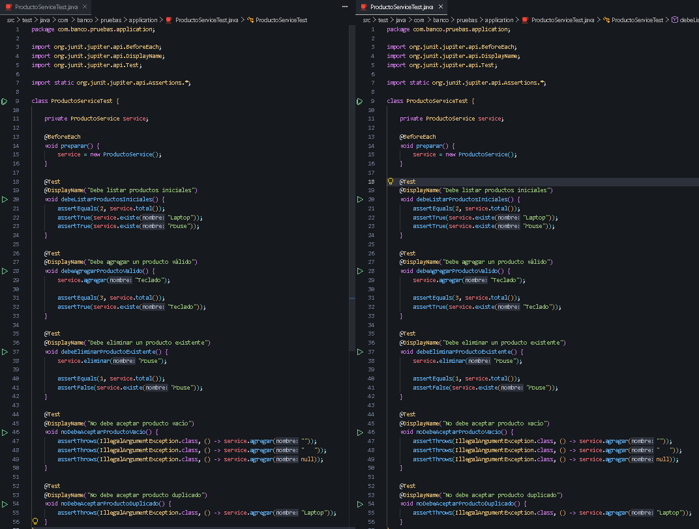

# Reporte de Pruebas - Sesión 13: Mantenimiento del banco de pruebas

## Objetivo
Mantener y organizar el banco de pruebas de la aplicación, incorporando pruebas unitarias de regresión para cubrir nuevas reglas de negocio de forma óptima. Además, documentar los casos de prueba y automatizar su ejecución mediante integración continua (CI) con un flujo de GitHub Actions.

## Arquitectura Implementada
El proyecto respeta el diseño y la separación de responsabilidades:
- **Capa Application (ProductoService)**: Contiene la lógica de negocio y las reglas de validación (no campos vacíos, no duplicados) usando colecciones en memoria.
- **Capa Pruebas Unitarias (ProductoServiceTest)**: Utiliza JUnit 5 para instanciar el servicio y validar directamente la efectividad de cada método público, simulando estados de manera aislada con ayuda de `@BeforeEach`.

## Pruebas Ejecutadas

| ID | Nombre de la Prueba | Descripción y Propósito |
| :--- | :--- | :--- |
| **PU-01** | `debeListarProductosIniciales` | Verifica el estado inicial, asegurando la existencia de "Laptop" y "Mouse" y que el total sea 2. |
| **PU-02** | `debeAgregarProductoValido` | Simula agregar un elemento correcto ("Teclado"), comprobando que el total aumente y el nuevo elemento exista. |
| **PU-03** | `debeEliminarProductoExistente` | Remueve un elemento existente ("Mouse") comprobando que la lista reduzca su tamaño a 1 y ya no lo contenga. |
| **PU-04** | `noDebeAceptarProductoVacio` | Fuerza la validación de vacíos, nulos y espacios en blanco, verificando que se arroje de manera controlada un `IllegalArgumentException`. |
| **PU-05** | `noDebeAceptarProductoDuplicado` *(Reto)* | Valida la nueva regla de negocio agregada, intentando insertar la duplicidad ("Laptop") para constatar el manejo seguro vía `IllegalArgumentException`. |

## Resultados de Ejecución (mvn test)
Todas las pruebas unitarias pasaron satisfactoriamente de manera íntegra, ratificando la robustez de nuestra clase Service y la ausencia de regresiones:

```text
[INFO] -------------------------------------------------------
[INFO]  T E S T S
[INFO] -------------------------------------------------------
[INFO] Running com.banco.pruebas.application.ProductoServiceTest
[INFO] Tests run: 5, Failures: 0, Errors: 0, Skipped: 0, Time elapsed: 0.097 s
[INFO] 
[INFO] Results:
[INFO] 
[INFO] Tests run: 5, Failures: 0, Errors: 0, Skipped: 0
[INFO] 
[INFO] ------------------------------------------------------------------------
[INFO] BUILD SUCCESS
[INFO] ------------------------------------------------------------------------
```

## Evidencias
- Captura de consola mostrando el **BUILD SUCCESS** tras ejecutar `./mvnw test`:
  
- Captura evidenciando los archivos **ProductoService.java** y **ProductoServiceTest.java** implementados con la solución al reto:
  
- Captura del historial o ejecución del **Workflow (GitHub Actions)** en el repositorio web de GitHub con su "check" en verde.
- Captura de Git local / push remoto en la rama asignada (`feature/sesion13-banco-pruebas-oriundo-josue`).

## Explicación del Flujo: Mantenimiento y GitHub Actions
A diferencia de simples ejecuciones por consola, esta estructura incorpora un mecanismo de **Regresión e Integración Continua (CI)**. 
Cada vez que un desarrollador hace _push_ o abre un _Pull Request_ a esta rama, GitHub Actions levanta un contenedor Ubuntu con Java 17, descarga el código y ejecuta `./mvnw test`. De esta forma, si el mantenimiento del código (por ejemplo, implementar la regla para no duplicados) rompe otras lógicas (como la creación por defecto), GitHub anulará la fusión protegiendo la rama `main` contra errores silenciosos.