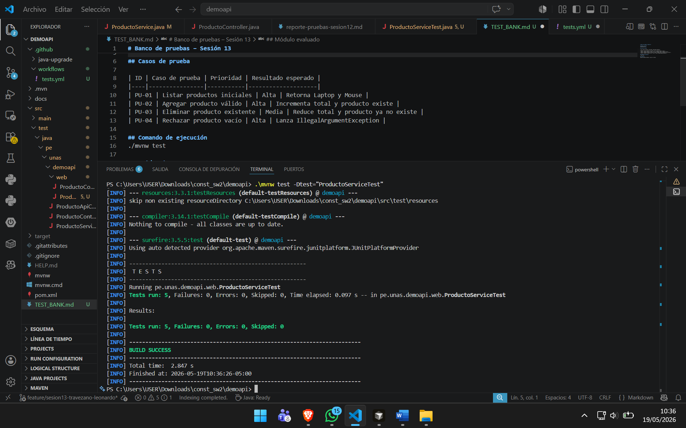
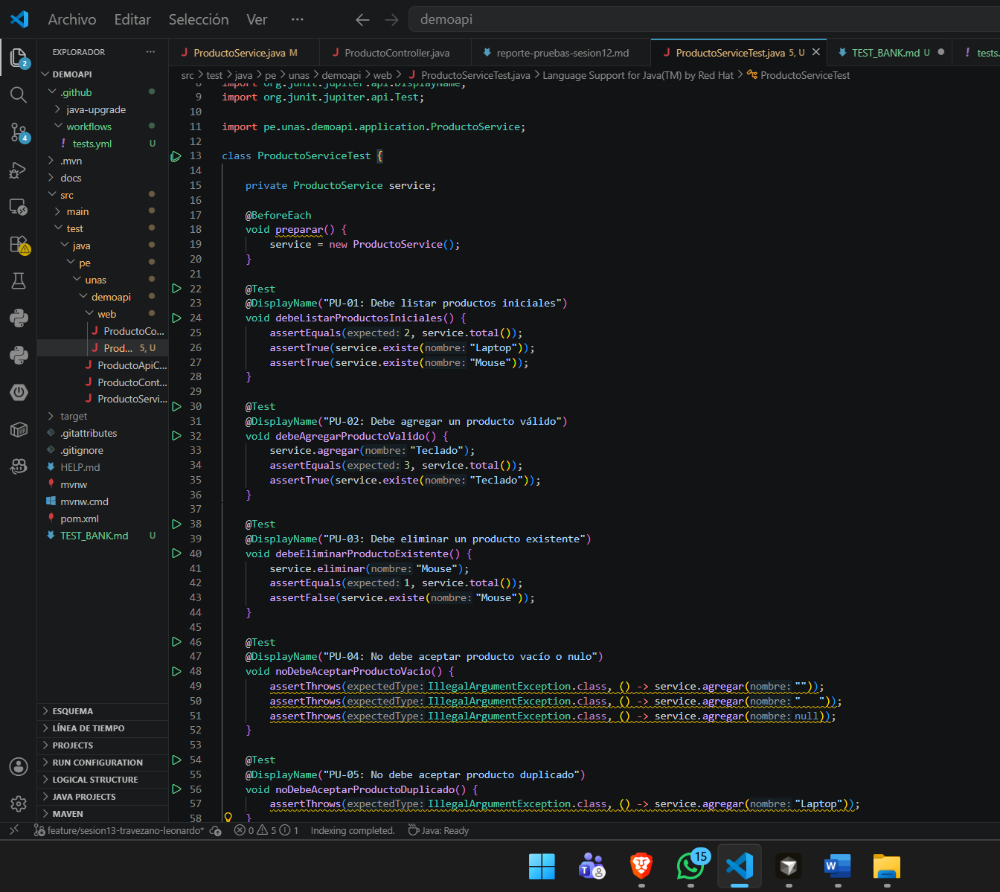
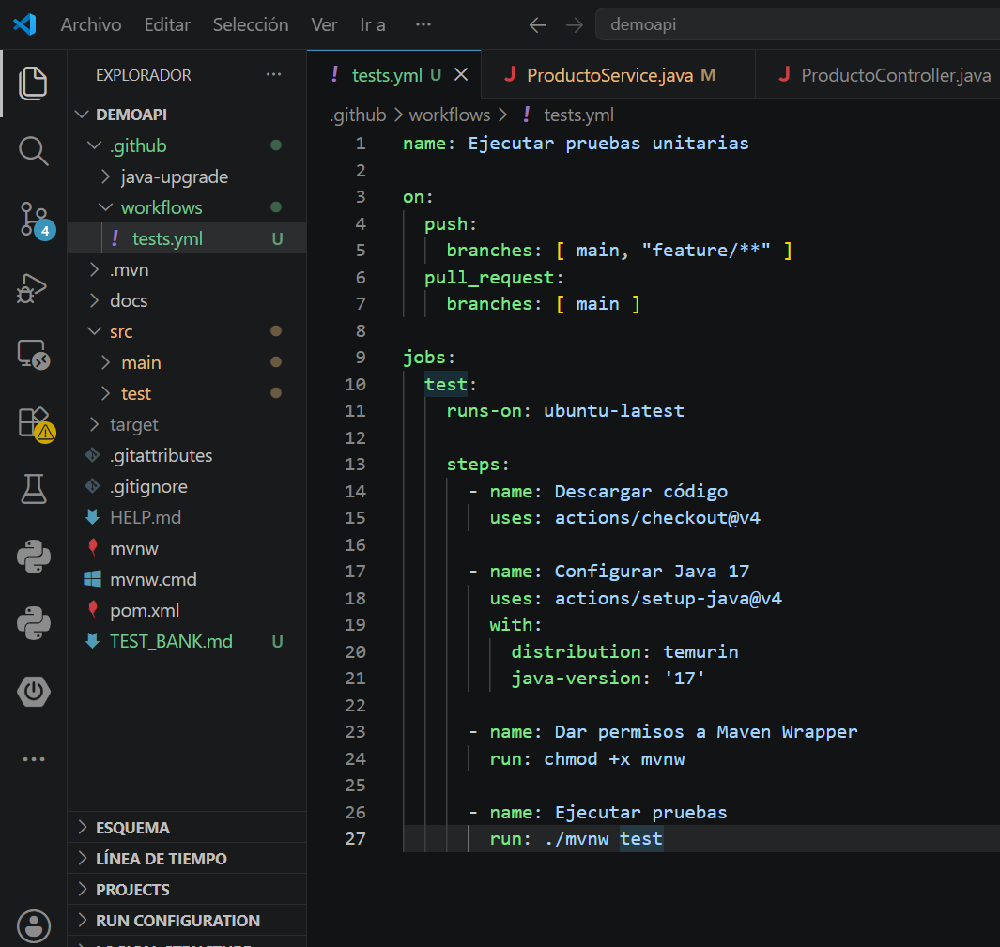
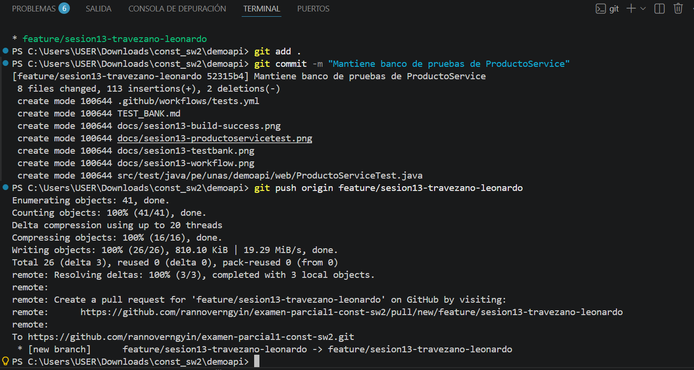
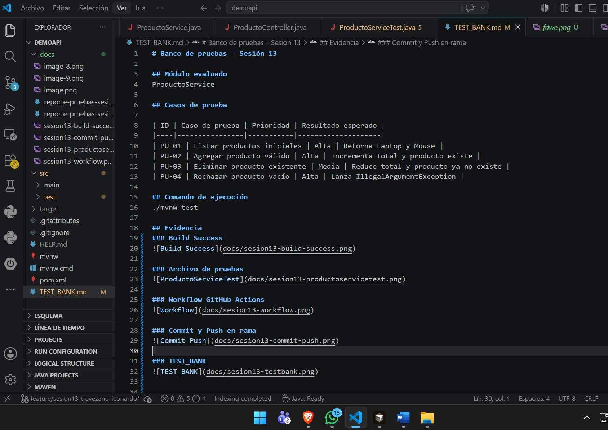

# Banco de pruebas – Sesión 13

## Módulo evaluado
ProductoService

## Casos de prueba

| ID | Caso de prueba | Prioridad | Resultado esperado |
|----|----------------|-----------|--------------------|
| PU-01 | Listar productos iniciales | Alta | Retorna Laptop y Mouse |
| PU-02 | Agregar producto válido | Alta | Incrementa total y producto existe |
| PU-03 | Eliminar producto existente | Media | Reduce total y producto ya no existe |
| PU-04 | Rechazar producto vacío | Alta | Lanza IllegalArgumentException |

## Comando de ejecución
./mvnw test

## Evidencia
### Build Success

### Archivo de pruebas

### Workflow GitHub Actions

### Commit y Push en rama

## Pull Request en GitHub

### TEST_BANK

