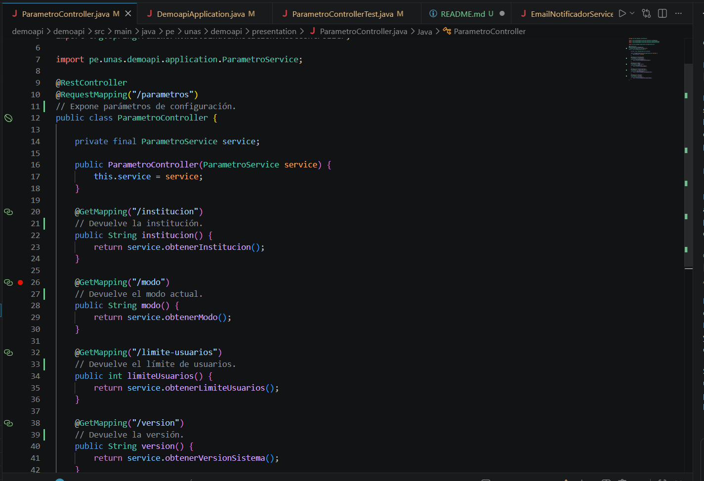
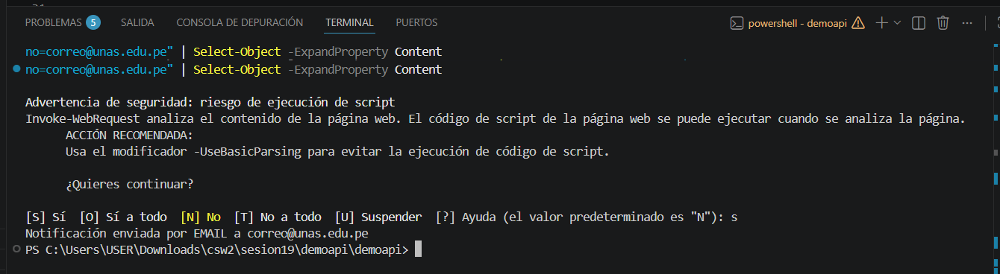
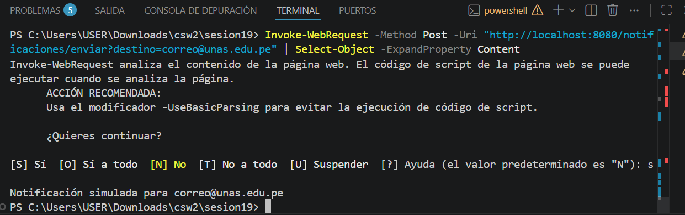
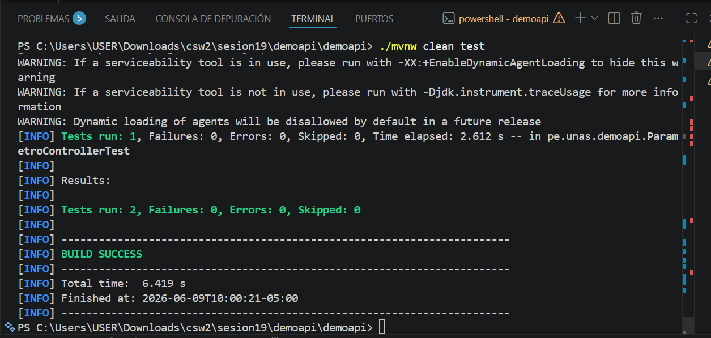
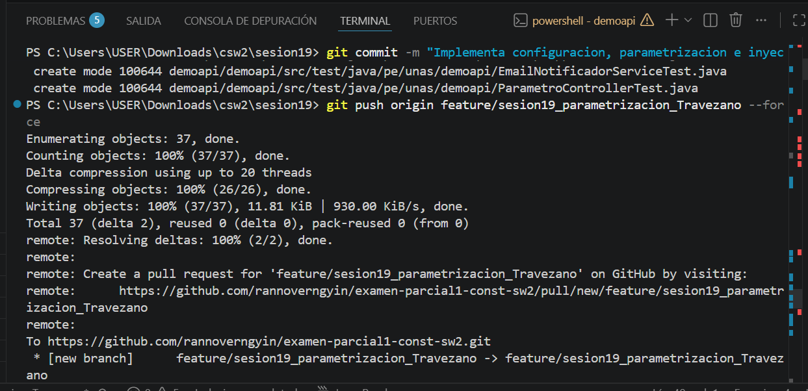

# Sesión 19: Configuración, Parametrización y Desacoplamiento (Inyección de Dependencias)

Este repositorio contiene el desarrollo práctico de la **Sesión 19** para el curso de **Construcción de Software II** de la **FIIS - UNAS**. El objetivo del laboratorio es implementar la configuración externa de parámetros del sistema y el desacoplamiento total de servicios utilizando la inyección de dependencias condicional de Spring Boot.

---

##  Evidencias de Ejecución y Validación

### 1. Validación de Endpoints de Parámetros (`/parametros`)
Validación del correcto funcionamiento de la API leyendo las propiedades externas desde el archivo `application.properties`.

* **Endpoint `/parametros/institucion`:**
  ```powershell
  # Devuelve la institución configurada
  Universidad Nacional Agraria de la Selva

  Endpoint /parametros/modo:
  # Devuelve el modo de operación activo
    ACADEMICO
  Endpoint /parametros/limite-usuarios:
  # Devuelve el límite máximo permitido
    100

Captura de Endpoints Activos:
2. Validación de Notificación - Proveedor EMAIL
Configuración del sistema apuntando a la implementación real de correo mediante la propiedad app.notificacion.proveedor=email.



Comando ejecutado (POST en PowerShell):

Invoke-WebRequest -Method Post -Uri "http://localhost:8080/notificaciones/enviar?destino=correo@unas.edu.pe" | Select-Object -ExpandProperty Content

Captura de Notificación Simulada (Mock):


. Ejecución de Pruebas Automatizadas (mvnw test)
Validación de la lógica del sistema mediante las pruebas unitarias y de integración del controlador ejecutadas con Maven Wrapper.

Comando: .\mvnw.cmd test

Ejercicio Aplicado Desarrollado
Se implementó de manera exitosa la propiedad configurable app.version-sistema con el valor 1.0.0, exponiéndola a través de la capa de aplicación hacia la capa de presentación en el endpoint GET /parametros/version. Asimismo, se diseñó su respectiva prueba automatizada con MockMvc garantizando la cobertura del requerimiento.

Repositorio y Git Historial
El laboratorio ha sido aislado de forma segura en su respectiva rama de trabajo:

Rama oficial: feature/sesion19_parametrizacion_Travezano

Captura del Commit y Pull Request en GitHub:
