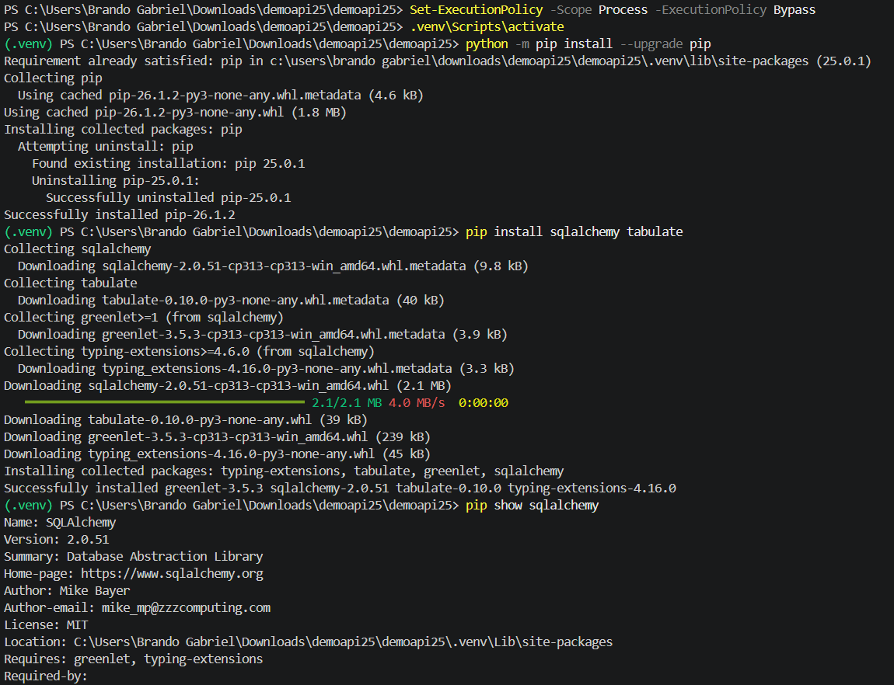
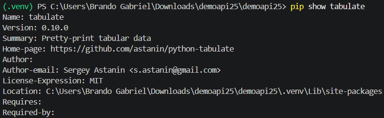
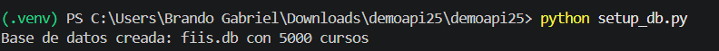
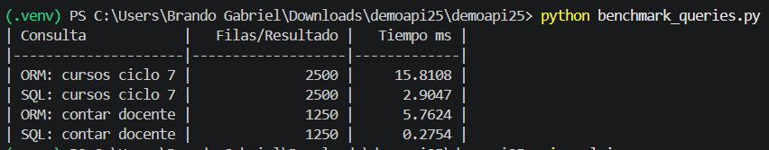
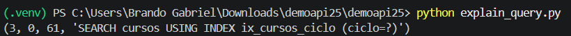
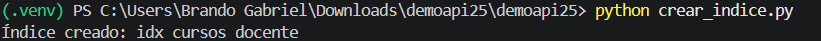
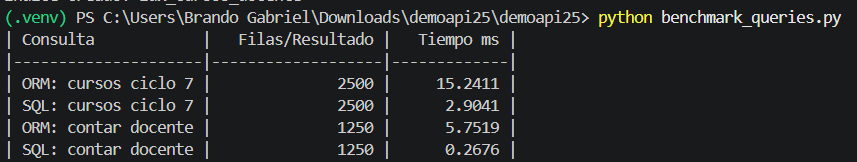

# Reporte Sesión 25 – ORM vs SQL directo en Python

## 1. Objetivo

Comparar el rendimiento de consultas realizadas mediante ORM con SQLAlchemy y SQL directo en Python, usando una base de datos SQLite con datos de prueba. La finalidad es identificar diferencias de tiempo, mantenibilidad y eficiencia en consultas filtradas y agregadas.

## 2. Entorno utilizado

- Sistema operativo: Windows
- Editor: Visual Studio Code
- Lenguaje: Python
- Base de datos: SQLite
- Librerías utilizadas:
  - SQLAlchemy
  - Tabulate
- Entorno virtual: `.venv`

## 3. Archivos desarrollados

| Archivo               | Descripción |
|-----------------------|---------------------------------------------------------------------------------------------|
| `setup_db.py`         | Crea la base de datos `fiis.db`, define la tabla `cursos` y carga 5000 registros de prueba. |
| `benchmark_queries.py`| Ejecuta consultas equivalentes con ORM y SQL directo, midiendo el tiempo de ejecución.      |
| `explain_query.py`    | Analiza el plan de ejecución de una consulta usando `EXPLAIN QUERY PLAN`.                   |
| `crear_indice.py`     | Crea el índice `idx_cursos_docente` sobre la columna `docente`.                             | 
| `REPORTE_SESION25.md` | Documenta resultados, interpretación, evidencias y reflexión técnica.                       |

## 4. Consultas evaluadas

Se evaluaron dos tipos principales de consultas:

1. Consulta filtrada por ciclo académico:
   - ORM: listar cursos del ciclo 7.
   - SQL directo: listar cursos del ciclo 7.

2. Consulta filtrada por docente:
   - ORM: traer cursos del docente y contarlos en Python.
   - SQL directo: usar `COUNT(*)` directamente en la base de datos.

## 5. Resultados antes de crear el índice explícito

| Consulta | Resultado | Tiempo ms | Observación |
|---|---:|---:|---|
| ORM: cursos ciclo 7 | 2500 | 15.8108 | Trae registros y los convierte en objetos Python. |
| SQL: cursos ciclo 7 | 2500 | 2.9047 | Ejecuta SQL directo y devuelve filas sin conversión ORM. |
| ORM: contar docente | 1250 | 5.7624 | Trae los registros del docente y luego los cuenta en Python. |
| SQL: contar docente | 1250 | 0.2754 | Usa `COUNT(*)`, por lo que la base de datos realiza el conteo internamente. |

## 6. Resultado del plan de consulta

Salida obtenida con EXPLAIN QUERY PLAN:

```text
(3, 0, 61, 'SEARCH cursos USING INDEX ix_cursos_ciclo (ciclo=?)')
```

## Preguntas de reflexión técnica
1. ¿Qué ventaja ofrece ORM frente a SQL directo en mantenibilidad?

ORM mejora la mantenibilidad porque permite representar tablas como clases y registros como objetos. Esto hace que el código sea más ordenado, reutilizable y fácil de modificar. Además, evita escribir muchas consultas SQL manuales, reduciendo errores repetitivos en operaciones comunes.

2. ¿En qué casos SQL directo puede ser más conveniente?

SQL directo puede ser más conveniente cuando se requiere mayor rendimiento, control fino de la consulta o uso de funciones específicas de la base de datos. También es recomendable para consultas agregadas, reportes, operaciones masivas o consultas complejas donde el ORM puede generar instrucciones menos eficientes.

3. ¿Qué impacto tuvo el índice en las consultas filtradas?

El índice permitió que SQLite buscara registros filtrados sin recorrer toda la tabla. En el caso de la consulta por ciclo, el plan mostró que se usó el índice ix_cursos_ciclo. En la consulta por docente, el índice explícito idx_cursos_docente generó una mejora ligera, porque la columna ya estaba indexada desde la definición ORM.

4. ¿Por qué una consulta agregada con COUNT puede ser más eficiente que traer todos los registros y contarlos en Python?

Porque COUNT(*) realiza el conteo directamente dentro del motor de base de datos. Esto evita transferir todos los registros hacia Python y evita crear objetos o estructuras innecesarias en memoria. Por eso, contar en SQL suele ser más eficiente que traer todos los datos y luego usar len() en Python.

5. ¿Qué riesgo existe si se construyen consultas SQL concatenando texto del usuario?

El principal riesgo es la inyección SQL. Si se concatena texto ingresado por el usuario directamente en una consulta, un atacante podría alterar la instrucción SQL y acceder, modificar o eliminar información. Para evitarlo, se deben usar consultas parametrizadas, como :ciclo o :docente, en lugar de concatenar valores manualmente.


##  Resultado del plan de consulta
  Evidencia de entorno virtual y librerias 



# Evidencia 1: Creación de base de datos

Comando ejecutado:

python setup_db.py

Resultado obtenido:



# Evidencia 2: Benchmark antes del índice explícito

Comando ejecutado:

python benchmark_queries.py

Resultados obtenidos:



# Evidencia 3: Plan de consulta

Comando ejecutado:

python explain_query.py

Resultado obtenido:



# Evidencia 4: Creación del índice

Comando ejecutado:

python crear_indice.py

Resultado obtenido:



# Evidencia 5: Benchmark después del índice

Comando ejecutado:

python benchmark_queries.py

Resultados obtenidos:



## Conclusión

La práctica demuestra que ORM y SQL directo no compiten de forma absoluta. ORM facilita el desarrollo y mejora la mantenibilidad, mientras que SQL directo puede ofrecer mejor rendimiento y mayor control en consultas específicas.

En las pruebas realizadas, SQL directo fue más rápido, especialmente en la consulta agregada con COUNT(*). También se comprobó que los índices ayudan a optimizar búsquedas filtradas, como se observó en el plan de consulta usando EXPLAIN QUERY PLAN.