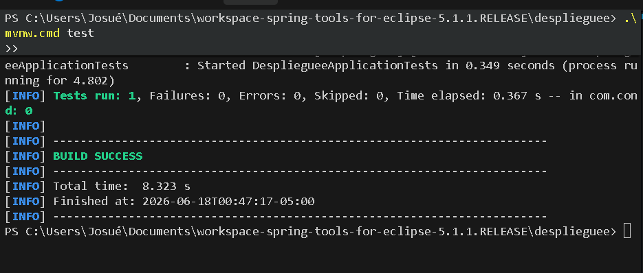
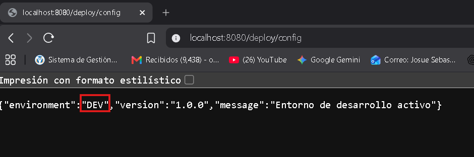
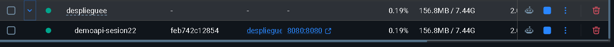
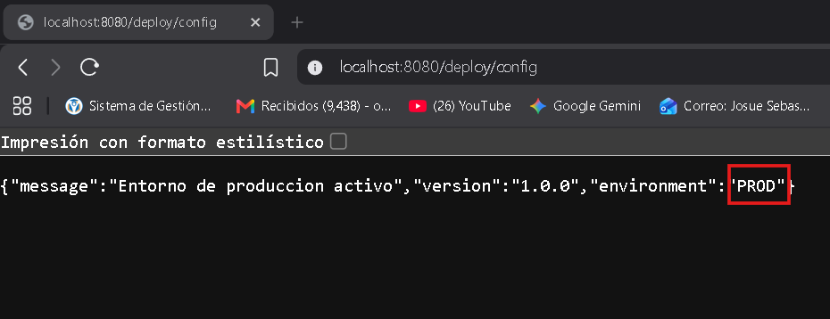

# Validacion de configuracion y despliegue

## Perfil validado
- dev: ejecutado localmente
- prod: ejecutado en Docker

## Endpoints verificados
- GET `/deploy/config`
- GET `/deploy/health`
- GET `/deploy/checklist`
- GET `/deploy/version` (Ejercicio aplicado)

## Evidencias

**Captura de mvn test**

**Captura de curl /deploy/config (Local DEV)**

**Captura de docker ps**

**Captura de curl /deploy/config (Docker PROD)**

