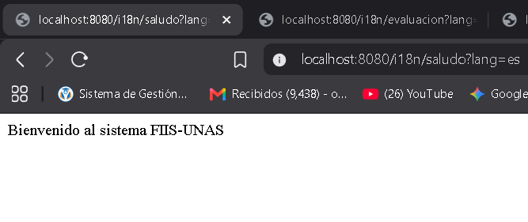
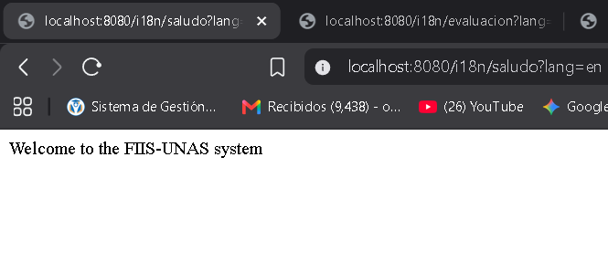
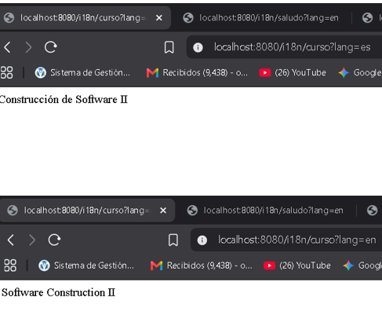
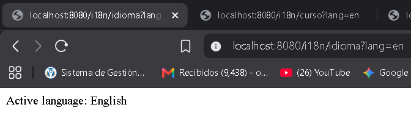
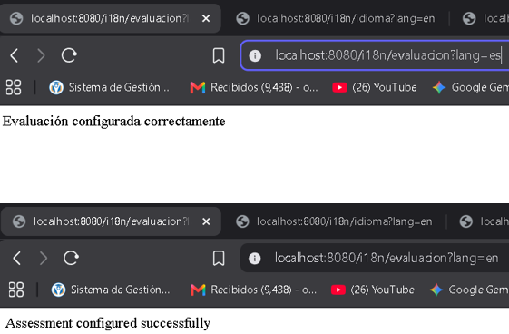

# Internacionalización (Sesión 21)

## Objetivo
Permitir que la API responda mensajes en más de un idioma sin quemar código duro en el controlador, externalizando los textos.

## Idiomas soportados
- Español: `es`
- Inglés: `en`

## Evidencias de Pruebas Automatizadas

**E1: Ejecución de Pruebas (MockMvc)**
Pruebas de integración verificando los idiomas.

---

## Evidencias de Endpoints (cURL)

**E2: Saludo en Español**
- GET `/i18n/saludo?lang=es`

**E3: Saludo en Inglés**
- GET `/i18n/saludo?lang=en`

**E4: Consulta de Curso**
- GET `/i18n/curso?lang=en` y `lang=es`

**E5: Consulta de Idioma**
- GET `/i18n/idioma?lang=en`

---

## Evidencias Adicionales (Retos)

**E6: Reto Opcional (Cabecera Accept-Language)**
- GET `/i18n/saludo-header` con header `Accept-Language: en`

**E7: Ejercicio Aplicado (Evaluación)**
- GET `/i18n/evaluacion?lang=es` y `lang=en`

---

## Evidencia de Repositorio

**E8: Commit en la rama feature**

