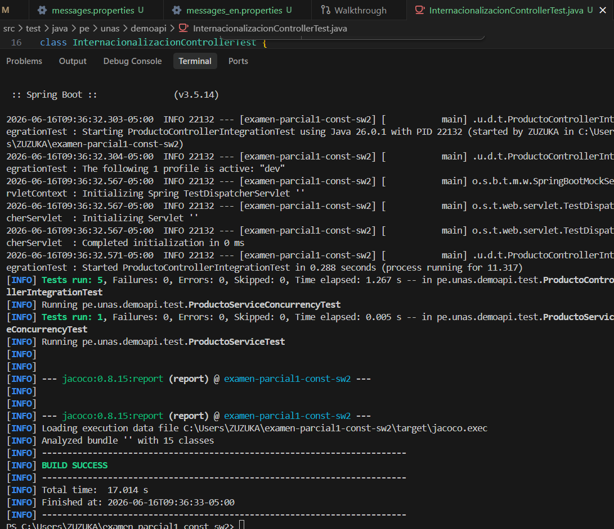
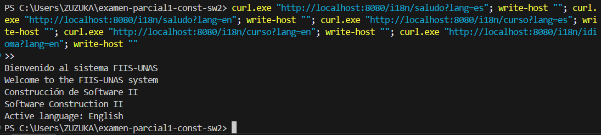
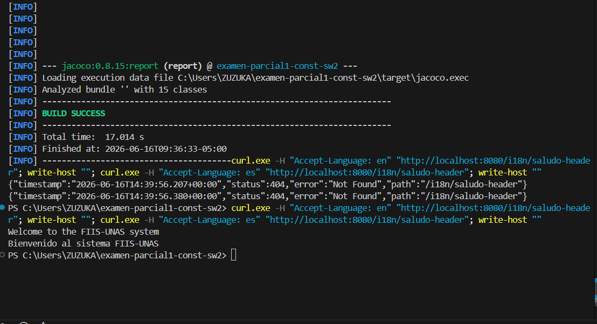
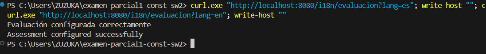

# Internacionalización

## Objetivo
Permitir que la API responda mensajes en más de un idioma.

## Idiomas soportados
- Español: `es`
- Inglés: `en`

## Endpoints
- `GET /i18n/saludo?lang=es` (Devuelve el saludo en español)
- `GET /i18n/saludo?lang=en` (Devuelve el saludo en inglés)
- `GET /i18n/curso?lang=es` (Devuelve el nombre del curso en español)
- `GET /i18n/curso?lang=en` (Devuelve el nombre del curso en inglés)
- `GET /i18n/idioma?lang=es` (Devuelve el idioma activo en español)
- `GET /i18n/idioma?lang=en` (Devuelve el idioma activo en inglés)
- `GET /i18n/evaluacion?lang=es` (Devuelve el estado de la evaluación en español)
- `GET /i18n/evaluacion?lang=en` (Devuelve el estado de la evaluación en inglés)
- `GET /i18n/saludo-header` (Devuelve el saludo detectando el idioma mediante el header `Accept-Language`)

---

## Evidencia

### 1. Ejecución y éxito de las pruebas locales
Se validó toda la suite de pruebas unitarias y de integración del proyecto , obteniendo un resultado exitoso de compilación y ejecución.

### 2. Prueba de los endpoints con parámetros de consulta (Query Params)
Prueba en lote de los endpoints `/i18n/saludo`, `/i18n/curso` e `/i18n/idioma` pasando el parámetro `lang`.

### 3. Prueba del endpoint /i18n/saludo-header con cabecera HTTP
Validación del saludo enviando la cabecera `Accept-Language` en inglés (`en`) y español (`es`) obteniendo las respuestas correctas.

### 4. Prueba del endpoint /i18n/evaluacion con parámetro de idioma
Validación de la obtención de la propiedad `evaluacion` pasando el parámetro `lang` en español e inglés.

