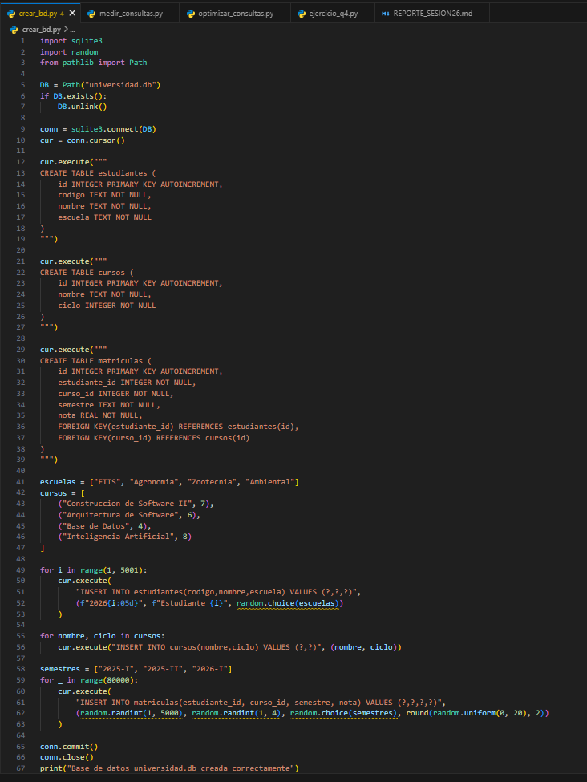
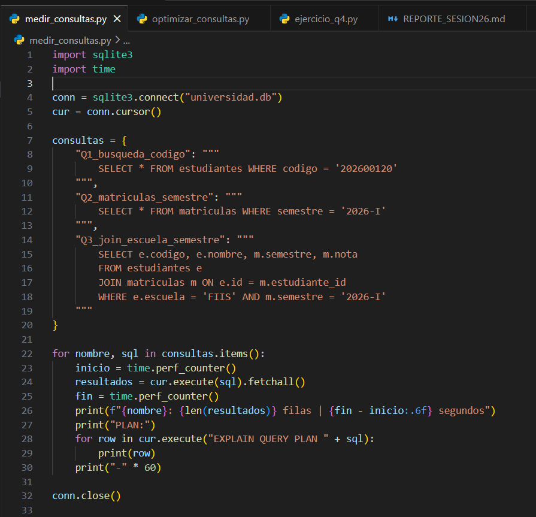
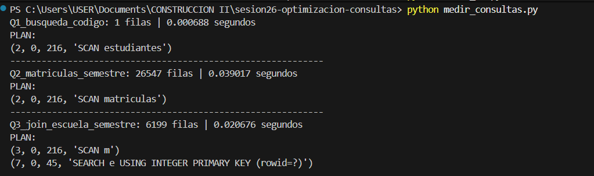
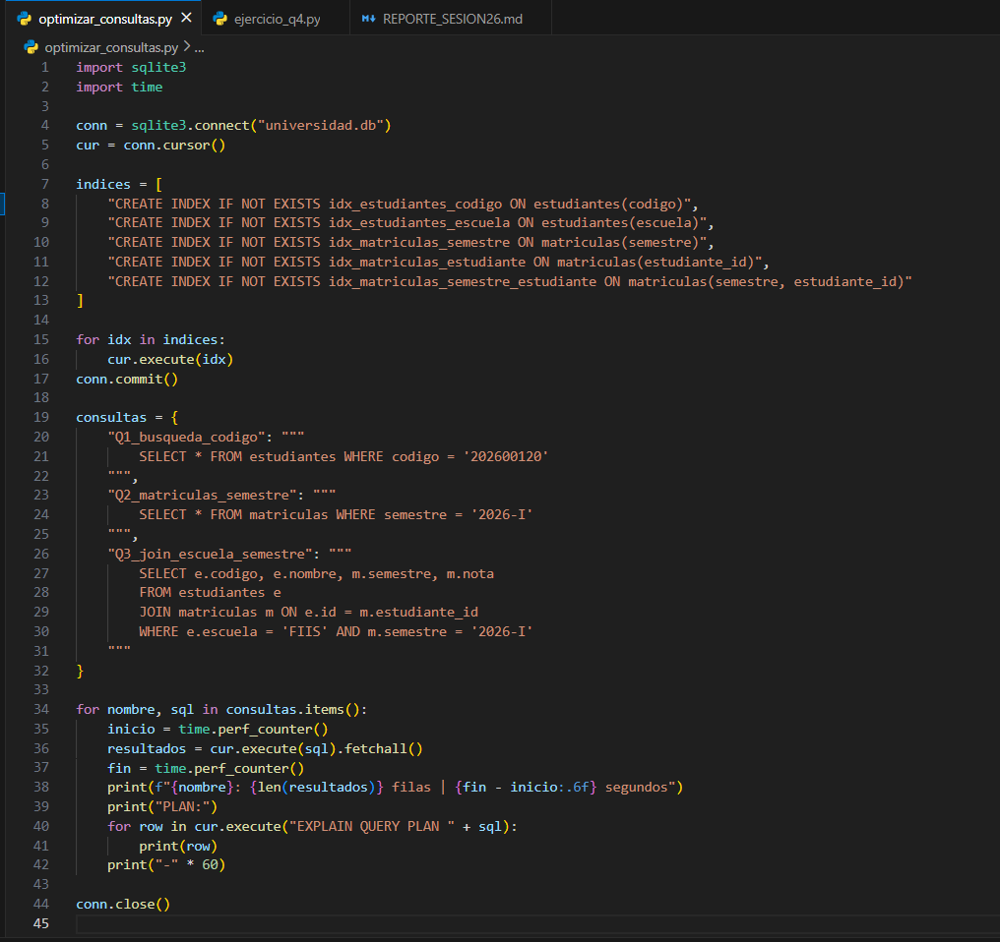
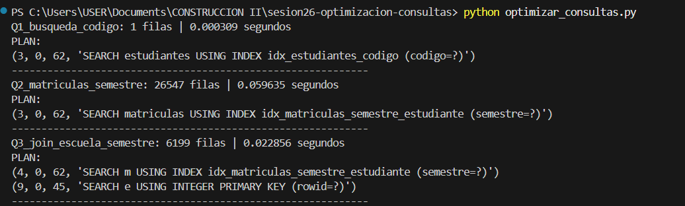
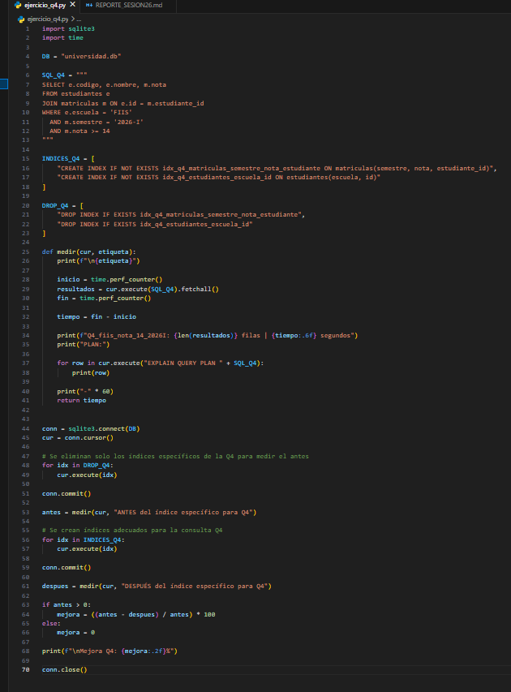
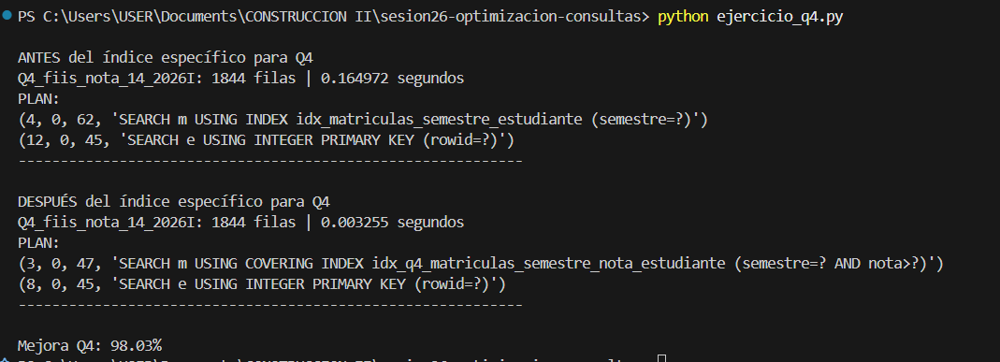

# Reporte Sesión 26 – Optimización de consultas

## 1. Consulta analizada

Se analizó una consulta que obtiene los estudiantes de la FIIS que tienen nota mayor o igual a 14 en el semestre 2026-I.

La consulta evaluada fue la siguiente:

```sql
SELECT e.codigo, e.nombre, m.nota
FROM estudiantes e
JOIN matriculas m ON e.id = m.estudiante_id
WHERE e.escuela = 'FIIS'
  AND m.semestre = '2026-I'
  AND m.nota >= 14;
```

Esta consulta puede volverse lenta porque realiza un JOIN entre las tablas `estudiantes` y `matriculas`, además de aplicar filtros por escuela, semestre y nota.

## 2. Tiempo antes de optimizar

Antes de crear el índice específico para esta consulta, el tiempo obtenido fue:

```text
ANTES del índice específico para Q4
Q4_fiis_nota_14_2026I: 1844 filas | 0.164972 segundos
PLAN:
(4, 0, 62, 'SEARCH m USING INDEX idx_matriculas_semestre_estudiante (semestre=?)')
(12, 0, 45, 'SEARCH e USING INTEGER PRIMARY KEY (rowid=?)')
```

El plan de ejecución muestra que SQLite utilizaba el índice `idx_matriculas_semestre_estudiante` para filtrar por semestre. Sin embargo, todavía debía evaluar la condición de la nota y realizar el JOIN con la tabla `estudiantes`.

## 3. Índice o cambio aplicado

Para optimizar la consulta, se creó un índice compuesto sobre las columnas usadas en el filtro y en la relación con estudiantes:

```sql
CREATE INDEX IF NOT EXISTS idx_q4_matriculas_semestre_nota_estudiante
ON matriculas(semestre, nota, estudiante_id);
```

También se creó un índice complementario sobre la tabla estudiantes:

```sql
CREATE INDEX IF NOT EXISTS idx_q4_estudiantes_escuela_id
ON estudiantes(escuela, id);
```

El índice más importante para la mejora fue `idx_q4_matriculas_semestre_nota_estudiante`, porque permite filtrar primero por `semestre`, luego por `nota`, y mantener disponible el `estudiante_id` para el JOIN.

## 4. Tiempo después de optimizar

Después de aplicar el índice específico, el tiempo obtenido fue:

```text
DESPUÉS del índice específico para Q4
Q4_fiis_nota_14_2026I: 1844 filas | 0.003255 segundos
PLAN:
(3, 0, 47, 'SEARCH m USING COVERING INDEX idx_q4_matriculas_semestre_nota_estudiante (semestre=? AND nota>?)')
(8, 0, 45, 'SEARCH e USING INTEGER PRIMARY KEY (rowid=?)')
```

La mejora porcentual fue:

```text
mejora = ((0.164972 - 0.003255) / 0.164972) * 100
mejora = 98.03%
```

## 5. Interpretación técnica

La consulta mejoró de forma considerable, pasando de 0.164972 segundos a 0.003255 segundos, con una mejora aproximada del 98.03%.

La mejora se debe a que el índice compuesto permite que SQLite filtre las matrículas usando directamente las columnas `semestre` y `nota`. Además, el plan de ejecución cambió a `USING COVERING INDEX`, lo que indica que SQLite pudo resolver gran parte de la consulta leyendo directamente desde el índice, sin recorrer completamente la tabla `matriculas`.

En las consultas anteriores también se observaron diferencias:

| Consulta                 | Antes (s) | Después (s) | Mejora (%) | Interpretación                                                                                     |
| ------------------------ | --------: | ----------: | ---------: | -------------------------------------------------------------------------------------------------- |
| Q1_busqueda_codigo       |  0.000688 |    0.000309 |     55.09% | Mejoró porque el índice sobre `codigo` permite ubicar directamente un estudiante.                  |
| Q2_matriculas_semestre   |  0.039017 |    0.059635 |    -52.84% | No mejoró porque devuelve muchas filas, por lo que el índice no reduce demasiado el trabajo total. |
| Q3_join_escuela_semestre |  0.020676 |    0.022856 |    -10.54% | No mejoró significativamente porque realiza un JOIN y devuelve varias filas.                       |
| Q4_fiis_nota_14_2026I    |  0.164972 |    0.003255 |     98.03% | Mejoró por el uso de un índice compuesto adecuado para los filtros de la consulta.                 |

Esto demuestra que no todos los índices generan mejoras automáticamente. La optimización depende de la selectividad del filtro, la cantidad de filas devueltas y el costo de las operaciones JOIN.

## 6. Evidencias

### Creación de base de datos

```text
python crear_bd.py
Base de datos universidad.db creada correctamente
```


### Medición antes de crear índices

```text
python medir_consultas.py

Q1_busqueda_codigo: 1 filas | 0.000688 segundos
PLAN:
(2, 0, 216, 'SCAN estudiantes')

Q2_matriculas_semestre: 26547 filas | 0.039017 segundos
PLAN:
(2, 0, 216, 'SCAN matriculas')

Q3_join_escuela_semestre: 6199 filas | 0.020676 segundos
PLAN:
(3, 0, 216, 'SCAN m')
(7, 0, 45, 'SEARCH e USING INTEGER PRIMARY KEY (rowid=?)')
```


### Medición después de crear índices

```text
python optimizar_consultas.py

Q1_busqueda_codigo: 1 filas | 0.000309 segundos
PLAN:
(3, 0, 62, 'SEARCH estudiantes USING INDEX idx_estudiantes_codigo (codigo=?)')

Q2_matriculas_semestre: 26547 filas | 0.059635 segundos
PLAN:
(3, 0, 62, 'SEARCH matriculas USING INDEX idx_matriculas_semestre_estudiante (semestre=?)')

Q3_join_escuela_semestre: 6199 filas | 0.022856 segundos
PLAN:
(4, 0, 62, 'SEARCH m USING INDEX idx_matriculas_semestre_estudiante (semestre=?)')
(9, 0, 45, 'SEARCH e USING INTEGER PRIMARY KEY (rowid=?)')
```


### Ejercicio aplicado Q4

```text
python ejercicio_q4.py

ANTES del índice específico para Q4
Q4_fiis_nota_14_2026I: 1844 filas | 0.164972 segundos
PLAN:
(4, 0, 62, 'SEARCH m USING INDEX idx_matriculas_semestre_estudiante (semestre=?)')
(12, 0, 45, 'SEARCH e USING INTEGER PRIMARY KEY (rowid=?)')

DESPUÉS del índice específico para Q4
Q4_fiis_nota_14_2026I: 1844 filas | 0.003255 segundos
PLAN:
(3, 0, 47, 'SEARCH m USING COVERING INDEX idx_q4_matriculas_semestre_nota_estudiante (semestre=? AND nota>?)')
(8, 0, 45, 'SEARCH e USING INTEGER PRIMARY KEY (rowid=?)')

Mejora Q4: 98.03%
```

