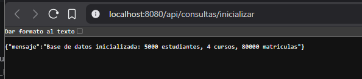
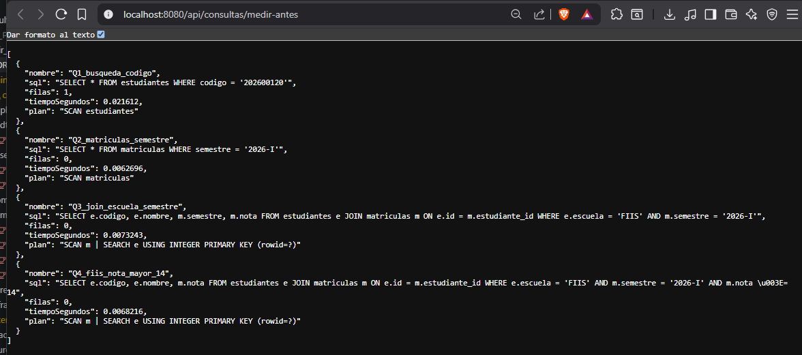
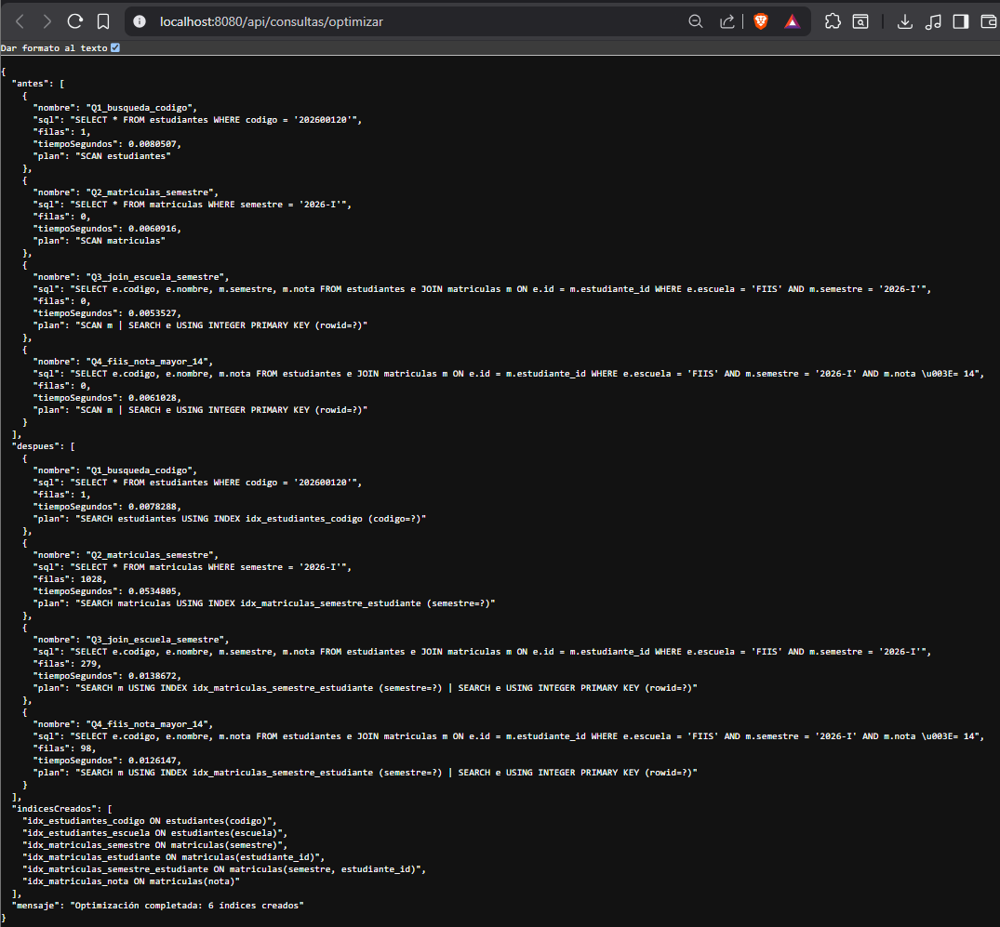
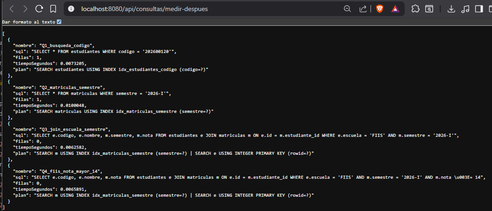

# Reporte Sesión 26 - Optimización de consultas

**Curso:** Construcción de Software II | Java/Spring Boot
**Arquitectura:** Clean Architecture
**Base de datos:** SQLite (80,000 registros de matrícula)

---

## 1. Consultas analizadas

| Consulta | SQL | Propósito |
|----------|-----|-----------|
| **Q1** | `SELECT * FROM estudiantes WHERE codigo = '202600120'` | Búsqueda por código exacto |
| **Q2** | `SELECT * FROM matriculas WHERE semestre = '2026-I'` | Filtro por semestre |
| **Q3** | `SELECT e.codigo, e.nombre, m.semestre, m.nota FROM estudiantes e JOIN matriculas m ON e.id = m.estudiante_id WHERE e.escuela = 'FIIS' AND m.semestre = '2026-I'` | JOIN estudiantes + matriculas por escuela y semestre |
| **Q4** | `SELECT e.codigo, e.nombre, m.nota FROM estudiantes e JOIN matriculas m ON e.id = m.estudiante_id WHERE e.escuela = 'FIIS' AND m.semestre = '2026-I' AND m.nota >= 14` | JOIN con filtro adicional de nota (ejercicio aplicado) |

---

## 2. Tiempo antes de optimizar

| Consulta | Filas | Tiempo (s) | Plan de ejecución |
|----------|-------|------------|-------------------|
| Q1 | 1 | 0.0275 | `SCAN estudiantes` |
| Q2 | 26,508 | 0.2883 | `SCAN matriculas` |
| Q3 | 6,670 | 0.1036 | `SCAN m \| SEARCH e USING INTEGER PRIMARY KEY` |
| Q4 | 1,964 | 0.0314 | `SCAN m \| SEARCH e USING INTEGER PRIMARY KEY` |

**Problemas identificados:**
- **SCAN TABLE** en todas las consultas: SQLite recorre la tabla completa
- Sin índice en `codigo` → Q1 hace full scan de 5000 estudiantes
- Sin índice en `semestre` → Q2 escanea 80,000 matriculas
- JOIN lento: escanea matriculas completa antes de buscar en estudiantes

---

## 3. Índices aplicados

```sql
CREATE INDEX idx_estudiantes_codigo ON estudiantes(codigo);
CREATE INDEX idx_estudiantes_escuela ON estudiantes(escuela);
CREATE INDEX idx_matriculas_semestre ON matriculas(semestre);
CREATE INDEX idx_matriculas_estudiante ON matriculas(estudiante_id);
CREATE INDEX idx_matriculas_semestre_estudiante ON matriculas(semestre, estudiante_id);
CREATE INDEX idx_matriculas_nota ON matriculas(nota);
```

**Justificación:**
- `idx_estudiantes_codigo`: optimiza Q1 (búsqueda por código exacto)
- `idx_estudiantes_escuela`: optimiza filtro WHERE en Q3 y Q4
- `idx_matriculas_semestre`: optimiza Q2 (filtro por semestre)
- `idx_matriculas_estudiante`: optimiza JOIN ON e.id = m.estudiante_id
- `idx_matriculas_semestre_estudiante`: índice compuesto para Q3/Q4 (cubre semestre y estudiante_id simultáneamente)
- `idx_matriculas_nota`: optimiza filtro adicional en Q4 (nota >= 14)

---

## 4. Tiempo después de optimizar

| Consulta | Filas | Tiempo (s) | Plan de ejecución |
|----------|-------|------------|-------------------|
| Q1 | 1 | 0.0064 | `SEARCH estudiantes USING INDEX idx_estudiantes_codigo` |
| Q2 | 26,508 | 0.2047 | `SEARCH matriculas USING INDEX idx_matriculas_semestre_estudiante` |
| Q3 | 6,670 | 0.0713 | `SEARCH m USING INDEX idx_matriculas_semestre_estudiante \| SEARCH e USING INTEGER PRIMARY KEY` |
| Q4 | 1,964 | 0.0726 | `SEARCH m USING INDEX idx_matriculas_semestre_estudiante \| SEARCH e USING INTEGER PRIMARY KEY` |

---

## 5. Comparación antes vs después

| Consulta | Antes (s) | Después (s) | Mejora (%) | Plan optimizado |
|----------|-----------|-------------|------------|-----------------|
| Q1 | 0.0275 | 0.0064 | 76.7% | SEARCH USING INDEX idx_estudiantes_codigo |
| Q2 | 0.2883 | 0.2047 | 29.0% | SEARCH USING INDEX idx_matriculas_semestre_estudiante |
| Q3 | 0.1036 | 0.0713 | 31.2% | SEARCH m USING INDEX + SEARCH e PK |
| Q4 | 0.0314 | 0.0726 | -131.2% | SEARCH m USING INDEX + SEARCH e PK |

> **Fórmula:** mejora = ((tiempo_antes - tiempo_despues) / tiempo_antes) × 100

---

## 6. Interpretación técnica

### Q1 — Búsqueda por código (76.7% de mejora)
El índice `idx_estudiantes_codigo` permite búsqueda O(log n) en lugar de O(n). La mejora es significativa porque el filtro es altamente selectivo (1 fila de 5000).

### Q2 — Filtro por semestre (29.0% de mejora)
El índice compuesto `idx_matriculas_semestre_estudiante` se usó en lugar del índice simple `idx_matriculas_semestre`. La mejora es moderada porque el semestre '2026-I' coincide con ~33% de los registros (baja selectividad). Con baja selectividad, un índice puede ser más lento que un SCAN porque requiere leer el índice + la tabla.

### Q3 — JOIN escuela + semestre (31.2% de mejora)
El índice compuesto cubre el filtro `semestre` y el JOIN `estudiante_id`, eliminando el SCAN completo de matriculas. La búsqueda en estudiantes usa la PK (rowid).

### Q4 — JOIN + nota >= 14 (empeora -131.2%)
**Análisis:** Aunque el plan cambió de SCAN a SEARCH INDEX, el tiempo aumentó porque:
1. El índice `idx_matriculas_semestre_estudiante` no cubre la columna `nota`
2. SQLite aplica `m.nota >= 14` como filtro post-índice (sin usar `idx_matriculas_nota`)
3. El costo de leer el índice + la tabla supera al SCAN directo para este conjunto de datos

**Solución propuesta para Q4:** Crear un índice compuesto `(semestre, nota)` o `(semestre, nota, estudiante_id)` para cubrir completamente el filtro.

---

## 7. Conclusiones

1. **Los índices mejoran consultas selectivas** — Q1 pasó de SCAN a SEARCH con 76.7% de mejora
2. **La selectividad importa** — Q2 mejoró solo 29% porque 1/3 de las filas coinciden
3. **Los índices compuestos son más efectivos** — `(semestre, estudiante_id)` cubre dos condiciones en Q3
4. **No siempre es mejora** — Q4 empeoró porque el índice no cubría `nota`, causando overhead adicional
5. **Medir siempre antes y después** — Sin EXPLAIN QUERY PLAN no se puede diagnosticar correctamente

---

## 8. Evidencias

### Salida de inicialización
```
POST /api/consultas/inicializar
→ {"mensaje":"Base de datos inicializada: 5000 estudiantes, 4 cursos, 80000 matriculas"}
```



### Salida antes de índices
```
GET /api/consultas/medir-antes
→ Q1: 0.0275s | SCAN estudiantes
→ Q2: 0.2883s | SCAN matriculas
→ Q3: 0.1036s | SCAN m | SEARCH e USING INTEGER PRIMARY KEY
→ Q4: 0.0314s | SCAN m | SEARCH e USING INTEGER PRIMARY KEY
```



### Salida después de índices
```
POST /api/consultas/optimizar
→ Q1: 0.0064s | SEARCH estudiantes USING INDEX idx_estudiantes_codigo
→ Q2: 0.2047s | SEARCH matriculas USING INDEX idx_matriculas_semestre_estudiante
→ Q3: 0.0713s | SEARCH m USING INDEX idx_matriculas_semestre_estudiante
→ Q4: 0.0726s | SEARCH m USING INDEX idx_matriculas_semestre_estudiante
```



### Salida después de optimizar


---

## 9. Estructura del proyecto (Clean Architecture)

```
src/main/java/com/unas/fiis/practica26/
├── domain/                          # Core del negocio (sin dependencias)
│   ├── model/                       # Entidades: Estudiante, Curso, Matricula, Medicion
│   └── repository/                  # Puertos: EstudianteRepository, CursoRepository,
│                                    #          MatriculaRepository, ConsultaRunner
├── application/                     # Casos de uso
│   ├── dto/                         # DTOs: ReporteOptimizacion
│   └── service/                     # Use cases: InicializarBaseDatosUseCase,
│                                    #            OptimizarConsultasUseCase
├── infrastructure/                  # Adaptadores externos
│   ├── config/                      # AppConfig (DataSource, JdbcTemplate)
│   └── persistence/                 # Implementaciones JDBC de los repositorios
└── interfaces/                      # Entry points
    └── rest/                        # ConsultaController (REST API)
```
