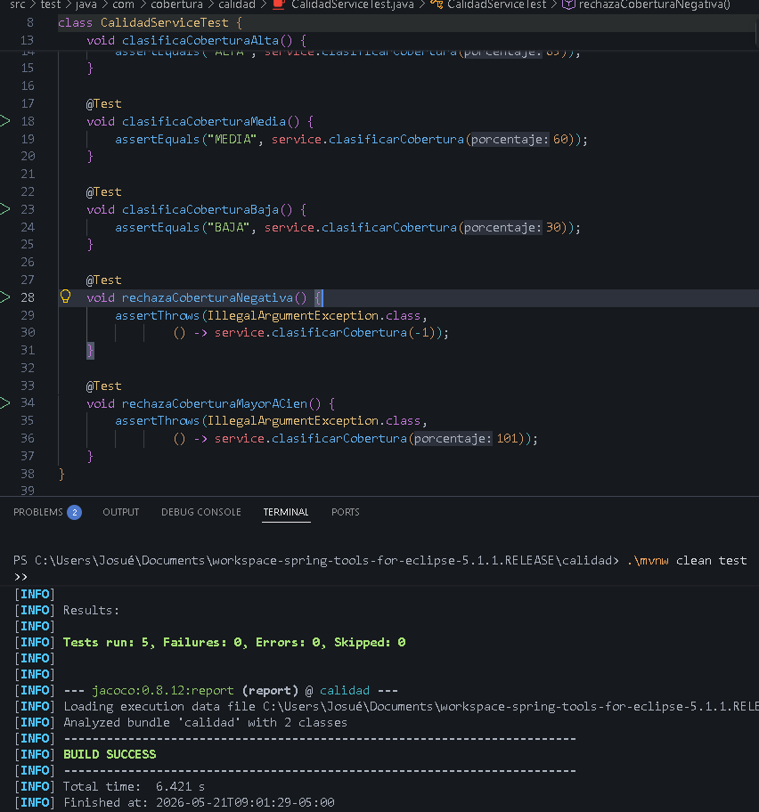
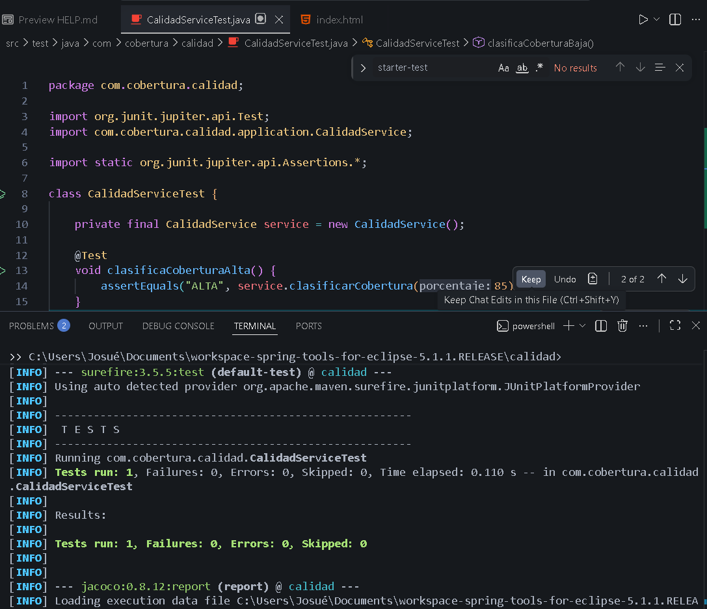

# Reporte de Pruebas - Sesión 14: Cobertura de código y calidad

## Objetivo
Evaluar la calidad del banco de pruebas mediante cobertura de código, identificar zonas no cubiertas y mejorar las pruebas unitarias e integrales de una aplicación Spring Boot. Además, generar un reporte de cobertura con JaCoCo, interpretar los resultados y asegurar que el código cumpla con los estándares mínimos definidos en el `pom.xml`.

## Arquitectura Implementada
El proyecto respeta el diseño y la separación de responsabilidades:
- **Capa Application (Servicios)**: Contiene la lógica de negocio. Se integraron `CalidadService` (clasificador y validador de cobertura) y los servicios de sesiones anteriores (`CalculadoraService`, `NotaService`, `ProductoService`).
- **Capa Pruebas Unitarias/Integración**: Utiliza JUnit 5 para instanciar los servicios y validar la efectividad de cada método público, comprobando todos los caminos de ejecución posibles. Los tests de integración incluyen validaciones adicionales.
- **Herramienta de Cobertura (JaCoCo)**: Configurada mediante Maven para generar un reporte HTML en `target/site/jacoco/index.html` y aplicar una regla estricta de un mínimo de 70% de cobertura de código.

## Pruebas Ejecutadas y Cobertura

Se dividió el proceso en Fases para visualizar cómo impacta la cobertura:

| Fase | Descripción y Propósito | Estado de Cobertura |
| :--- | :--- | :--- |
| **Fase 1 Inicial** | Se creó el `CalidadService` y se probó solo la cobertura `ALTA`. Propósito: Validar que el reporte marcara las ramas de flujo no ejecutadas en color ROJO (por debajo del 50%). | **INCOMPLETA** |
| **Fase 2 Resto de Casos** | Se agregaron las pruebas para cobertura Media, Baja, y manejo de Excepciones (negativas o mayores a 100). | **ALTA (100% sobre CalidadService)** |
| **Fase 3 Sesiones Anteriores** | Se consolidaron los servicios `CalculadoraService`, `NotaService` y `ProductoService` de las simulaciones pasadas para tener un entorno integral con un gran número de clases. | **ALTA (Variado por clase)** |
| **Ejercicio Aplicado** | Se agregó una nueva regla de negocio `esAceptable` al `CalidadService` (retorna verdadero para `>= 70`, de lo contrario falso o Exception) junto con sus test completos (70, 90, 40). | **VERDE (100% en CalidadService)** |

## Interpretación de la Cobertura (Análisis del Ejercicio)
Inicialmente, nuestro `CalidadService` poseía el método `clasificarCobertura` altamente vulnerable a falta de tests ya que la prueba unitaria original sólo pasaba el valor `85` (camino feliz). JaCoCo evidenció mediante el indicador **ROJO** (branches missed) que no se cubrían los flujos condicionales inferiores a 80 y mayores a 100.
**Solución:** Se implementaron aserciones adicionales como `assertEquals("MEDIA", ...)` y `assertThrows(...)`. Como resultado, las líneas y ramas del `CalidadService` mejoraron a un estado 100% de cobertura. Esta misma métrica holística abarcó a los servicios antiguos, superando exitosamente nuestro limitante estricto global del `70%`.

## Resultados de Ejecución (mvn test)

El reporte general indicó el éxito transversal de la suite de pruebas debido a que sobrepasó la regla mínima estipulada en el `COVEREDRATIO`.

```text
[INFO] -------------------------------------------------------
[INFO]  T E S T S
[INFO] -------------------------------------------------------
[INFO] Running com.cobertura.calidad.CalidadServiceTest
...
[INFO] 
[INFO] Results:
[INFO] 
[INFO] Tests run: 19, Failures: 0, Errors: 0, Skipped: 0
[INFO] 
[INFO] --- jacoco:0.8.12:report (report) @ calidad ---
[INFO] Loading execution data file C:\...\target\jacoco.exec
[INFO] Analyzed bundle 'calidad' with 4 classes
[INFO] 
[INFO] --- jacoco:0.8.12:check (check) @ calidad ---
[INFO] Loading execution data file C:\...\target\jacoco.exec
[INFO] Analyzed bundle 'calidad' with 4 classes
[INFO] All coverage checks have been met.
[INFO] ------------------------------------------------------------------------
[INFO] BUILD SUCCESS
[INFO] ------------------------------------------------------------------------
```

## Evidencias Fotográficas
**(Se encuentran alojadas en el directorio `docs/`)**

1. **Captura del BUILD SUCCESS en la Terminal de las pruebas finales:**
  

2. **Captura evidenciando la Cobertura Inicial deficiente en el reporte:**
  

3. **Captura evidenciando la Cobertura Final completa (target/site/jacoco/index.html):**
  *(Por favor, agrega una captura y nombrala `cobertura-final.png` en el archivo docs/)*

4. **Capturas de las pruebas y métodos agregados en el editor (Ejercicio aplicado):**
  *(Toma captura de CalidadService.java y CalidadServiceTest.java mostrando el nuevo método y renómbra a `captura-ejercicio-aplicado.png` en docs/)*

5. **Commit/Pull Request en GitHub:**
  *(Aún pendiente a realizar mediante git CLI o cliente gráfico, la imagen deberá ser `captura-git-pull.png`)*
