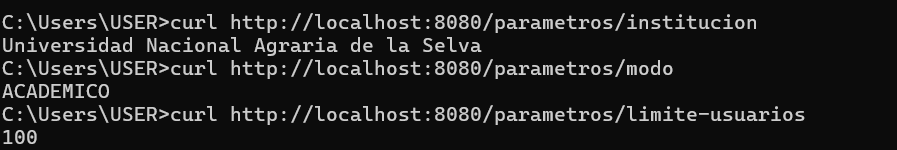
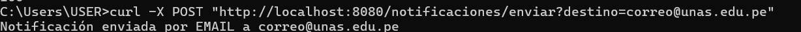
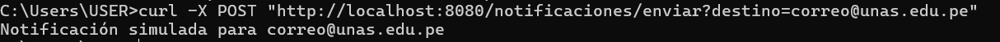
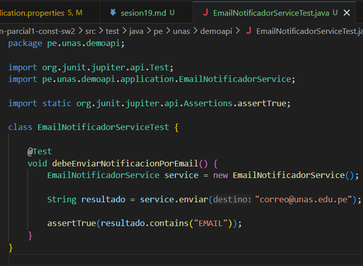
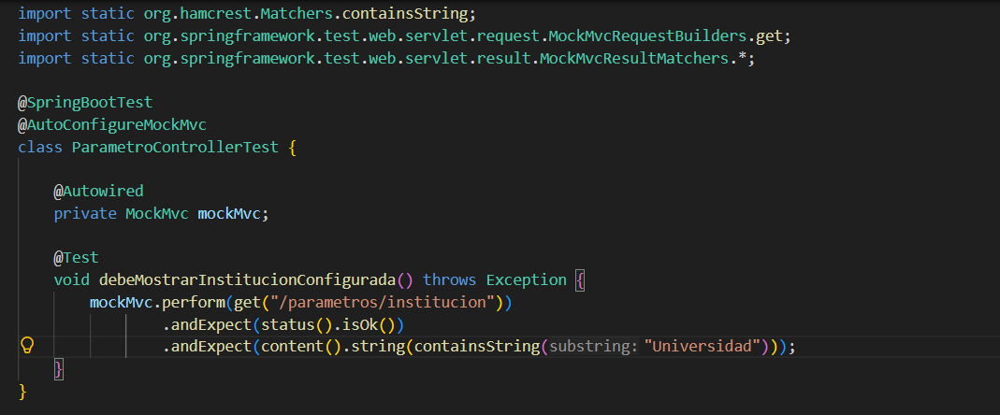
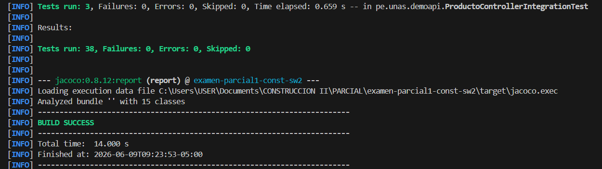
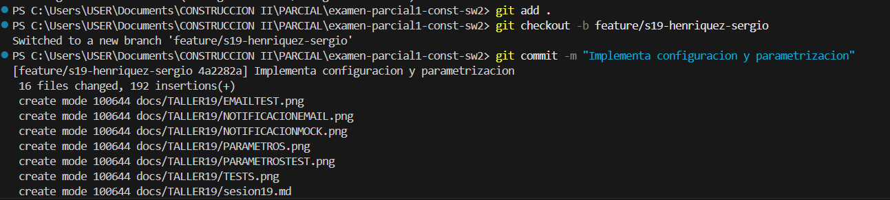
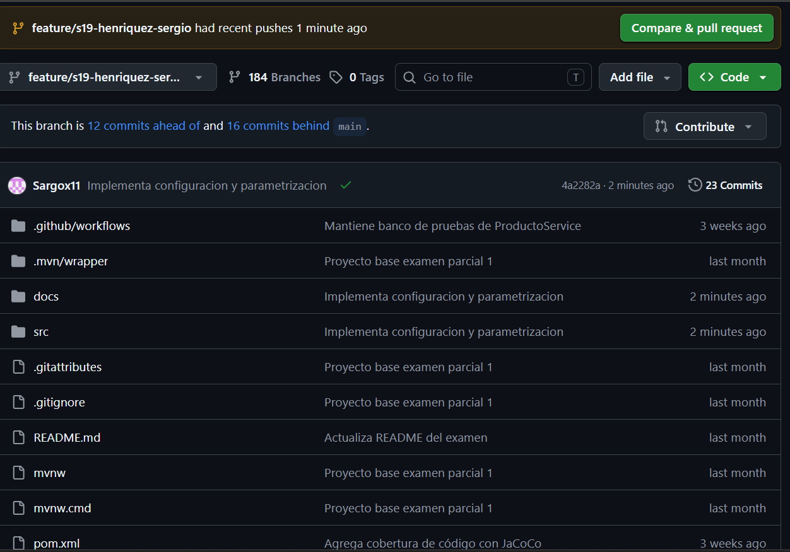

# Reporte de Pruebas - Sesión 19

## Pruebas ejecutadas
- EmailNotificadorServiceTest
- ParametroControllerTest

## Resultado
BUILD SUCCESS

## Evidencias
-	Captura de endpoints /parametros funcionando.
-	Captura de notificación con proveedor email.
-	Captura de notificación con proveedor mock.
-	Captura de ./mvnw test con BUILD SUCCESS.
-	Commit y Pull Request en GitHub.

## Conclusión
La configuración y parametrización permiten que el software sea flexible, mantenible y adaptable a distintos entornos sin recompilar ni modificar el código fuente. Esta práctica conecta la variabilidad del software con la construcción profesional de sistemas empresariales.