# Contenedores y despliegue - Sesión 20

## Productos
- Imagen Docker
- Contenedor ejecutandose 

## Resultado
BUILD SUCCESS

## Evidencias
-	Captura de ./mvnw test exitoso.
-	Captura de ./mvnw clean package -DskipTests.
-	Captura de docker build exitoso.
-	Captura de docker ps mostrando el contenedor activo.
-	Captura de curl al endpoint funcionando.
-	Archivo Dockerfile y docker-compose.yml en el repositorio.
-	Commit y push en rama feature/apellido_nombre.

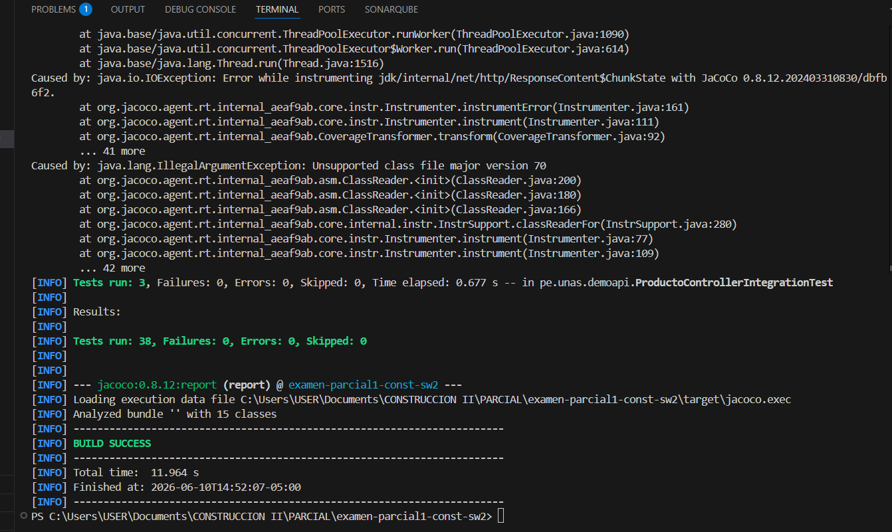
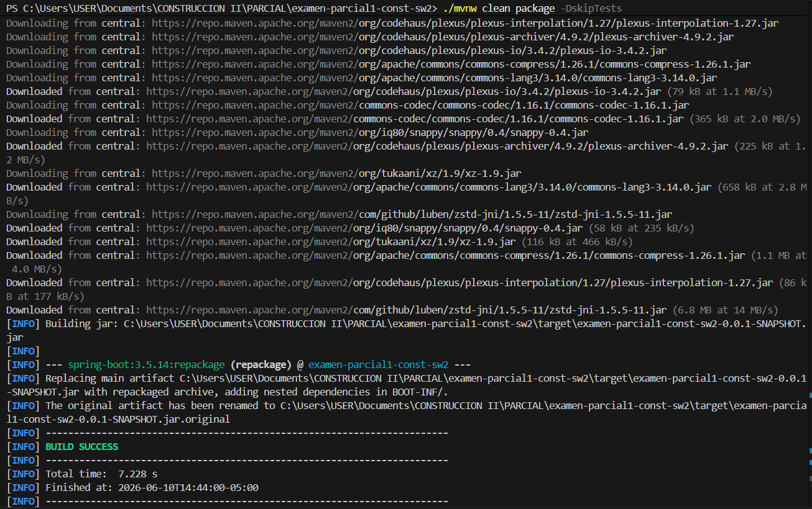 
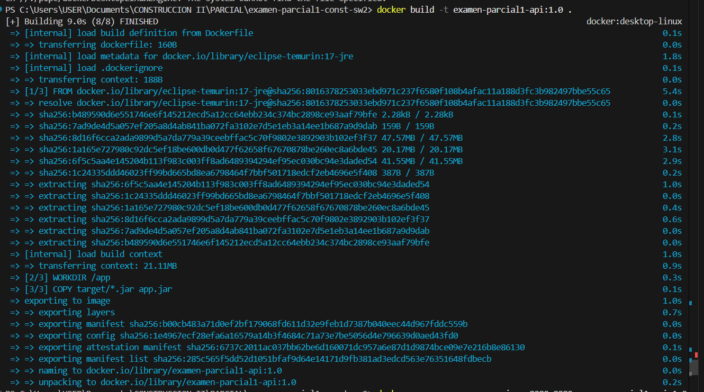 
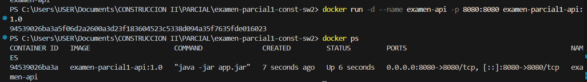 
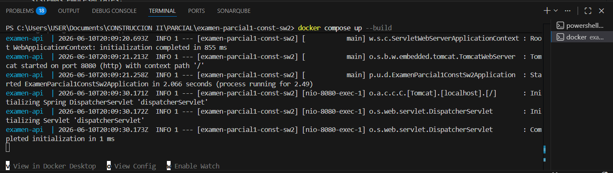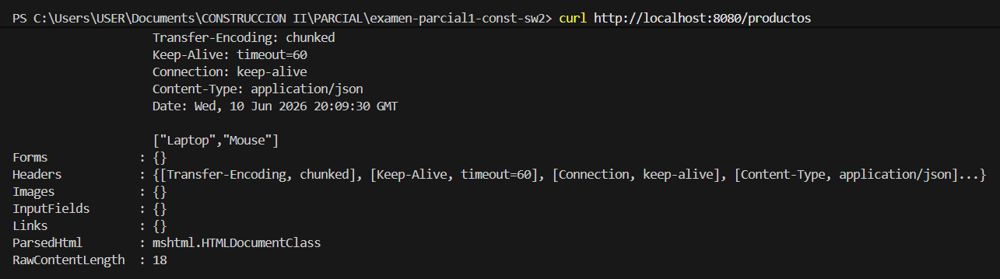 
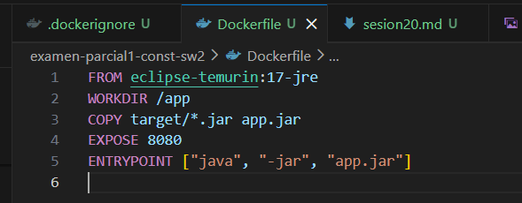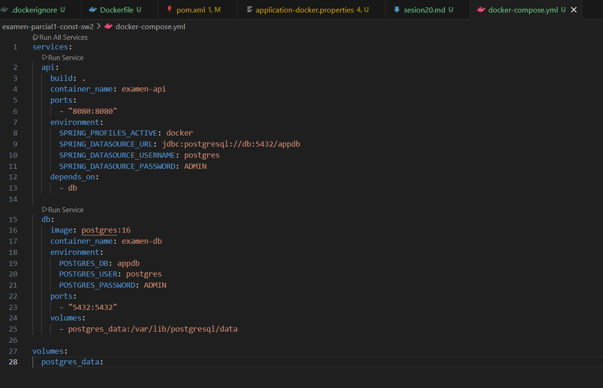 
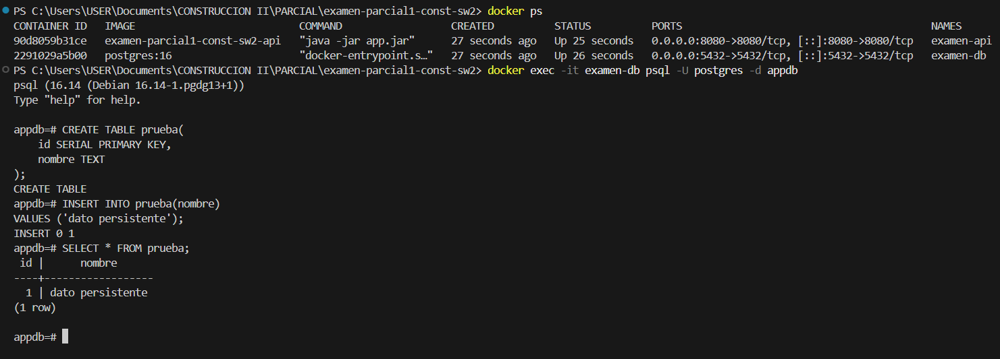 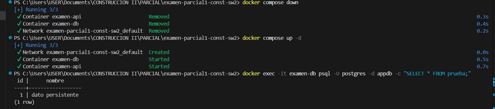
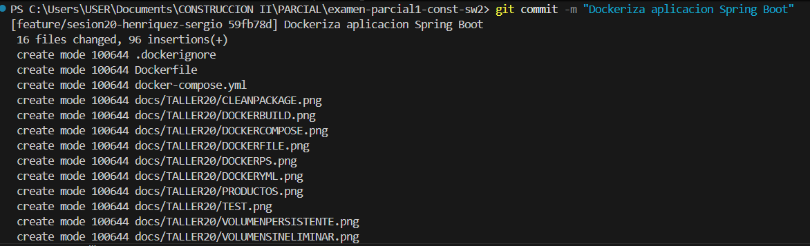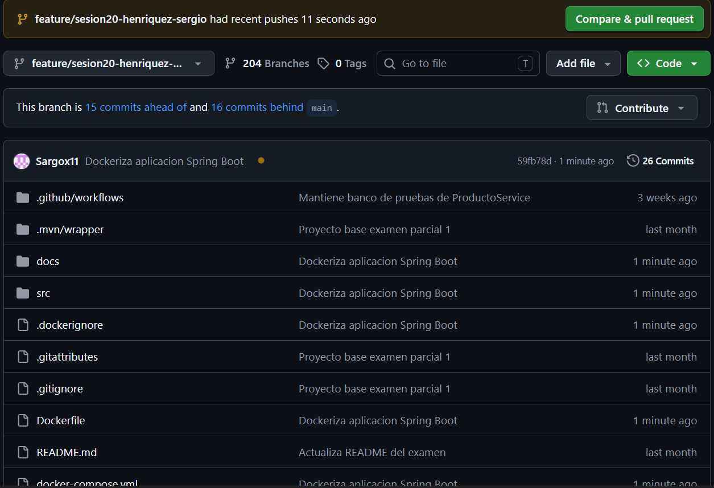 

## Conclusión
Desplegar software no es solamente ejecutar codigo; es hacerlo reproducible, verificable y portable. Un contenedor permite que la aplicacion funcione igual en la PC del estudiante, en el laboratorio y en un servidor.