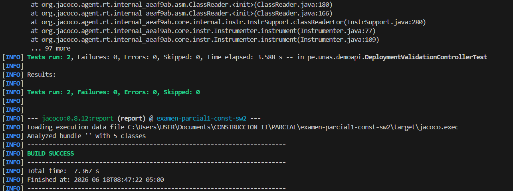
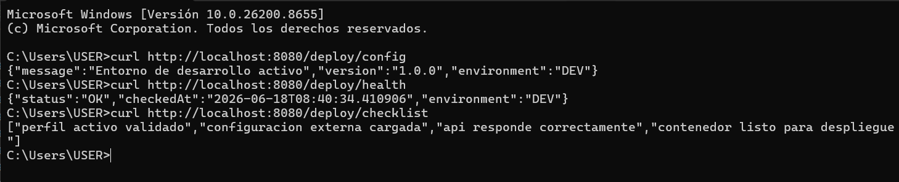
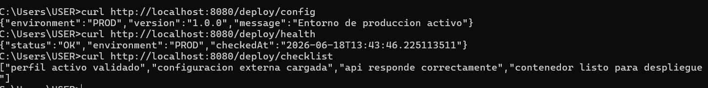
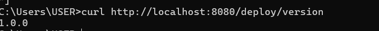

# Validacion de configuracion y despliegue

## Perfil validado
- dev: ejecutado localmente
- prod: ejecutado en Docker

## Endpoints verificados
- GET /deploy/config
- GET /deploy/health
- GET /deploy/checklist
- GET /deploy/version

## Evidencias
- Captura de mvn test
- Captura de docker ps
- Captura de curl /deploy/config
- Commit y Pull Request

## Conclusion
Una aplicacion no esta lista para liberarse solo porque compila. Debe demostrar que su configuracion es correcta, que responde en el entorno esperado, que puede ejecutarse en contenedor y que existe evidencia tecnica del despliegue.