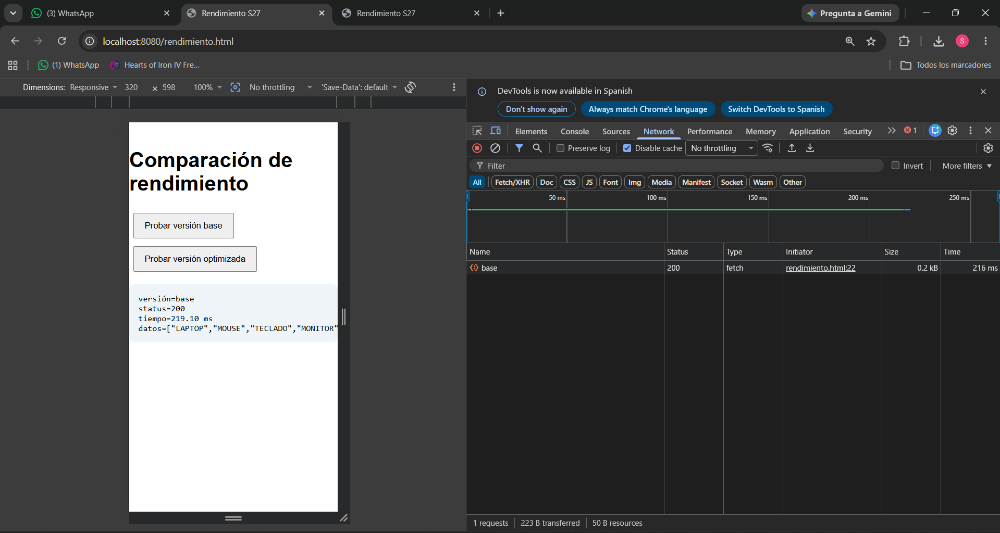
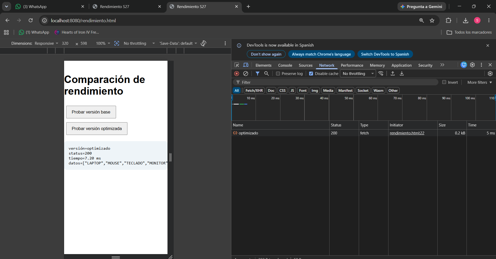
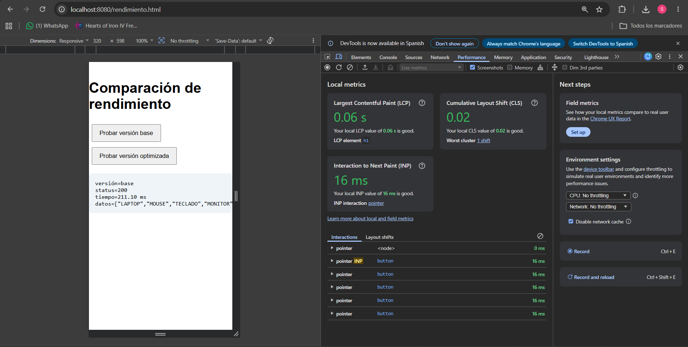
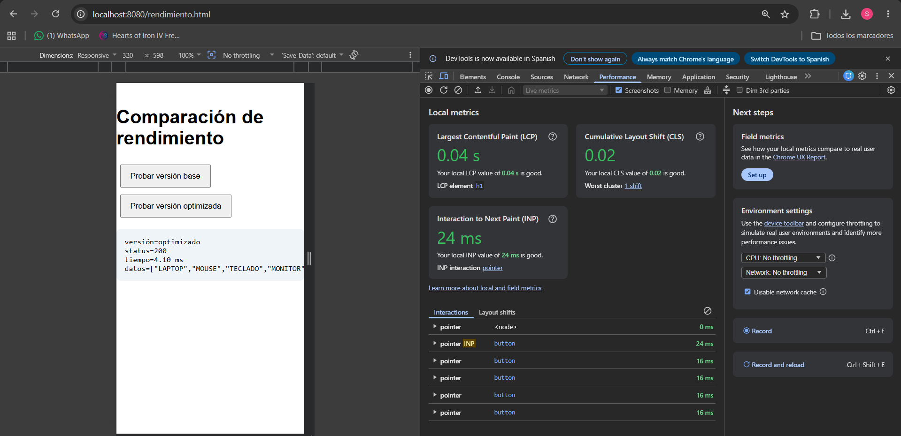
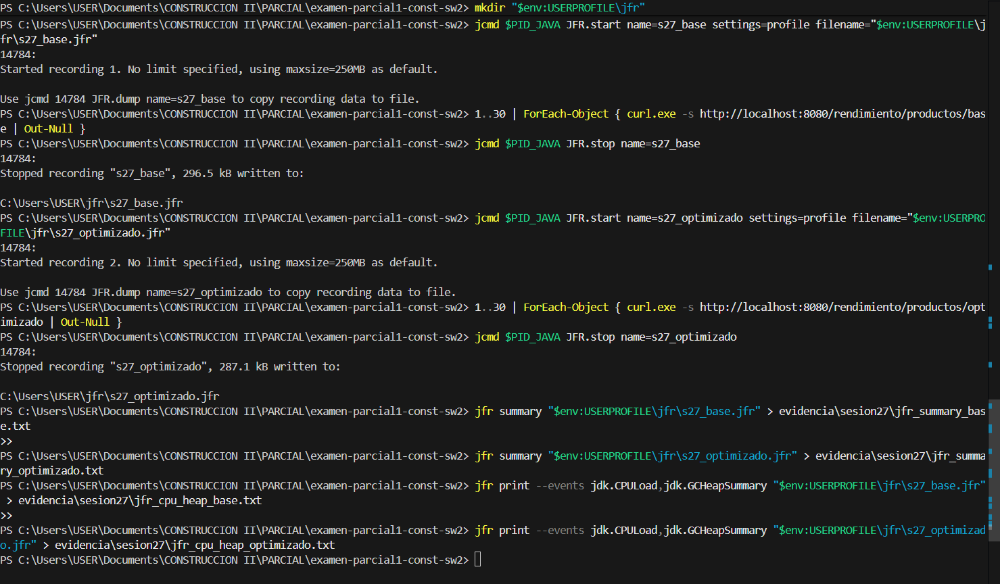
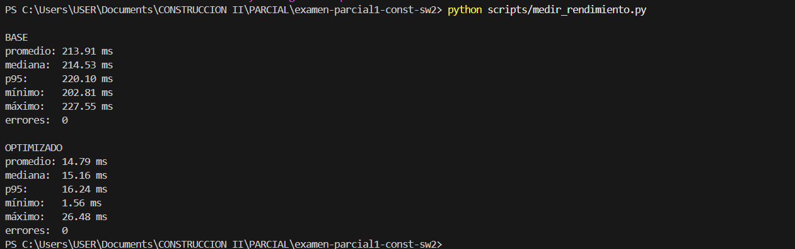

# Reporte técnico - Sesión 27

## 1. Escenario

- Endpoint base: `/rendimiento/productos/base`
- Endpoint optimizado: `/rendimiento/productos/optimizado`
- Frontend: `/rendimiento.html`
- Dataset: lista simulada de 5 productos.
- Repeticiones: 5 llamadas de calentamiento y 30 mediciones por endpoint.
- Equipo/entorno: Windows, Java 17, Spring Boot, Chrome DevTools y Java Flight Recorder.
- Commit evaluado: completar después del commit final.

## 2. Hipótesis inicial

Se espera que el endpoint base tenga mayor latencia porque incluye una espera controlada de 200 ms mediante `Thread.sleep(200)` y transforma la lista de productos en cada solicitud.

El endpoint optimizado debería responder más rápido porque elimina la espera artificial y reutiliza una lista previamente procesada. Por ello, se espera que el p95 del endpoint optimizado sea menor que el p95 del endpoint base.

## 3. Resultados

| Versión | Promedio | Mediana | p95 | Errores | CPU | Heap |
|---|---:|---:|---:|---:|---:|---:|
| Base | 213.91 ms | 214.53 ms | 220.10 ms | 0 | JVM baja, pico aislado de máquina 33.26% | Sin crecimiento anormal observado |
| Optimizada | 14.79 ms | 15.16 ms | 16.24 ms | 0 | JVM baja, pico aislado de máquina 26.97% | Sin crecimiento anormal observado |

Mejora porcentual usando p95:

Mejora porcentual = ((p95_base - p95_optimizado) / p95_base) × 100

Mejora porcentual = ((220.10 - 16.24) / 220.10) × 100

Mejora porcentual = 92.62 %

El p95 disminuyó de 220.10 ms a 16.24 ms, lo que representa una mejora aproximada del 92.62 %. No se registraron errores HTTP en ninguna de las dos versiones.

## 4. Evidencias
- Captura DevTools Network.  
- Captura Performance.   
- Captura VisualVM/JFR. 
- Salida de medir_rendimiento.py. 

## 5. Conclusión

El cuello de botella principal se encuentra en el backend. La versión base presenta mayor latencia porque contiene una espera controlada de 200 ms mediante `Thread.sleep(200)` y realiza procesamiento repetido al transformar la lista de productos en cada solicitud.

La versión optimizada elimina la espera artificial y reutiliza una lista previamente procesada. Como resultado, el p95 disminuyó de 220.10 ms a 16.24 ms, logrando una mejora aproximada del 92.62 %.

Las evidencias de Chrome DevTools muestran que el frontend no presenta bloqueo significativo. La diferencia principal se observa en Network y en el script automatizado, donde la versión base tarda mucho más que la versión optimizada.

La evidencia de Java Flight Recorder confirma el diagnóstico, ya que la versión base registró múltiples eventos `ThreadSleep`, mientras que la versión optimizada casi no presentó este comportamiento. Además, no se observó carga sostenida alta de CPU ni crecimiento anormal de memoria.

Por lo tanto, se cumple el criterio de éxito de la práctica: el p95 del endpoint optimizado es menor que el p95 del endpoint base y no se registraron errores HTTP.