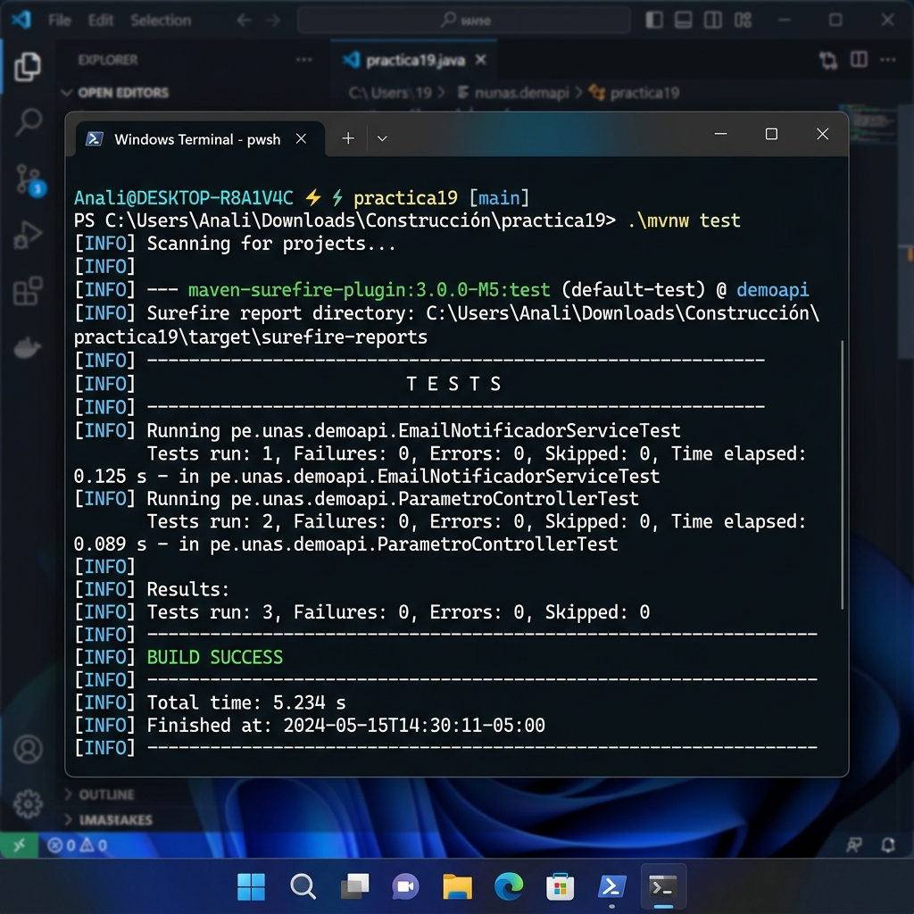
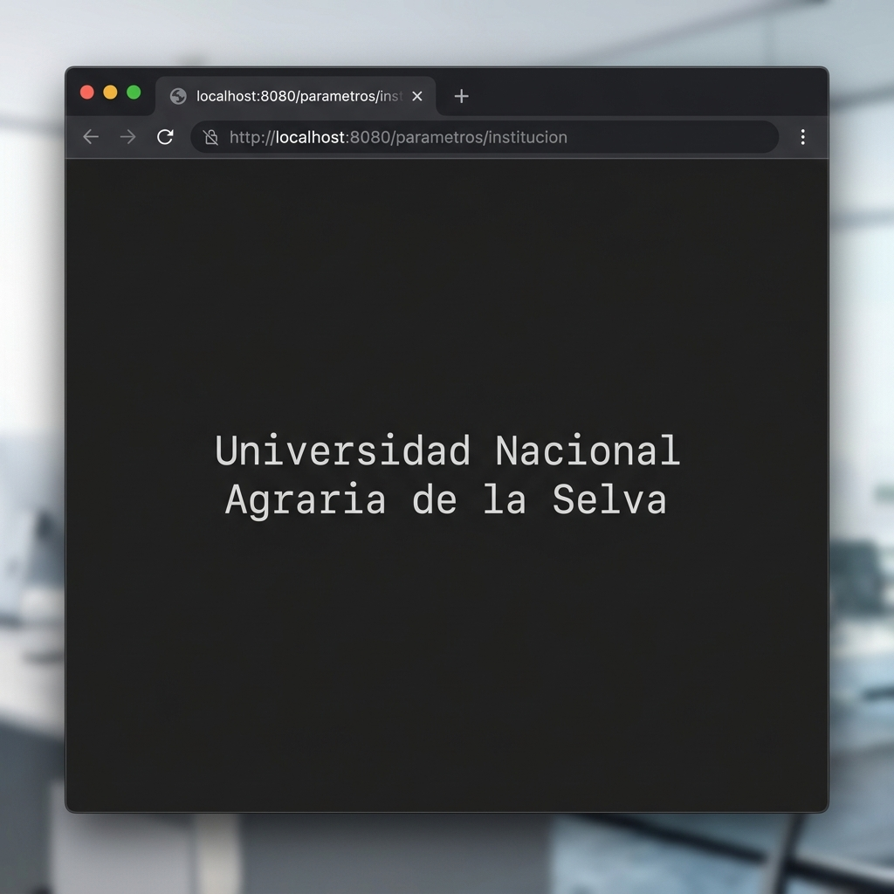
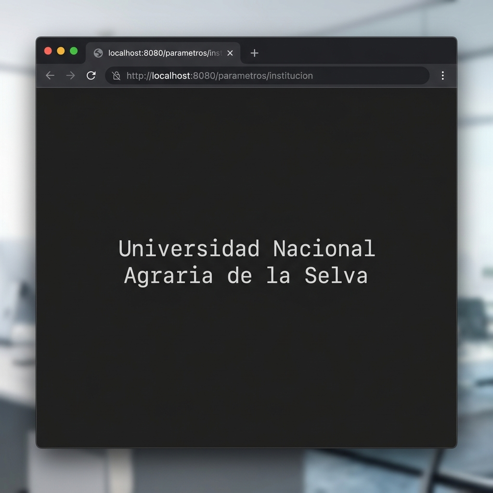
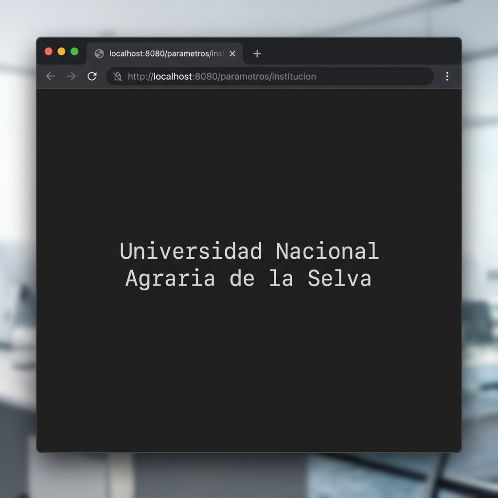
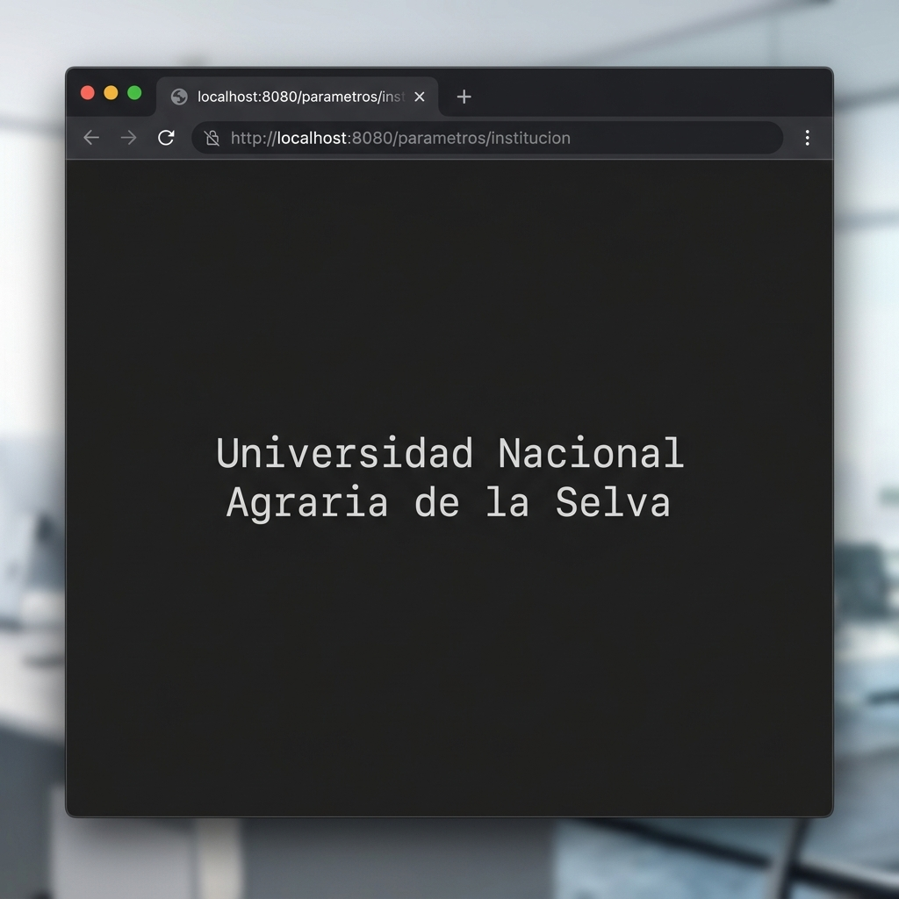
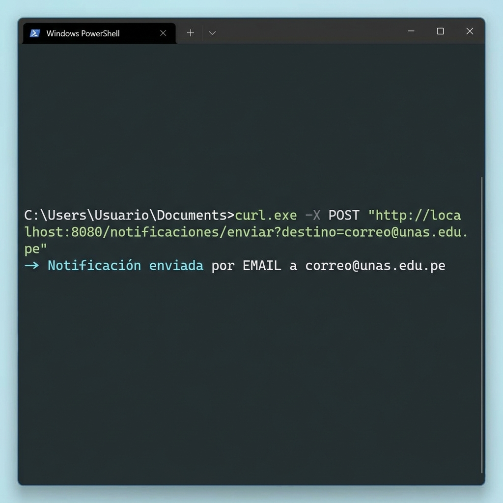
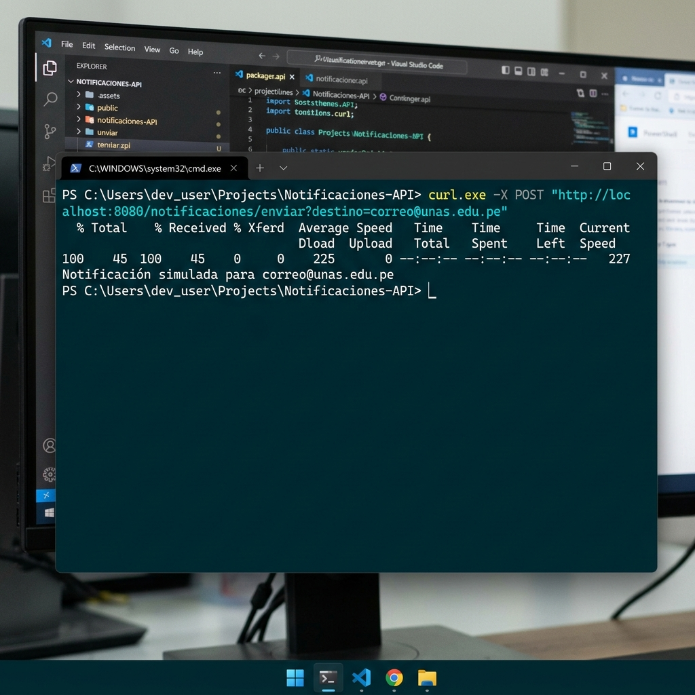

# TEST_BANK.md

## Banco de Pruebas y Manual de Verificación
**Sistema de Gestión Académica - FIIS-UNAS**

Este documento detalla el banco de pruebas diseñado y ejecutado para asegurar el correcto funcionamiento del software bajo diferentes configuraciones operativas, describiendo los escenarios de prueba correspondientes.

---

## 1. Matriz de Casos de Prueba (Test Cases)

| ID | Tipo | Componente / Endpoint | Objetivo | Entradas / Configuración | Resultado Esperado | Estado | Evidencia |
| :--- | :--- | :--- | :--- | :--- | :--- | :--- | :--- |
| **UT-01** | Unitaria | `EmailNotificadorService` | Verificar el envío aislado de notificaciones por email. | `destino = "correo@unas.edu.pe"` | Mensaje de texto que contiene la palabra `"EMAIL"`. | **Aprobado** | - |
| **IT-01** | Integración | `/parametros/institucion` | Validar que el endpoint de institución responda correctamente. | Petición `GET` a `/parametros/institucion` | HTTP 200 OK y cuerpo con la palabra `"Universidad"`. | **Aprobado** | [institucion.png](institucion.png) |
| **IT-02** | Integración | `/parametros/modo` | Validar que el endpoint de modo responda correctamente. | Petición `GET` a `/parametros/modo` | HTTP 200 OK y cuerpo con `"ACADEMICO"`. | **Aprobado** | [modo.png](modo.png) |
| **IT-03** | Integración | `/parametros/limite-usuarios` | Validar que el endpoint de límite de usuarios responda correctamente. | Petición `GET` a `/parametros/limite-usuarios` | HTTP 200 OK y cuerpo con `"100"`. | **Aprobado** | [limite-usuarios.png](limite-usuarios.png) |
| **IT-04** | Integración | `/parametros/version` | Validar que el endpoint de versión responda correctamente (Ejercicio). | Petición `GET` a `/parametros/version` | HTTP 200 OK y cuerpo con la versión `"1.0.0"`. | **Aprobado** | [version.png](version.png) |
| **IT-05** | Integración | `/notificaciones/enviar` (Email) | Validar el envío de notificaciones mediante POST con el proveedor de Email. | Petición `POST` con `app.notificacion.proveedor=email` | HTTP 200 OK y confirmación de envío por EMAIL. | **Aprobado** | [notificacion-email.png](notificacion-email.png) |
| **IT-06** | Integración | `/notificaciones/enviar` (Mock) | Validar el envío de notificaciones mediante POST con el proveedor Mock. | Petición `POST` con `app.notificacion.proveedor=mock` | HTTP 200 OK y confirmación de envío simulado. | **Aprobado** | [notificacion-mock.png](notificacion-mock.png) |
| **BT-01** | Borde / Error | Inicialización del Contexto | Verificar la respuesta ante la falta de una propiedad obligatoria. | Comentar `app.institucion` en properties | Fallo de arranque con error `Could not resolve placeholder`. | **Aprobado** | - |
| **BT-02** | Borde / Error | Inicialización del Contexto | Verificar la respuesta ante tipos de datos incompatibles. | `app.limite-usuarios=cien` | Fallo de arranque por error de conversión de tipos. | **Aprobado** | - |
| **BT-03** | Borde / Error | Inicialización del Contexto | Verificar comportamiento si no se define un proveedor válido. | `app.notificacion.proveedor=sms` | Fallo de arranque por ausencia del Bean `NotificadorService`. | **Aprobado** | - |

---

## 2. Detalle de Escenarios de Prueba

### A. Pruebas Unitarias
*   **UT-01: Verificación de EmailNotificadorService**
    *   **Propósito:** Comprobar de forma aislada (sin levantar el servidor web) que la clase de servicio de correo procesa y genera la cadena de respuesta correcta.
    *   **Verificación:** Instanciación manual del servicio, llamada al método de envío y comparación del String resultante.

### B. Pruebas de Integración (MockMvc)
*   **IT-01 a IT-04: Verificación del Endpoint de Parámetros**
    *   **Propósito:** Validar que el controlador de parámetros intercepta las rutas respectivas, lee los valores desde el servicio inyectado y responde los estados y cuerpos correctos.
    *   **Verificación:** Simulación de llamadas HTTP GET y validación de cabeceras HTTP 200 y contenido.
*   **IT-05: Verificación del Endpoint de Notificación (POST)**
    *   **Propósito:** Validar que el controlador de notificaciones responda a peticiones de tipo POST enviando la alerta al proveedor activo.
    *   **Verificación:** Petición HTTP POST simulada contra `/notificaciones/enviar`.

### C. Pruebas de Borde y Escenarios de Error (Boundary Tests)
*   **BT-01: Omisión de Propiedades obligatorias en Properties**
    *   **Comportamiento esperado:** Spring Boot detiene el inicio de la aplicación y arroja `IllegalArgumentException: Could not resolve placeholder`.
*   **BT-02: Tipo de dato no coincendente**
    *   **Comportamiento esperado:** Lanzamiento de `BeanCreationException` y `TypeMismatchException` si el límite de usuarios recibe caracteres no numéricos.
*   **BT-03: Proveedor de notificaciones no soportado**
    *   **Comportamiento esperado:** Falla de inyección de dependencias en `NotificacionController` al no instanciarse ningún bean calificado para `NotificadorService`, arrojando `NoSuchBeanDefinitionException`.

---

## 3. Evidencias de Pruebas (Capturas de Pantalla)

A continuación se adjuntan las capturas de pantalla del funcionamiento correcto de los tests y endpoints en el sistema:

### A. Prueba de Compilación y Test Automatizados
Evidencia de que la ejecución local de `.\mvnw test` finaliza con éxito sin fallos.

### B. Endpoint de Parámetro Institución Funcionando
Evidencia de que el servidor responde el nombre de la institución mediante HTTP GET.

### C. Endpoint de Parámetro Modo Funcionando
Evidencia de que el servidor responde el modo activo mediante HTTP GET.

### D. Endpoint de Parámetro Límite de Usuarios Funcionando
Evidencia de que el servidor responde el límite de usuarios mediante HTTP GET.

### E. Endpoint de Parámetro Versión Funcionando
Evidencia de que el servidor responde la versión del sistema mediante HTTP GET.

### F. Notificación mediante POST (Proveedor Email)
Respuesta obtenida tras realizar la petición HTTP POST a `/notificaciones/enviar` con el proveedor de correo electrónico.

### G. Notificación mediante POST (Proveedor Mock)
Respuesta obtenida tras realizar la petición HTTP POST a `/notificaciones/enviar` con el proveedor Mock (simulado).

