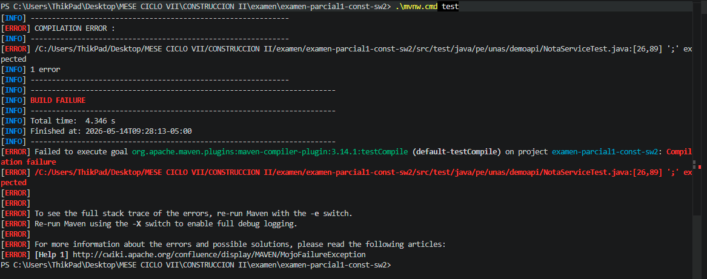
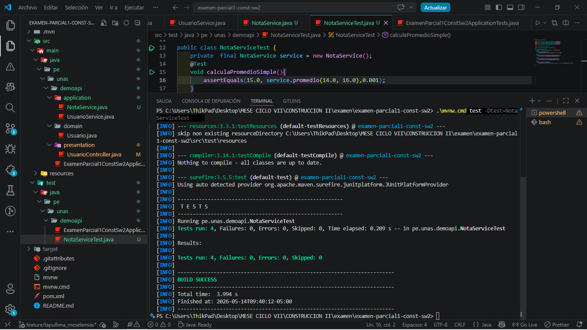
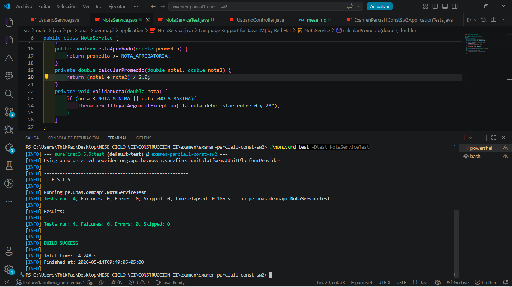
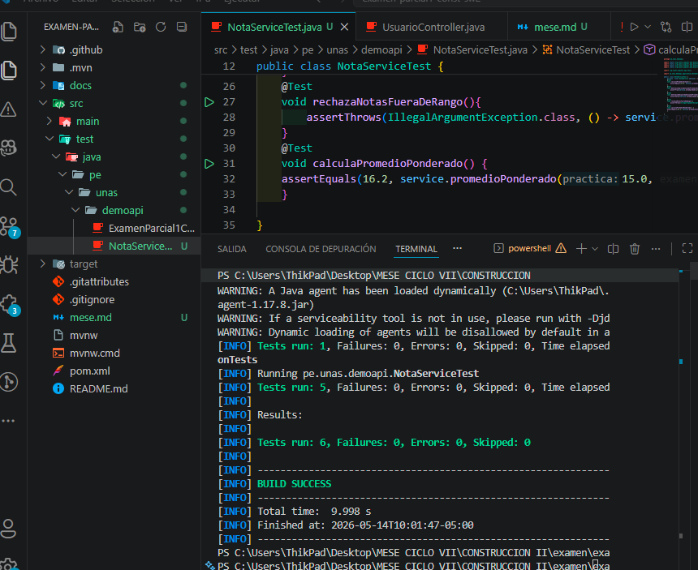

Fase RED: escribir primero la prueba

Fase GREEN: implementar el código mínimo

Fase REFACTOR: mejorar sin romper pruebas

Ejercicio aplicado: nuevo ciclo TDD

-------------------------------------------------------------------------------
Test set: pe.unas.demoapi.ExamenParcial1ConstSw2ApplicationTests
-------------------------------------------------------------------------------
Tests run: 1, Failures: 0, Errors: 0, Skipped: 0, Time elapsed: 5.328 s -- in pe.unas.demoapi.ExamenParcial1ConstSw2ApplicationTests
-------------------------------------------------------------------------------
Test set: pe.unas.demoapi.NotaServiceTest
-------------------------------------------------------------------------------
Tests run: 5, Failures: 0, Errors: 0, Skipped: 0, Time elapsed: 0.074 s -- in pe.unas.demoapi.NotaServiceTest