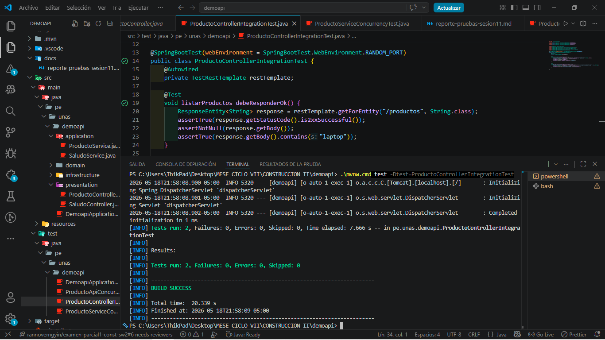
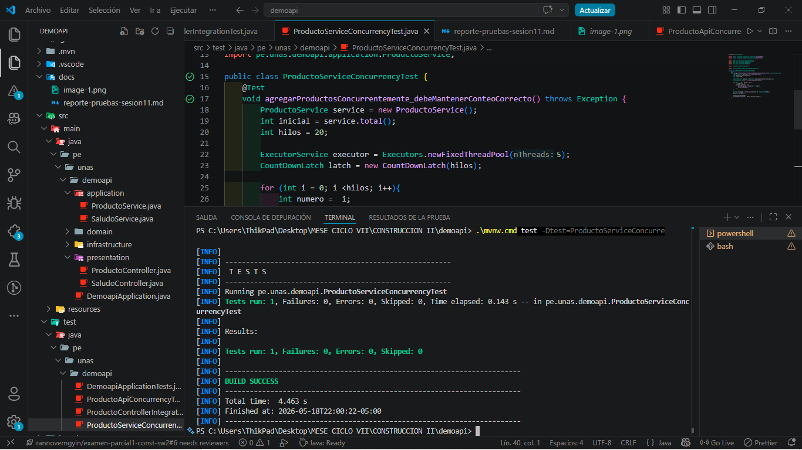
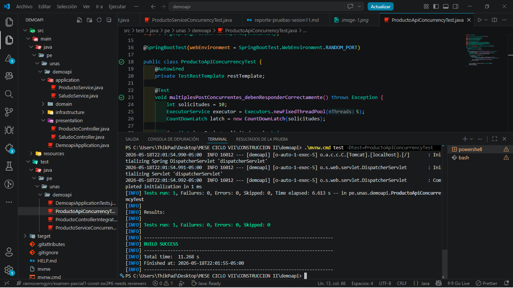
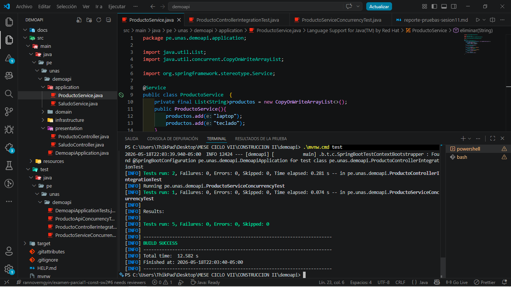
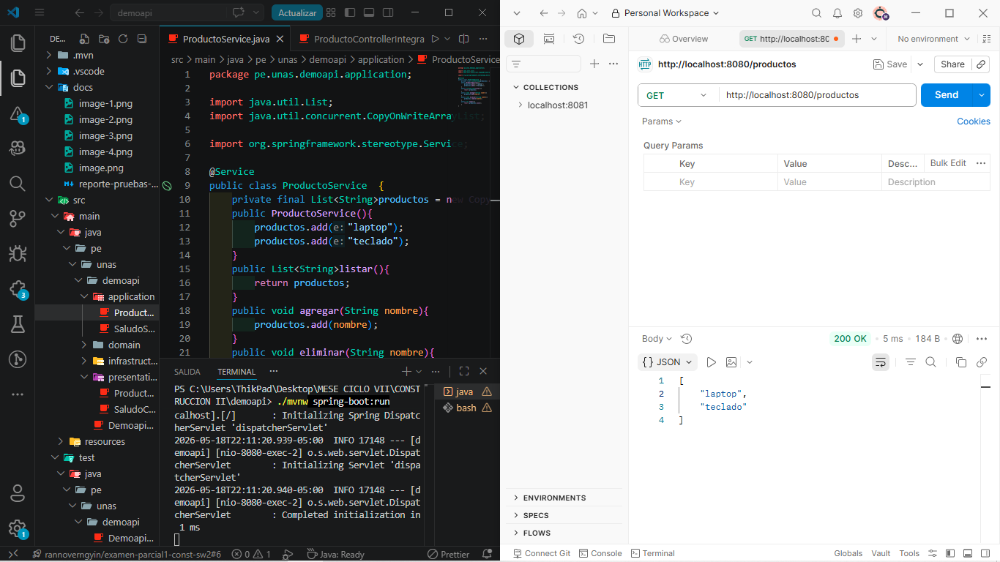

# Reporte de Evidencias - Sesion 11

## 1. Objetivo
Validar el comportamiento del modulo de productos en tres niveles:
1. Integracion de endpoints REST.
2. Concurrencia en la capa de servicio.
3. Concurrencia por llamadas HTTP al API.

## 2. Contexto del problema encontrado
Durante la sesion se detecto que varias pruebas fallaban porque el endpoint /productos no estaba expuesto por un controlador.

Efecto observado:
1. Las pruebas de integracion y API devolvian error por ruta no encontrada.
2. La prueba de servicio no dependia del controlador y podia pasar por separado.

## 3. Correcciones aplicadas
Se realizaron ajustes para alinear implementacion y pruebas:
1. Se implemento ProductoController con endpoints:
    - GET /productos para listar productos.
    - POST /productos?nombre=... para agregar un producto.
2. Se normalizaron textos y rutas en pruebas para que coincidan con el contrato del API.

## 4. Evidencias visuales de ejecucion
### 4.1 ProductoControllerIntegrationTest

### 4.2 ProductoServiceConcurrencyTest

### 4.3 ProductoApiConcurrencyTest

### 4.4 Ejecucion completa de pruebas

### 4.5 Verificacion manual de endpoint /productos

## 5. Resultado final
Estado final de la suite:
1. Tests run: 5
2. Failures: 0
3. Errors: 0
4. Skipped: 0

