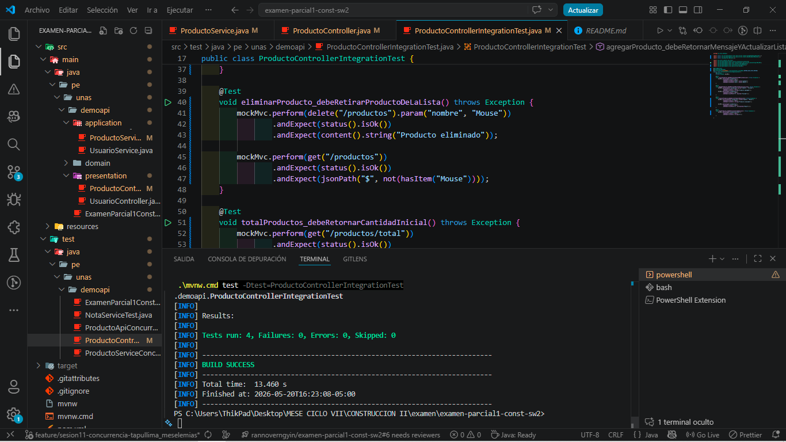
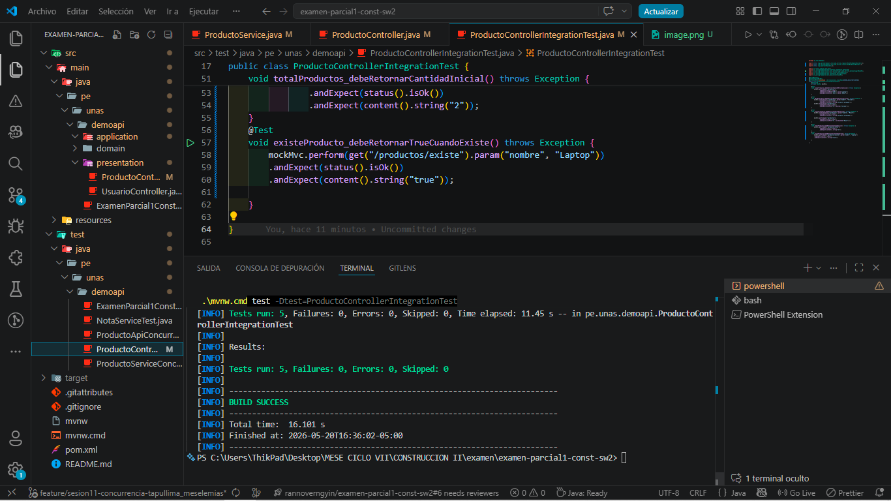
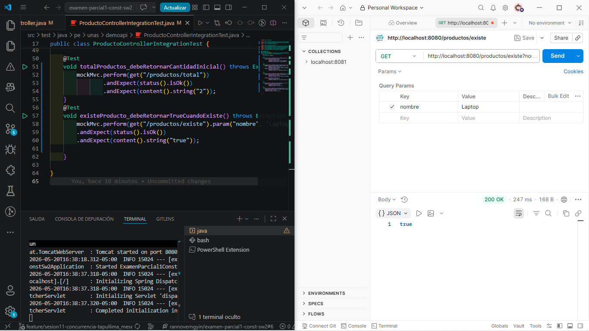
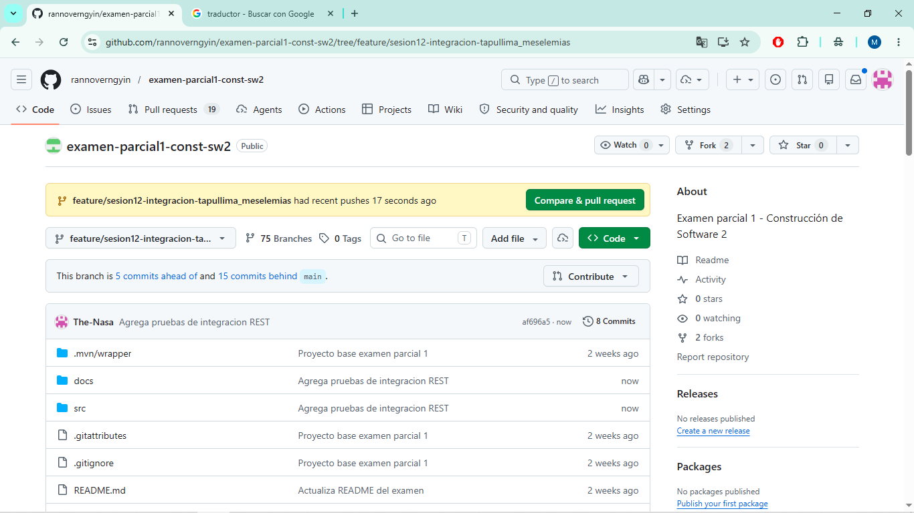

Evidencias visuales y salida de ejecución

### Capturas 

- ProductoControllerIntegrationTest (terminal con tests):



- Resultado con test adicional (`existe`):



- Prueba manual del endpoint `/productos/existe` (Postman/HTTP client):



```
[INFO] Tests run: 5, Failures: 0, Errors: 0, Skipped: 0
[INFO]
[INFO] Results:
[INFO]
[INFO] Tests run: 5, Failures: 0, Errors: 0, Skipped: 0
[INFO]
[INFO] ------------------------------------------------------------------------
[INFO] BUILD SUCCESS
[INFO] ------------------------------------------------------------------------
[INFO] Total time:  18.378 s
[INFO] Finished at: 2026-05-20T16:21:49-05:00
[INFO] ------------------------------------------------------------------------
```

### Captura del repositorio y commit



### Breve explicación del flujo
MockMvc simula peticiones HTTP hacia `ProductoController`, el cual delega la lógica en `ProductoService`. Las pruebas validan respuestas HTTP (status), contenido (JSON o texto) y cambios en la lista de productos.
---
