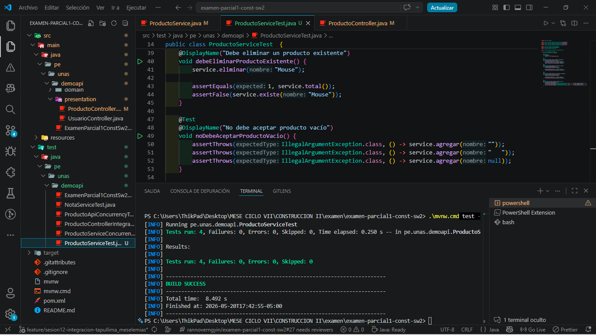
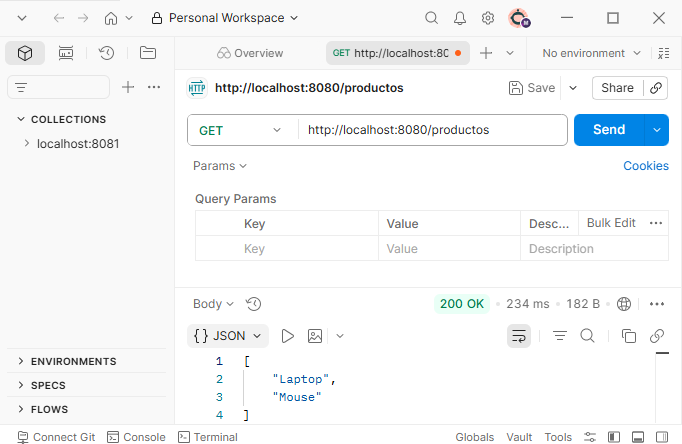
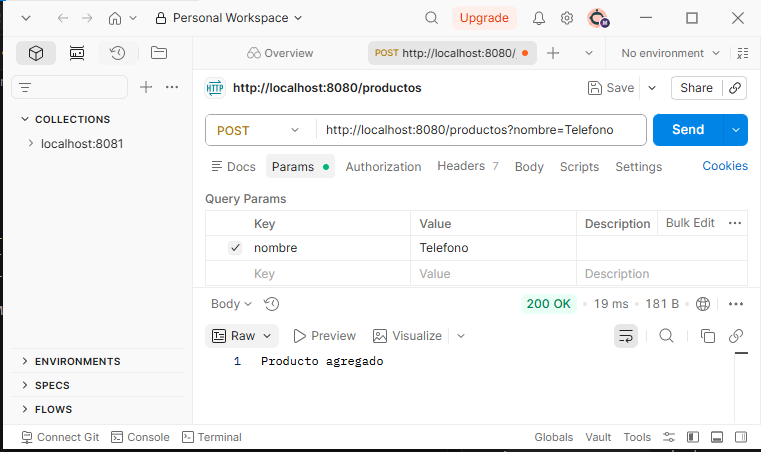
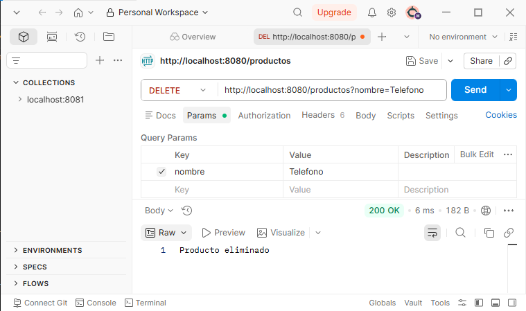
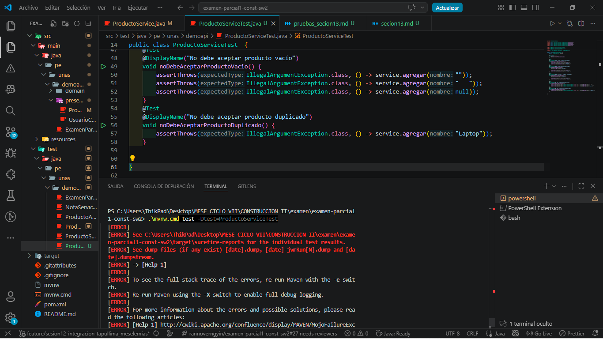
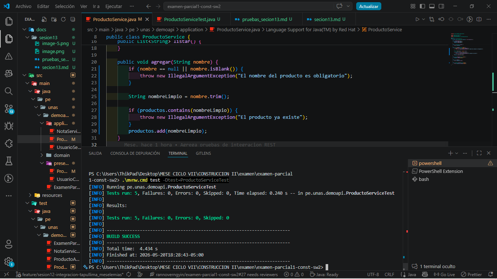

# Banco de pruebas – Sesión 13

## Módulo evaluado
ProductoService

## Casos de prueba

| ID | Caso de prueba | Prioridad | Resultado esperado |
|----|----------------|-----------|--------------------|
| PU-01 | Listar productos iniciales | Alta | Retorna Laptop y Mouse |
| PU-02 | Agregar producto válido | Alta | Incrementa total y producto existe |
| PU-03 | Eliminar producto existente | Media | Reduce total y producto ya no existe |
| PU-04 | Rechazar producto vacío | Alta | Lanza IllegalArgumentException |

-evidencias de los  casos de pruebas

## Comando de ejecución
./mvnw test
## Evidencia
Captura de BUILD SUCCESS de la prueva ProductoServiceTest.java

## Pruebas con Postman 

3. Peticiones incluidas en la colección:
- GET `http://localhost:8080/productos` — espera JSON con `Laptop` y `Mouse`.

- POST `http://localhost:8080/productos` — body form `nombre=Telefono` — espera `producto agregado`.

- DELETE `http://localhost:8080/productos` — body form `nombre=Telefono` — espera `Producto eliminado`.

- Ejercicio Aplicado

