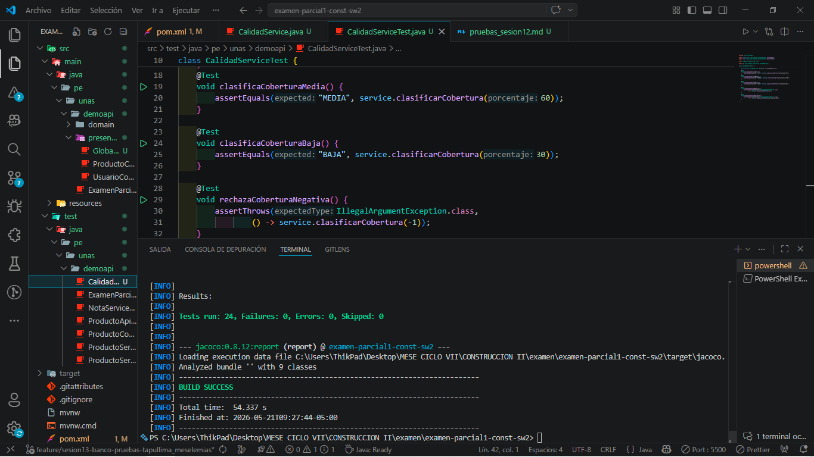
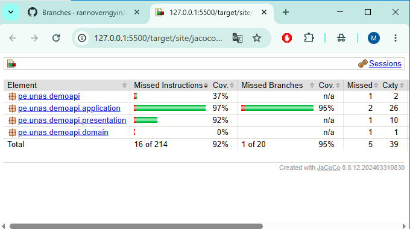
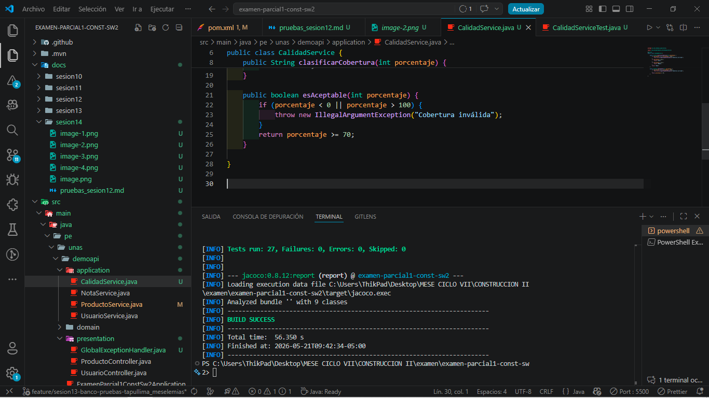
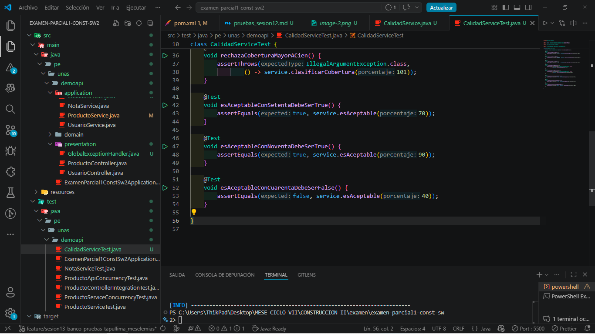
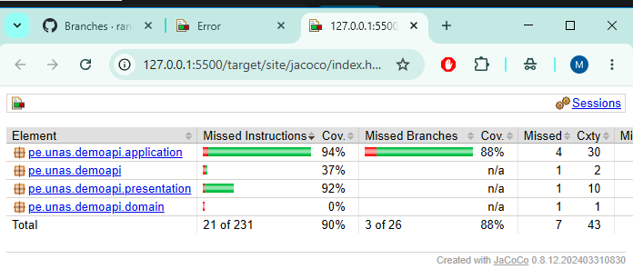

# Evidencias de la sesión 14

## 1. Ejecución de pruebas
Captura de la ejecución de `./mvnw clean test` con resultado exitoso.

## 2. Reporte de cobertura
El reporte JaCoCo fue generado en `target/site/jacoco/index.html`.

## 3. Código aplicado
Se agregó la nueva regla en `CalidadService` y sus pruebas en `CalidadServiceTest`.

### CalidadService

### CalidadServiceTest

## 4. Resultado de la prueba aplicada
La ejecución de la prueba aplicada se muestra a continuación.

## 5. Interpretación breve
La cobertura mejoró al agregar pruebas para la nueva regla `esAceptable(int porcentaje)` y para los casos de `70`, `90` y `40`. Esto permitió validar el comportamiento esperado en el umbral mínimo de cobertura.