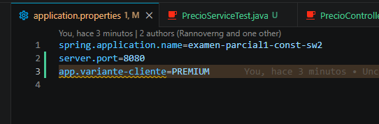
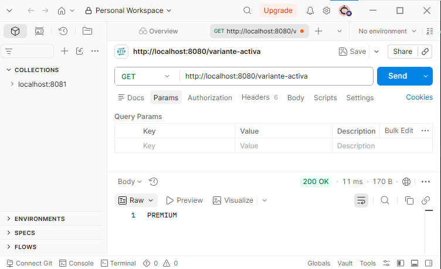
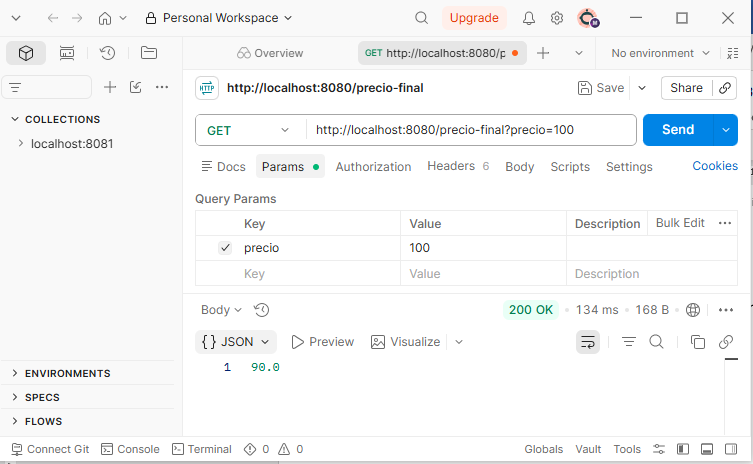
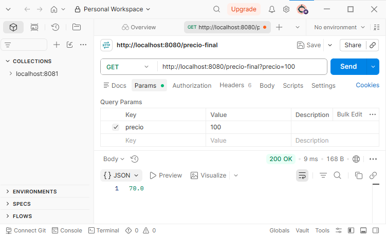
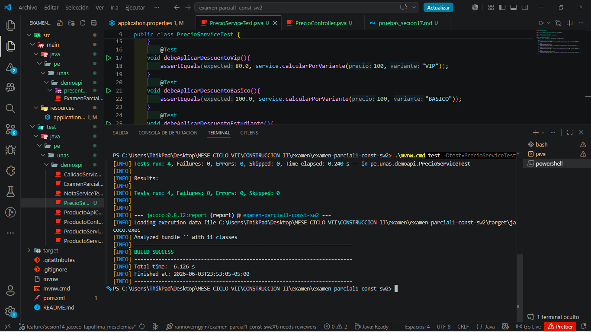

# Análisis de variabilidad – Sesión 17

## Punto de variación
Cálculo de precio final según tipo de cliente.

## Variantes
- BASICO: sin descuento.
- PREMIUM: 10% de descuento.
- VIP: 20% de descuento.

## Mecanismo usado
Configuración externa mediante application.properties.

## Propiedad
app.variante-cliente=PREMIUM

## Evidencias de la variante PREMIUM
- GET /variante-activa

- GET /precio-final?precio=100

## Evidencias de la variante ESTUDIANTE
- GET /variante-activa

- GET /precio-final?precio=100

Probar ESTUDIANTE con nueva implementacion sin reiniciar es servidor:
curl "http://localhost:8080/precio-final?precio=100&variante=ESTUDIANTE"

## Captura de ejecución ./mvnw test con BUILD SUCCESS.

