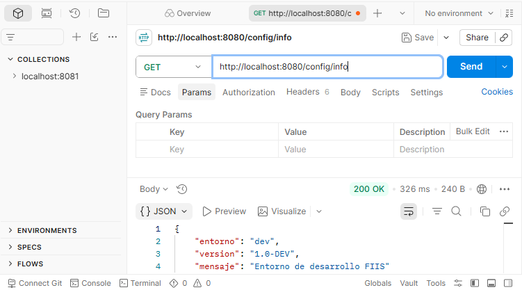
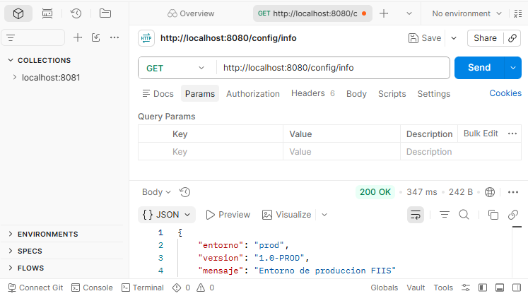
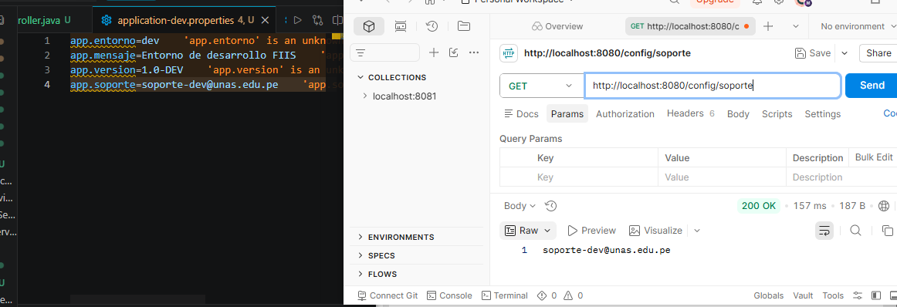

# Sesión 18 - Configuración dinámica y perfiles

## Perfil dev
Comando ejecutado:
./mvnw spring-boot:run "-Dspring-boot.run.profiles=dev"

Resultado:
/config/info -> entorno dev

## Perfil prod
Variable usada:
APP_MENSAJE=Sistema FIIS en produccion

Resultado:
/config/info -> entorno prod

## Implementacion de soporte

## Conclusión
La configuración cambia por entorno sin modificar el código fuente.

