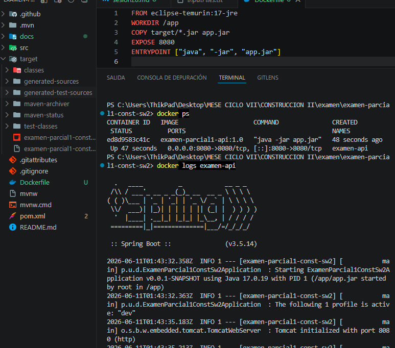
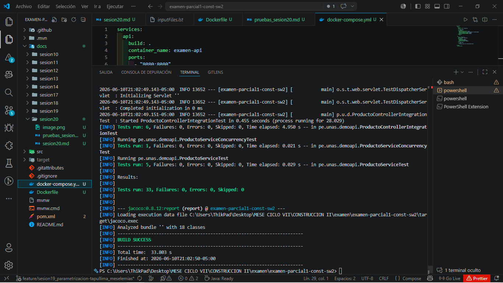
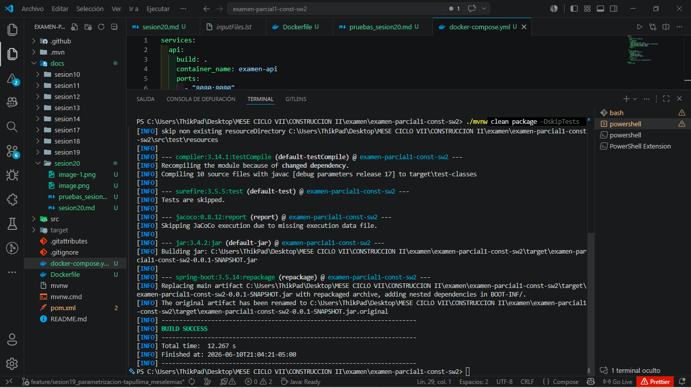
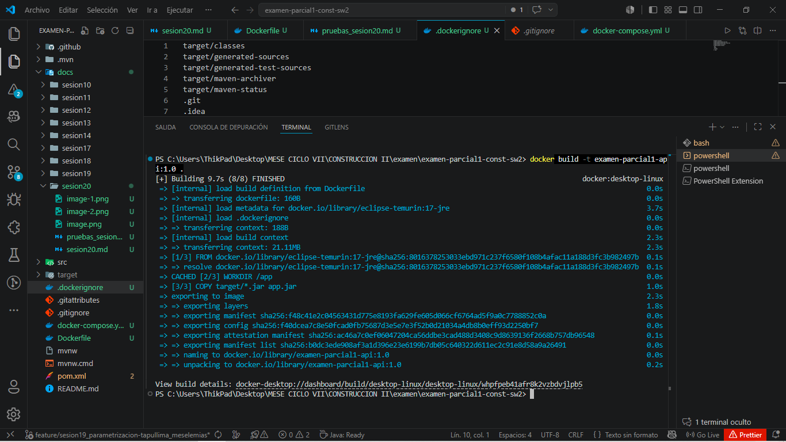
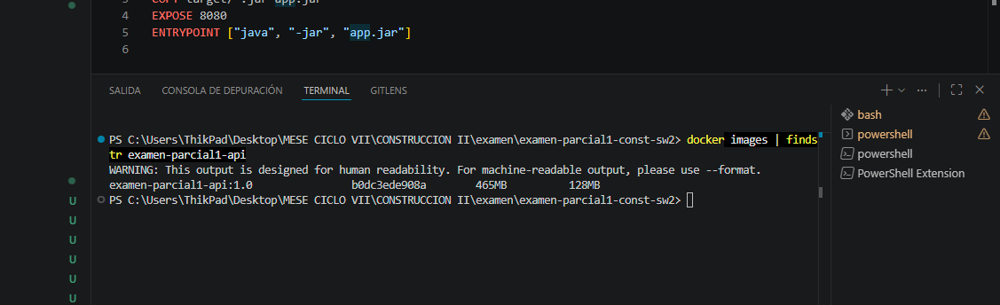
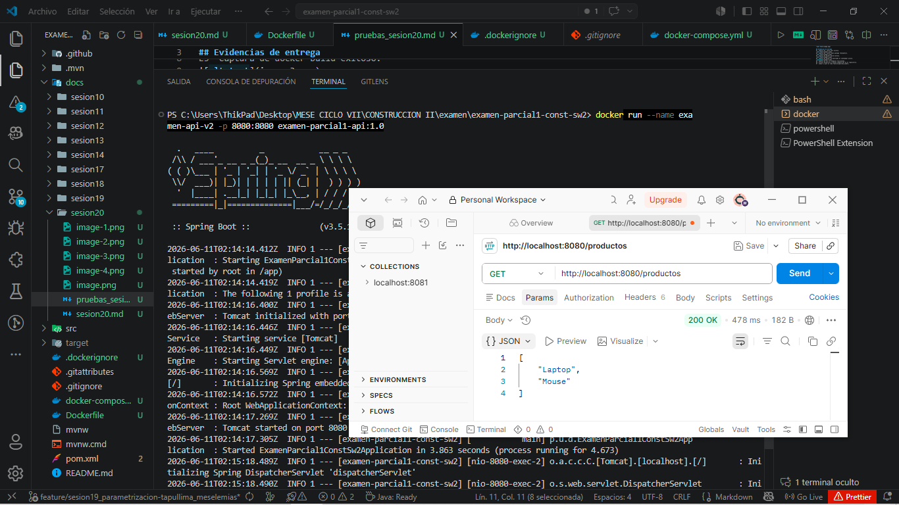
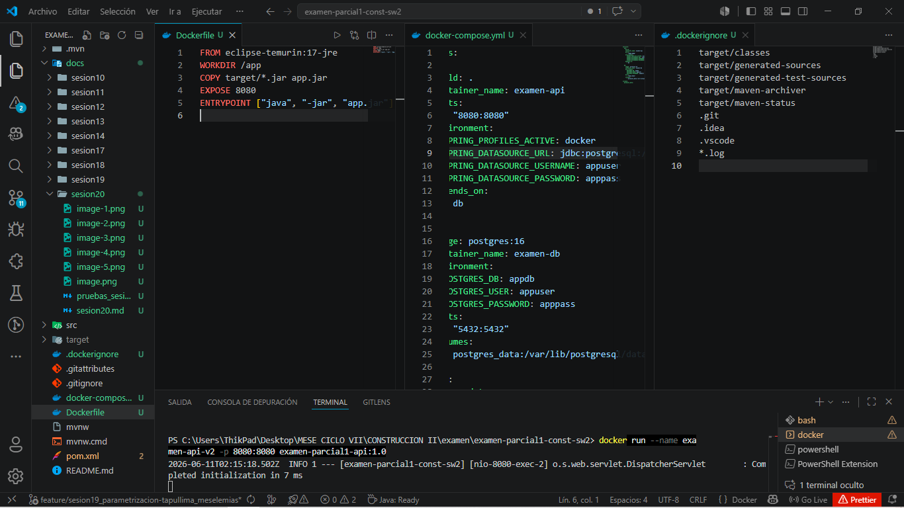

## Evidencias de entrega
E1	Captura de ./mvnw test exitoso.

E2	Captura de ./mvnw clean package -DskipTests.

E3	Captura de docker build exitoso.

E4	Captura de docker ps mostrando el contenedor activo.

E5	Captura de curl al endpoint funcionando.

E6	Archivo Dockerfile y docker-compose.yml en el repositorio.

E7	Commit y push en rama feature/apellido_nombre.
