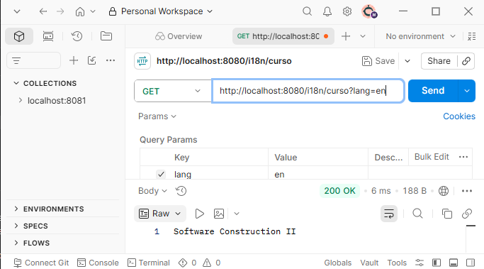
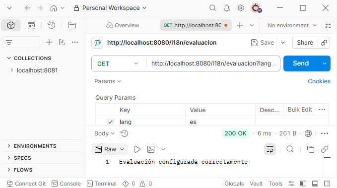
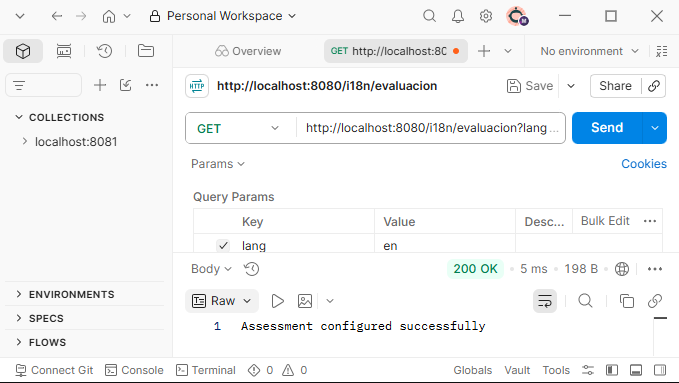
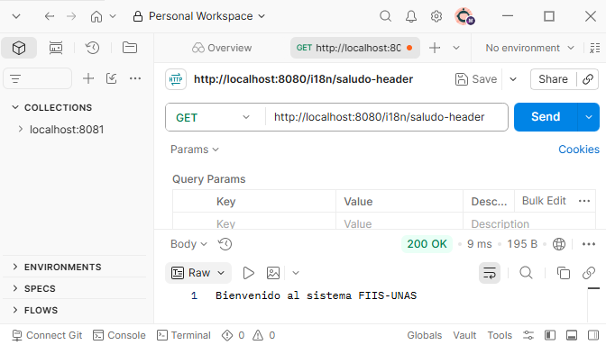
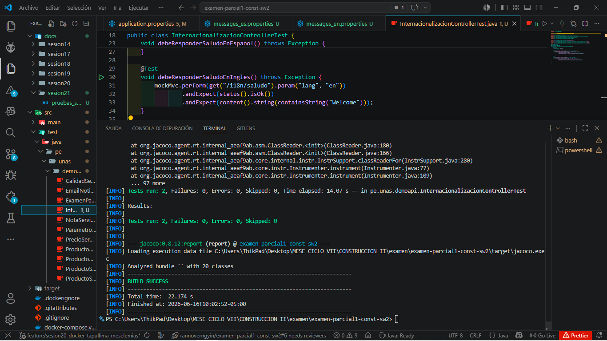

# Internacionalización

## Objetivo
Permitir que la API responda mensajes en más de un idioma.

## Idiomas soportados
- Español: es
- Inglés: en

## Endpoints
- GET /i18n/saludo?lang=es
- GET /i18n/saludo?lang=en
- GET /i18n/curso?lang=es
- GET /i18n/curso?lang=en

## Evidencia
Capturas de curl y ejecución de pruebas.

- GET /i18n/saludo?lang=es

- GET /i18n/saludo?lang=en

- GET /i18n/curso?lang=es

- GET /i18n/curso?lang=en

GET /i18n/evaluacion?lang=es

GET /i18n/evaluacion?lang=en

GET /i18n/saludo-header

- Ejecucion de prueba

