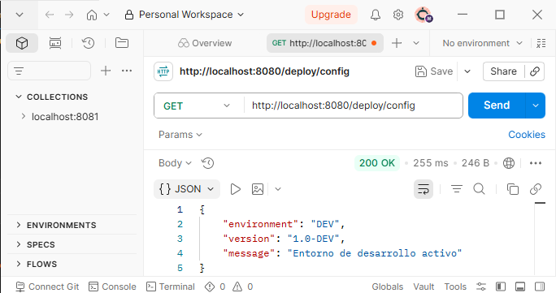
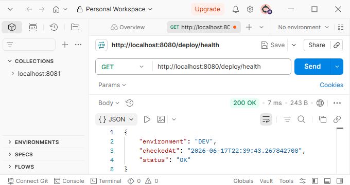
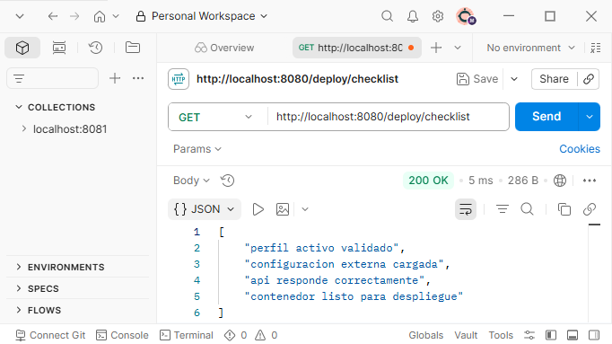
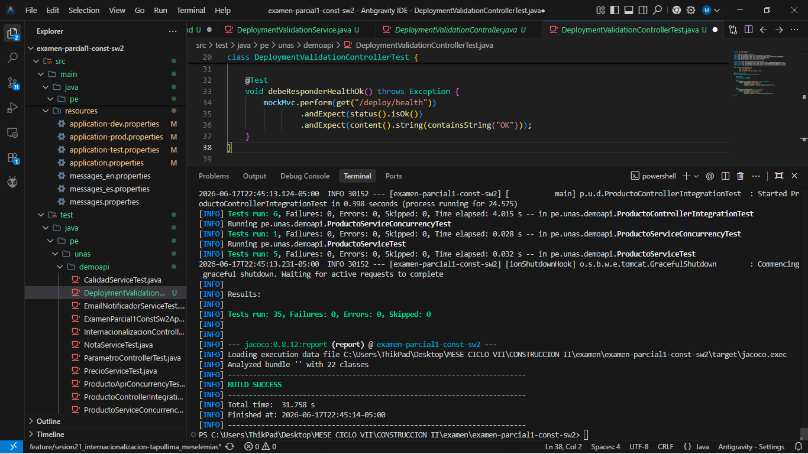
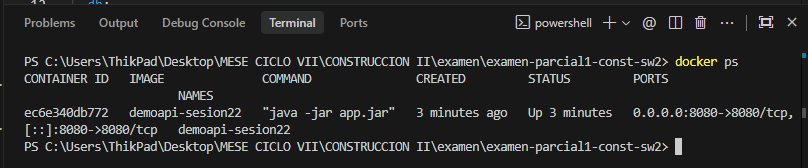
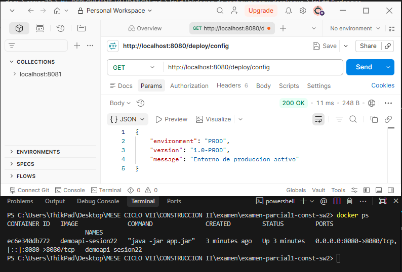
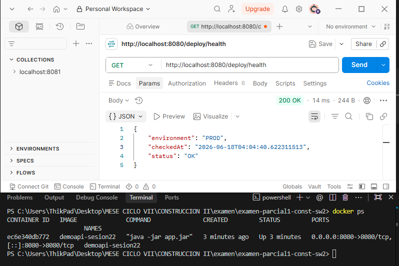
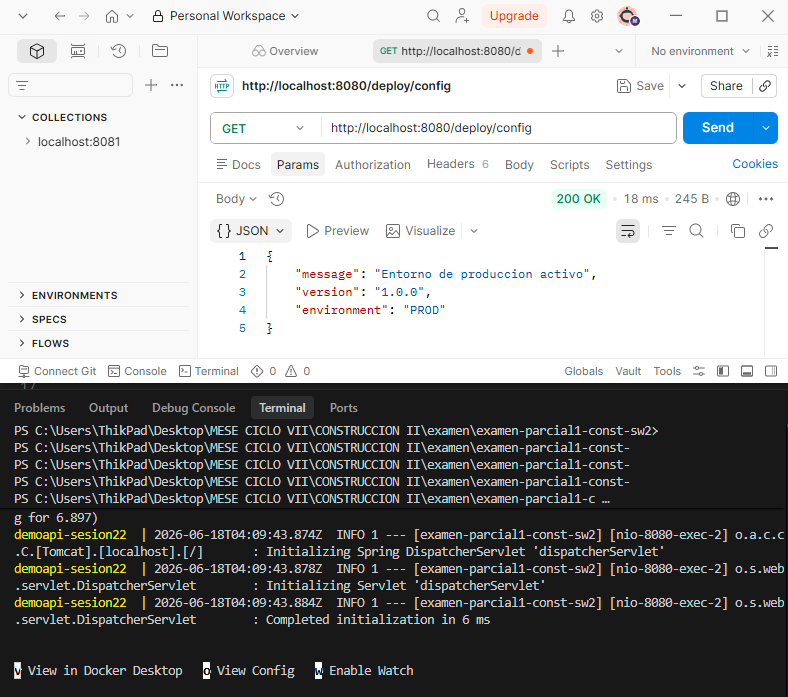

# Validacion de configuracion y despliegue

## Perfil validado
- dev: ejecutado localmente
- prod: ejecutado en Docker

## Endpoints verificados
- GET /deploy/config

- GET /deploy/health

- GET /deploy/checklist

## Evidencias
- Captura de mvn test

- Captura de docker ps

- Captura de curl /deploy/config

- Captura de curl /deploy/health

- Captura de curl /deploy/config

- Commit y Pull Request
