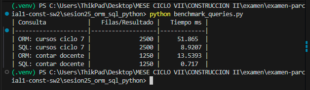
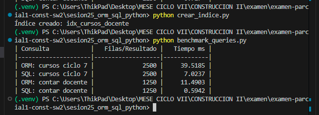
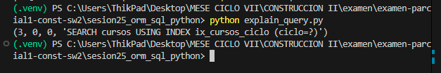

# Reporte Sesión 25 – ORM vs SQL directo en Python

## 1. Objetivo
Comparar consultas ORM y SQL directo.

## 2. Consultas evaluadas
- Cursos por ciclo
- Conteo por docente

## 3. Resultados
| Consulta | Resultado | Tiempo ms | Observación |
|---|---:|---:|---|
| ORM ciclo 7 | 2500 filas | ~39.52 | Trae objetos de modelo SQLAlchemy completos (overhead de instanciación). |
| SQL ciclo 7 | 2500 filas | ~7.02 | Ejecuta consulta directa y retorna tuplas nativas rápidamente. |
| ORM docente | 1250 (conteo) | ~11.49 | Carga los objetos completos en memoria para luego usar `len()`. |
| SQL docente | 1250 (conteo) | ~0.59 | Ejecuta `SELECT COUNT(*)` directamente en el motor, optimizando red y memoria. |

## 4. Interpretación
* **¿Cuándo conviene usar ORM?**:
  * Para desarrollo rápido (CRUD), lógica de negocio compleja, validaciones y donde se requiere manipular entidades como objetos de Python.
  * Para mantener la portabilidad del código, permitiendo cambiar de motor de base de datos (ej. de SQLite a PostgreSQL) con mínimo esfuerzo.
* **¿Cuándo conviene usar SQL directo?**:
  * En consultas críticas donde el rendimiento es primordial (operaciones de lectura masiva o reportes complejos).
  * Para operaciones agregadas (ej. `COUNT`, `SUM`, `AVG`) donde no se requiere instanciar objetos en memoria, evitando el overhead de mapeo de SQLAlchemy.

## 5. Evidencias
- Captura de benchmark_queries.py sin indice

- Captura de benchmark_queries.py con indice

- Captura de explain_query.py

- Commit de Git
