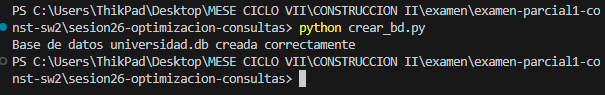
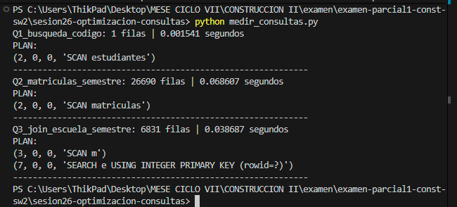
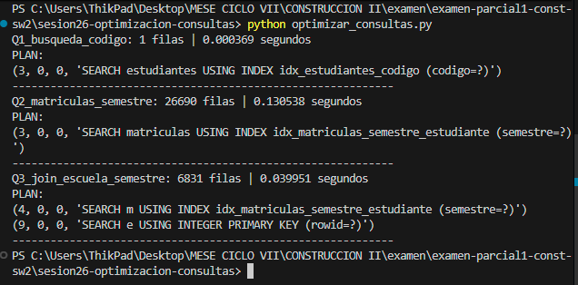
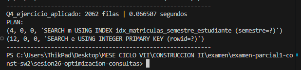
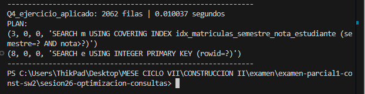

# Reporte Sesión 26 – Optimización de consultas

## 1. Creación de la Base de Datos (`crear_bd.py`)

## 2. Consultas antes de optimizar (`medir_consultas.py`)

## 3. Consultas después de optimizar (`optimizar_consultas.py`)

## 4. Ejercicio Aplicado (Q4)
* **Consulta analizada**: Estudiantes de la FIIS con nota mayor o igual a 14 en el semestre 2026-I.
* **Índice propuesto**: `CREATE INDEX IF NOT EXISTS idx_matriculas_semestre_nota_estudiante ON matriculas(semestre, nota, estudiante_id)`
* **Evidencia antes**:

* **Evidencia después**:

* **Justificación técnica**: El índice compuesto `idx_matriculas_semestre_nota_estudiante` en la tabla `matriculas` permite al motor de la base de datos filtrar rápidamente por las condiciones del `WHERE` (`semestre` y `nota >= 14`) y obtener directamente los `estudiante_id` para realizar el JOIN. Esto evita realizar un escaneo completo secuencial (`SCAN TABLE`) de las 80,000 filas de la tabla de matrículas.

