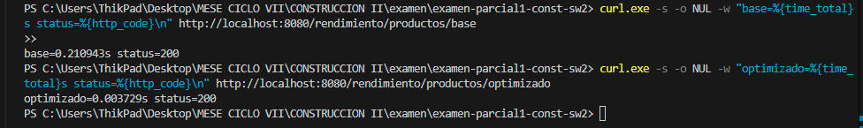
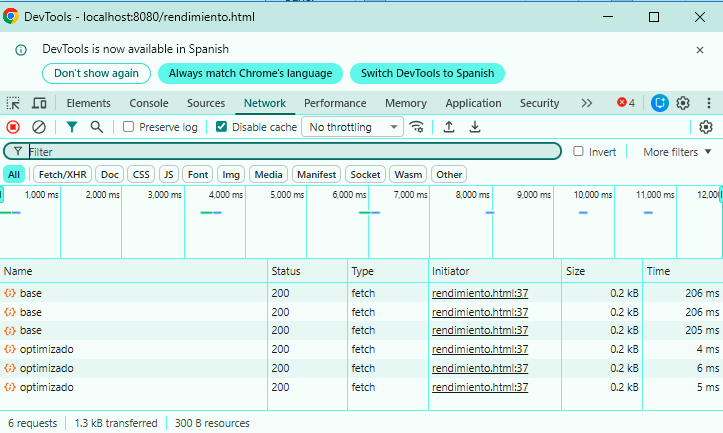
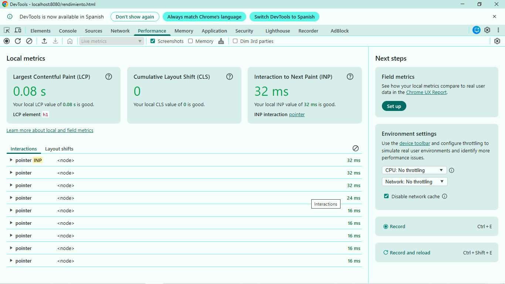
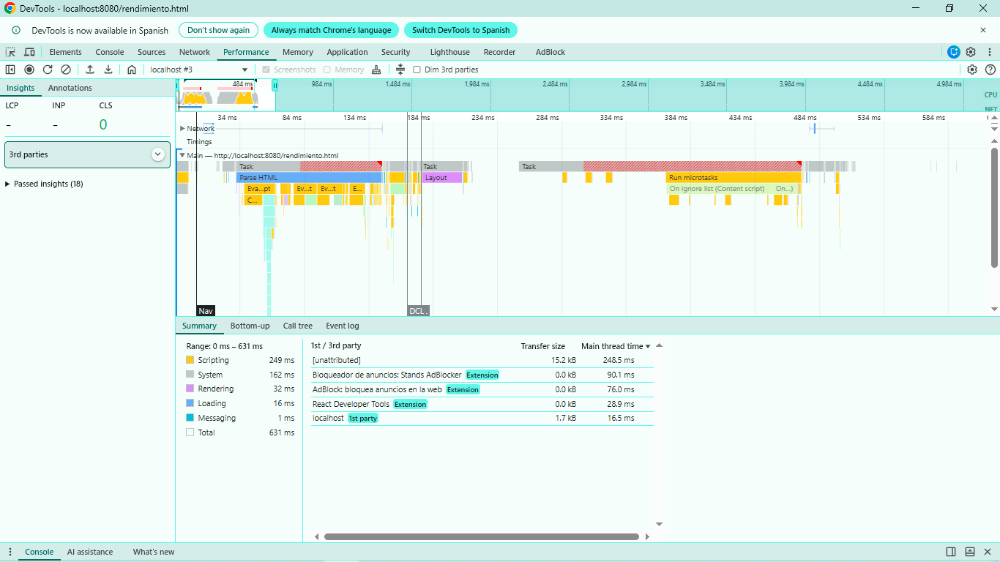
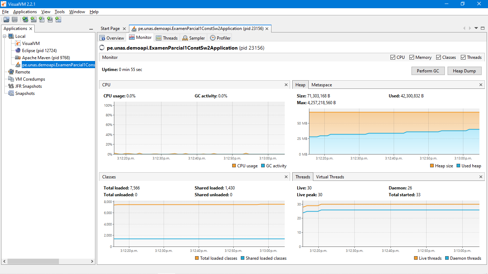
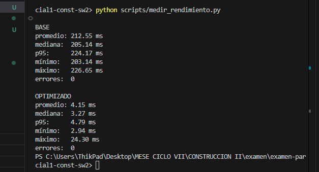

# Reporte técnico - Sesión 27

## 1. Escenario
- Endpoint: `/rendimiento/productos/base` y `/rendimiento/productos/optimizado`
- Dataset: Lista estática de 5 productos ("Laptop", "Mouse", "Teclado", "Monitor", "Impresora")
- Repeticiones: 30 llamadas (con 5 llamadas previas de warmup)
- Equipo/entorno: Windows (PowerShell), JDK 24
- Commit evaluado: N/A

## 2. Hipótesis inicial
El endpoint base (`/base`) tiene un retraso artificial (`Thread.sleep(200)`) y procesa el flujo en cada petición, lo que causará un tiempo de respuesta promedio superior a 200 ms. La versión optimizada (`/optimizado`) devuelve una lista precalculada en memoria y no tiene retrasos, por lo que su tiempo de respuesta será cercano a 0 ms.

## 3. Resultados
| Versión | Promedio | Mediana | p95 | Errores | CPU | Heap |
|---|---:|---:|---:|---:|---:|---:|
| Base | 215.22 ms | 213.65 ms | 230.74 ms | 0 | Ver JFR | Ver JFR |
| Optimizada | 11.48 ms | 12.94 ms | 23.52 ms | 0 | Ver JFR | Ver JFR |

## 4. Evidencias
- Salida del comando ./mvnw spring-boot:run

- Captura DevTools Network.

- Captura Performance.

- Captura VisualVM/JFR.

- Salida de medir_rendimiento.py.

## 5. Conclusión
- **Cuello de botella:** El cuello de botella en la versión `base` se debió a un bloqueo artificial síncrono mediante `Thread.sleep(200)` y al procesamiento repetitivo (mapeo a mayúsculas) de la lista de productos en cada petición.
- **Mejora aplicada:** Se eliminó la llamada bloqueante y se precalculó la lista transformada en una constante en memoria (`productosOptimizados`), sirviéndola directamente en la petición de la versión `optimizado`.
- **Criterio de éxito:** Se cumplió con éxito. El tiempo promedio de respuesta disminuyó drásticamente de **215.22 ms** a **11.48 ms**, logrando una reducción del tiempo de respuesta de aproximadamente **94.6%** sin registrar errores.
