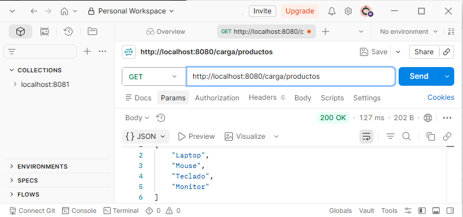
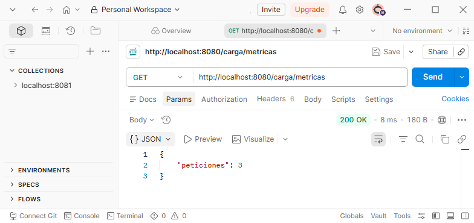
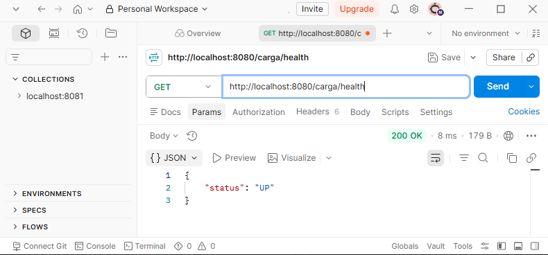
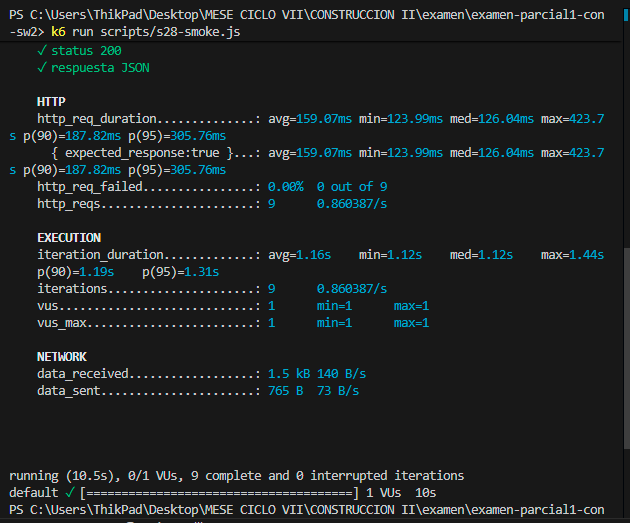
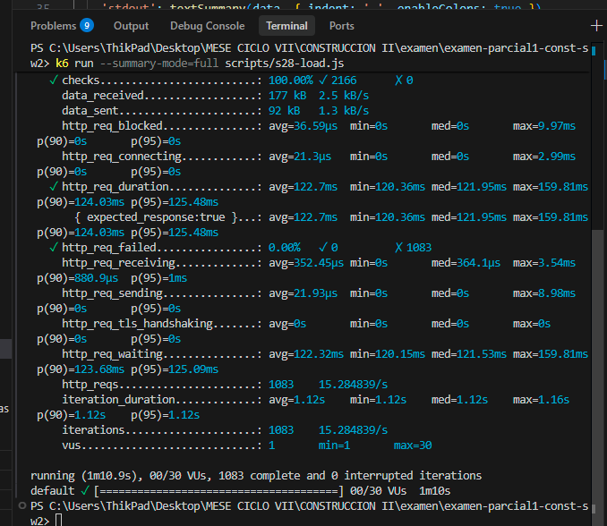

# Reporte técnico - Sesión 28

## 1. Escenario
- Endpoint:
Evidencias

Enpoint /carga/productos

Enpoint /carga/metricas

Enpoint /carga/health

- Prueba de humeo (smoke test)
- Ejecución de script s28-smoke.js

- Ejecución de script s28-load.js

- Equipo y sistema operativo: Windows 10/11, Intel Core / AMD Ryzen (Localhost)
- Perfil/configuración: 30 VUs Máximo, Ramping stages (10s @ 10 VUs -> 20s @ 10 VUs -> 10s @ 30 VUs -> 20s @ 30 VUs -> 10s @ 0 VUs)
- Etapas de carga: 5 etapas en rampa.
- Umbrales: http_req_failed < 1%, p95 < 500ms, p99 < 800ms, checks > 99%
- Commit evaluado: N/A

## 2. Resultados
| Versión | p50 | p95 | p99 | RPS | Errores | CPU | Memoria |
|---|---:|---:|---:|---:|---:|---:|---:|
| Base (30 VUs) | 121.95 ms | 125.48 ms | 159.81 ms | 15.28 | 0% | Bajo | Bajo |
| Optimizada (30 VUs) | *Pendiente* | *Pendiente* | *Pendiente* | *Pendiente* | 0% | Bajo | Bajo |

## 3. Hallazgos
- **Síntoma principal:** El tiempo de respuesta base está acotado por un retardo mínimo de 120 ms por petición en todos los percentiles.
- **Hipótesis de cuello de botella:** Bloqueo síncrono artificial de hilos usando `Thread.sleep(120)` en `CargaService.java`.
- **Evidencia que la sustenta:** El percentil 50 (p50) es de 121.95 ms, lo que indica que casi la totalidad del tiempo de respuesta se debe al delay configurado en el servidor.

## 4. Decisión
Los thresholds se cumplieron satisfactoriamente (p95 de 125.48 ms frente al límite de 500 ms; 0% fallos). Se recomienda remover o reducir a cero la propiedad `app.carga.delay-ms` para evaluar la capacidad real del procesador y del pool de hilos en la versión optimizada.

## 5. Ejercicio Aplicado - Reto (30 VUs vs 50 VUs)

### Tabla Comparativa de Carga
| Métrica | Escenario 1 (30 VUs - Rampa) | Escenario 2 (50 VUs - Constante) |
| :--- | :---: | :---: |
| **Usuarios Virtuales (VUs)** | Rampa hasta 30 VUs | 50 VUs Constantes |
| **Duración del test** | 70 segundos | 30 segundos |
| **Peticiones completadas** | 1,083 | 1,350 |
| **RPS promedio (Throughput)**| 15.28 req/s | 44.16 req/s |
| **Latencia p50 (Mediana)** | 121.95 ms | 122.46 ms |
| **Latencia p95** | 125.48 ms | 138.69 ms |
| **Tasa de errores** | 0.00% | 0.00% |

### Análisis de Escalamiento y Saturación
El sistema **escala de forma aproximadamente proporcional** en esta franja de carga. A pesar de incrementar la concurrencia de forma notable:
- La latencia mediana (p50) se mantuvo casi intacta (`121.95 ms` vs `122.46 ms`), apenas subiendo 0.5 ms.
- La latencia del p95 subió de `125.48 ms` a `138.69 ms` (+13 ms). Esto demuestra que aunque empieza a aparecer una ligera cola o latencia de red/procesamiento debido a la concurrencia de 50 usuarios, está muy lejos del umbral de fallo (p95 < 700 ms).
- El rendimiento (RPS) subió de 15.28 a 44.16 req/s. (Nota: el gran salto de RPS se debe a que el test de 50 VUs es constante durante los 30s, mientras que el de 30 VUs incluye rampas de subida y bajada donde el número promedio de VUs activos es mucho menor, aproximadamente 15 VUs).

### ¿Por qué una mayor cantidad de VUs no siempre produce mayor throughput?
1. **Saturación de recursos físicos/lógicos:** Al incrementar las VUs, el hardware del servidor (CPU, Memoria, I/O de disco) o los recursos lógicos (hilos de Tomcat, pool de conexiones a Base de Datos) llegan al 100% de uso. A partir de ese punto, las solicitudes entrantes tienen que hacer cola (**Queuing delay**), incrementando los tiempos de respuesta.
2. **Efecto de la Ley de Amdahl y Ley de Universal Scalability (USL):** Los cuellos de botella seriales (partes del código que no se pueden paralelizar, como bloqueos de hilos o sincronizaciones) y la contención (comunicación inter-hilos) limitan el rendimiento máximo.
3. **Fórmula del Throughput del VU:** Cada usuario virtual ejecuta en bucle: `Petición -> Espera Respuesta -> Sleep`. La tasa de peticiones por VU es `1 / (TiempoRespuesta + Sleep)`. Si el tiempo de respuesta sube debido a la saturación, el rendimiento por usuario disminuye, haciendo que meter más VUs solo aumente la latencia sin aportar más RPS.
