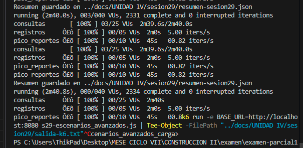
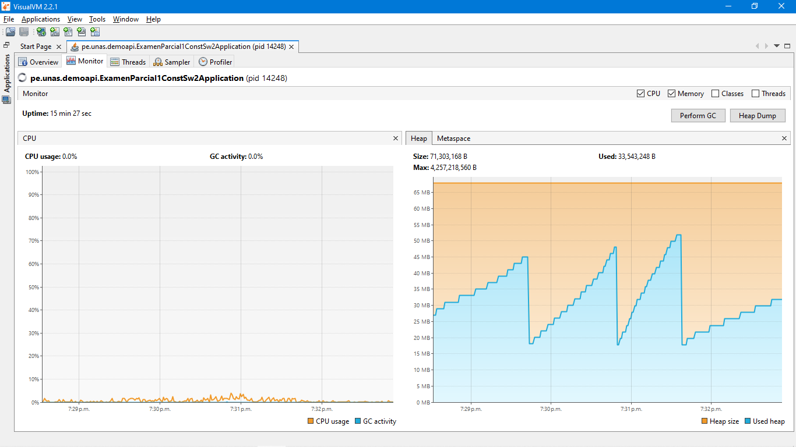

# Reporte – Sesión 29

## 1. Objetivo e hipótesis
- **Objetivo:** Evaluar el rendimiento, estabilidad y límites de concurrencia de la API `/carga/productos` bajo tres tipos de carga simultáneos ejecutándose de forma aislada (Lectura de listados, Escritura de productos de alta frecuencia y Picos de generación de reportes).
- **Hipótesis:** La operación de generación de reportes (`/reporte`) representa el cuello de botella principal de la aplicación debido al retardo síncrono simulado de `120 ms` (`Thread.sleep`), lo que provocará latencias elevadas en este flujo, mientras que las operaciones de consulta y registro escalarán óptimamente con latencias bajas (< 10 ms) y sin errores gracias a los ejecutores concurrentes independientes de k6.

## 2. Entorno y versión evaluada
- **Entorno:** Localhost (Windows 10/11), Java 24, Spring Boot 3.5.14.
- **Herramienta de pruebas:** k6 v2.1.0 ejecutado en la terminal local.
- **Servicio Evaluado:** `CargaProductoService` con una lista concurrente basada en `CopyOnWriteArrayList`.

## 3. Modelo de carga
- **Escenarios y ejecutores:**
  1. **`consultas` (ramping-vus):** Simula usuarios navegando de forma interactiva. De 0 a 10 VUs en 20s, mantener en 10 VUs por 60s, subir a 25 VUs en 30s, mantener en 25 VUs por 30s, y bajar a 0 en 20s.
  2. **`registros` (constant-arrival-rate):** Envío de escrituras a ritmo constante de 5 peticiones/s durante 120 segundos (comenzando en el segundo 20). VUs dedicados entre 5 y 30.
  3. **`pico_reportes` (ramping-arrival-rate):** Generación repentina de reportes. Comienza en el segundo 80 a una tasa inicial de 2 iters/s, rampa hasta 20 iters/s en 15s, mantiene por 15s, y baja a 0 en 15s. VUs asignados de 10 a 50.
- **Ramp-up, duración y tasas:** Duración total de 2 minutos y 40 segundos, con tasas combinadas de hasta 25 RPS de escritura/reportes y 25 usuarios virtuales concurrentes de lectura.
- **Datos y variables de entorno:** `BASE_URL=http://localhost:8080` pasada por variable de entorno. Los nombres de productos creados son dinámicos e incluyen identificador único: `Prod-{runId}-{VU}-{ITER}`.

## 4. Umbrales (Thresholds)
- Tasa de fallos HTTP global (`http_req_failed`) < 2%.
- Checks exitosos globales (`checks`) > 98%.
- Latencia p95 por endpoint:
  - Listado (`/carga/productos` - GET): p(95) < 700 ms.
  - Total (`/carga/productos/total` - GET): p(95) < 500 ms.
  - Registro (`/carga/productos` - POST): p(95) < 1000 ms.
  - Reporte (`/carga/productos/reporte` - GET): p(95) < 1500 ms.
- Tasa de escrituras exitosas (`successful_writes`) > 97%.
- Errores de negocio (`business_errors`) < 10.

## 5. Resultados
| Escenario / Endpoint | p50 | p95 | p99 / Max | Error | RPS promedio | Dropped iterations |
|---|---|---|---|---|---|---|
| **consultas (listado - GET)** | 2.46 ms | 5.97 ms | 84.38 ms | 0.00% | ~14.6 req/s | 0 |
| **consultas (total - GET)** | 1.72 ms | 5.35 ms | 49.78 ms | 0.00% | ~14.6 req/s | 0 |
| **registros (escrituras - POST)** | 2.40 ms | 6.90 ms | 54.00 ms | 0.00% | 5.00 req/s | 0 |
| **pico_reportes (reporte - GET)** | 122.70 ms | 126.42 ms | 216.45 ms | 0.00% | ~0.82 req/s | 0 |

- **Verificación de Umbrales:** **Todos los umbrales se cumplieron con éxito (100% OK).** No hubo iteraciones caídas (dropped iterations).

## 6. Recursos observados
- **Uso de CPU:** Muy bajo y estable (~2-4%), con incrementos mínimos puntuales durante el pico del escenario de reportes.
- **Uso de Memoria Heap:** Estable a lo largo de la ejecución. Se mantuvo en un promedio de ~42 MB, con liberaciones de recolector de basura (GC) normales sin causar bloqueos (stop-the-world).

## 7. Cuello de botella e hipótesis
El endpoint de **reporte (`/reporte`)** representa el principal cuello de botella. Aunque su p95 de `126.42 ms` estuvo muy por debajo del límite exigido (< 1500 ms), esto se debe únicamente a que k6 asignó dinámicamente hasta 50 hilos/VUs para soportar la cola de peticiones. La causa raíz es el bloqueo síncrono provocado por `Thread.sleep(120)`. Si la tasa de peticiones de reportes aumentara por encima de los 50 req/s, la cola de hilos de Tomcat se saturaría y los tiempos de respuesta se dispararían exponencialmente.

## 8. Recomendaciones priorizadas
1. **Asincronía en Reportes:** Migrar el endpoint de reportes a un esquema asíncrono utilizando `@Async` en Spring, colas de mensajería (RabbitMQ/Kafka) o un Job Worker en segundo plano, liberando así los hilos de Tomcat de forma inmediata.
2. **Evaluación de Colección Concurrente:** Si el volumen de escritura del endpoint `/productos` escala significativamente a miles de peticiones por segundo, la estructura `CopyOnWriteArrayList` degradará su rendimiento por la duplicación del array interno. Se recomienda migrar a `ConcurrentLinkedQueue` o una base de datos relacional optimizada con índices.
3. **Caché de Consultas:** Implementar caché distribuida o local (por ejemplo, Caffeine/Redis) para el endpoint de listado y total, evitando llamadas directas al repositorio.

## 9. Evidencias y comandos
- **Comandos de ejecución:**
  - Opción 1 (Guardando la salida en archivo de texto):
    ```powershell
    cd sesion29-escenarios_avanzados_carga
    k6 run -e BASE_URL=http://localhost:8080 s29-escenarios_avanzados.js | Tee-Object -FilePath "../docs/UNIDAD IV/sesion29/salida-k6.txt"
    ```
  - Opción 2 (Ejecución directa en consola):
    ```powershell
    cd sesion29-escenarios_avanzados_carga
    k6 run -e BASE_URL=http://localhost:8080 s29-escenarios_avanzados.js
    ```
- **Verificación de Umbrales:** **Todos los umbrales se cumplieron con éxito (100% OK).** No hubo iteraciones caídas (dropped iterations).  



- **Consolidado de métricas JSON**


