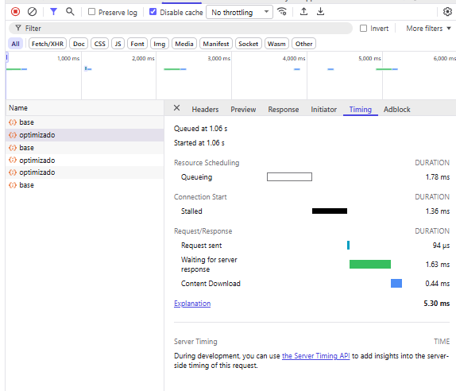
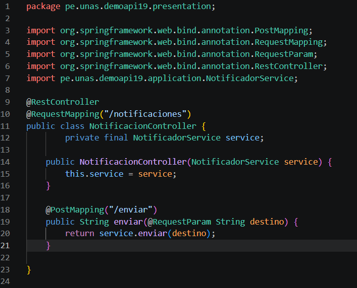
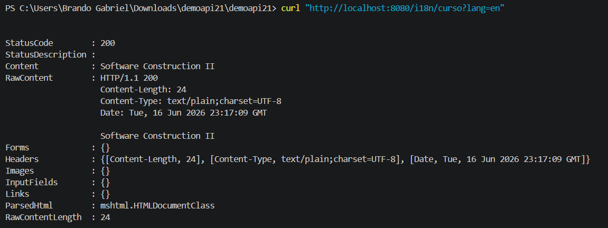
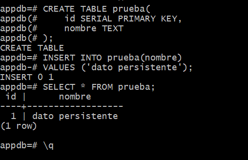

# Sesión 18 - Configuración dinámica y perfiles

## PASO 1: Perfil dev
Comando ejecutado:
./mvnw spring-boot:run -Dspring-boot.run.profiles=dev

Resultado:
/config/info -> entorno dev

## PASO 2: Perfil prod
Variable usada:
APP_MENSAJE=Sistema FIIS en produccion

Resultado:
/config/info -> entorno prod

## PASO 3:: Perfil test

Comando ejecutado:
./mvnw spring-boot:run -Dspring-boot.run.profiles=test

Resultado:
/config/info -> entorno test

## PASO 4: CAMBIO DE MENSAJE EN EL PERFIL DE PERDIL PROD

## COMANDO 

## RESULTADO

## PASO 5: CAMBIO DE MENSAJE EN EL PERFIL DE PERDIL PROD 2

## COMANDO 

## RESULTADO

## PASO 6 EJERCICIO APLICANDO app.soporte 

## perfil dev 

## perfil test

## perfil prod 

 

 ## git commit 

 

 ## git push

 

 
## Conclusión
La configuración cambia por entorno sin modificar el código fuente.

