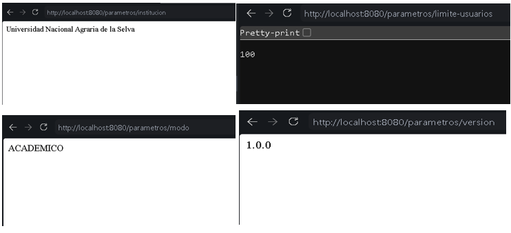
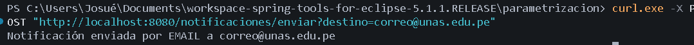
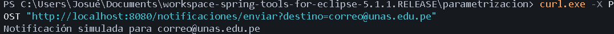
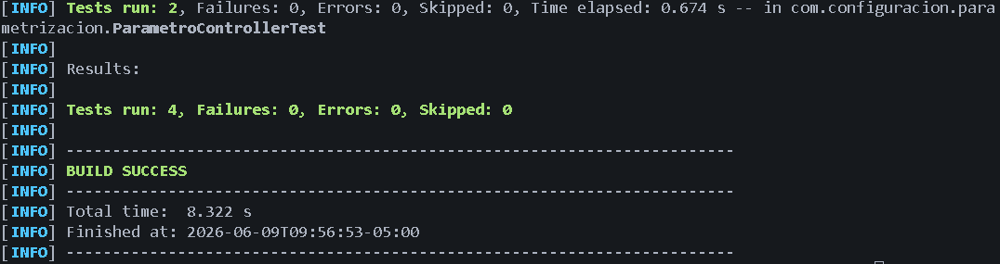

# Evidencias de Entrega - Sesión 19
**Curso:** Construcción de Software II  
**Tema:** Configuración y parametrización con Spring Boot  
**Estudiante:** Josué Oriundo 

---

## 1. Endpoints `/parametros` funcionando
*Captura de las pruebas a los endpoints, incluyendo el parámetro añadido en el ejercicio aplicado (`/parametros/version`).*

---

## 2. Notificación con proveedor Email
*Captura de la prueba enviando una notificación cuando `app.notificacion.proveedor=email`.*

---

## 3. Notificación con proveedor Mock
*Captura de la prueba enviando una notificación tras cambiar dinámicamente la configuración a `app.notificacion.proveedor=mock` sin modificar el código.*

---

## 4. Ejecución de Pruebas (Build Success)
*Captura de la ejecución exitosa de los tests de integración y unitarios (`./mvnw test`).*

---
