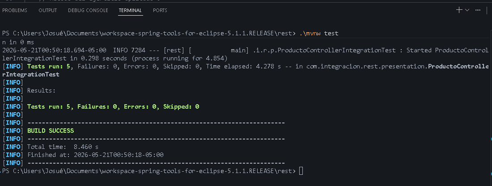
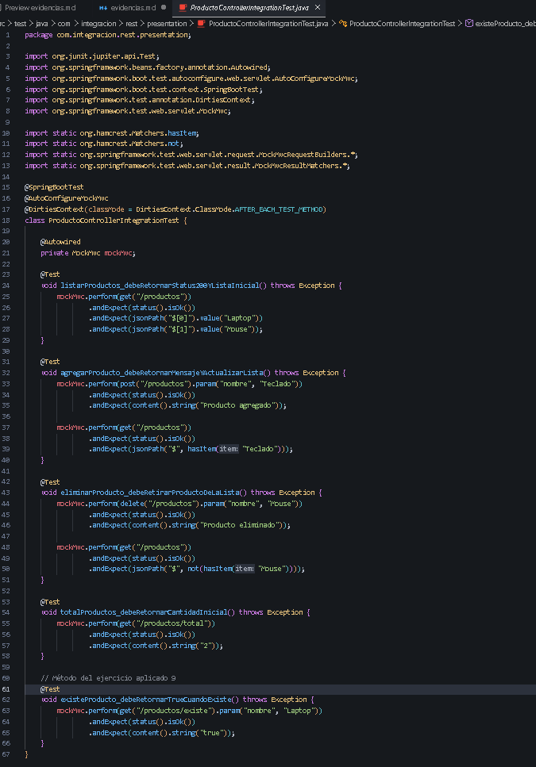
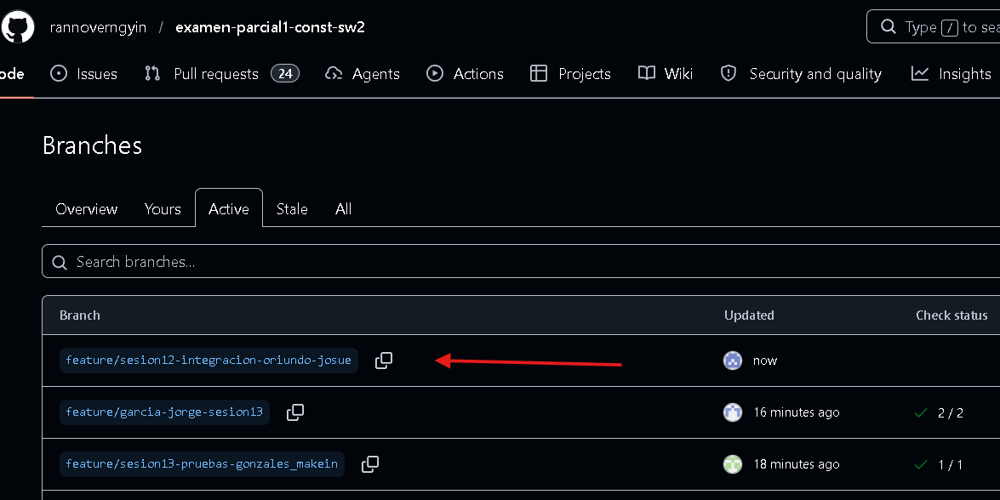

# Reporte de Pruebas - Sesión 12: Pruebas de Integración en Servicios REST con MockMvc

## Objetivo
Validar el funcionamiento integrado de servicios REST en una aplicación Spring Boot mediante pruebas automatizadas. Se verifican las rutas, métodos HTTP, códigos de estado y el intercambio de datos (JSON) simulando llamadas del lado del cliente a través de MockMvc.

## Arquitectura Implementada
El proyecto respeta el diseño en capas:
- **Capa Application (ProductoService)**: Maneja la lógica de negocio y las operaciones sobre la lista de productos (agregar, listar, eliminar, obtener total, validar existencia).
- **Capa Presentation (ProductoController)**: Expone los endpoints REST (GET, POST, DELETE) y delega la ejecución de los procesos al servicio.

## Pruebas Ejecutadas usando MockMvc

| Nombre de la Prueba | Descripción y Propósito |
| :--- | :--- |
| listarProductos | Realiza una petición GET y valida que retorne estado 200 (OK) con la lista inicial ("Laptop", "Mouse"). |
| gregarProducto | Realiza una petición POST pasando el parámetro nombre y valida que el estado sea 200 y se haya agregado correctamente. |
| eliminarProducto | Ejecuta un método DELETE para quitar un producto y verifica en una petición posterior que ya no exista. |
| 	otalProductos | Llama al endpoint de cálculo mediante GET y espera como respuesta el número total de la colección inicial. |
| existeProducto *(Reto)* | Valida el endpoint del reto 9 con una petición GET que devuelve 	rue si un elemento solicitado se encuentra registrado. |

## Resultados de Ejecución (mvn test)
Todas las pruebas (incluida la del ejercicio propuesto) pasaron satisfactoriamente verificando el contrato REST:

`	ext
[INFO] Results:
[INFO] 
[INFO] Tests run: 5, Failures: 0, Errors: 0, Skipped: 0
[INFO] 
[INFO] ------------------------------------------------------------------------
[INFO] BUILD SUCCESS
[INFO] ------------------------------------------------------------------------
`

## Evidencias
- Captura de consola mostrando el BUILD SUCCESS tras ejecutar las pruebas:
  

- Captura del archivo de integración ProductoControllerIntegrationTest.java:
  

- Captura del historial y commit realizado en el repositorio Git:
  

## Explicación del Flujo: MockMvc → Controller → Service
En las pruebas de integración, **MockMvc** se encarga de interceptar y simular las peticiones HTTP que haría un cliente real (navegador, Postman, etc.). Esta petición simulada llega directamente a la capa de presentación (**Controller**), quien procesa la ruta y los parámetros. El Controller, a su vez, delega la operación a la capa de negocio (**Service**). El framework ejecuta todo el flujo de ida y de retorno sin necesidad de arrancar por completo el servidor Tomcat, permitiendo una prueba extremadamente rápida pero altamente fiel a la realidad de la aplicación.
