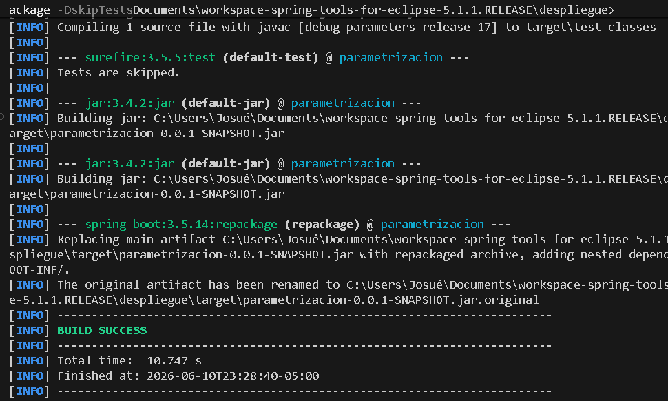
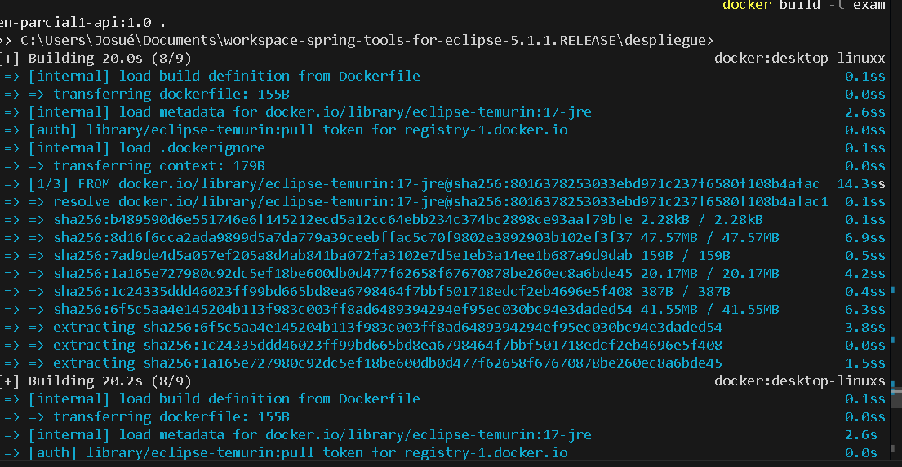
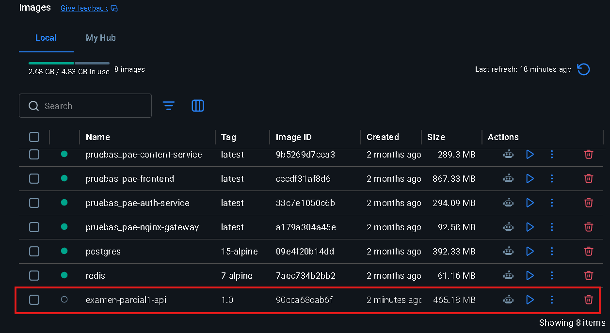
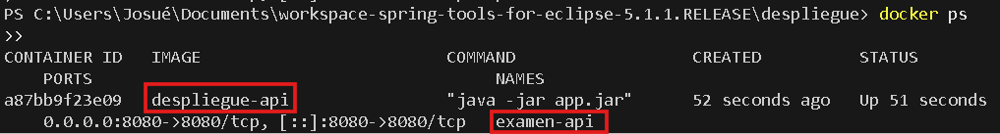
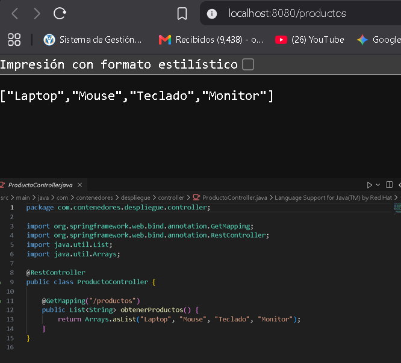

# Evidencias del Taller: Contenedores y despliegue

Este documento contiene las evidencias requeridas para la Práctica de Laboratorio - Sesión 20.

---

### E1: Pruebas unitarias con Maven

---

### E2: Empaquetado de la aplicación

---

### E3: Construcción de la imagen Docker

---

### E4: Contenedor ejecutándose en Docker

---

### E5: API respondiendo desde el contenedor

---

### E6: Archivos de configuración
Los archivos `Dockerfile` y `docker-compose.yml` ya han sido creados en la raíz del repositorio y se incluyen directamente en el código de este proyecto.

---

### E7: Repositorio con el commit

