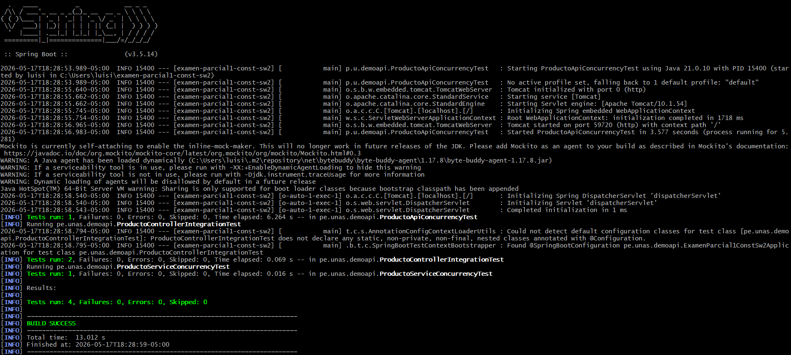
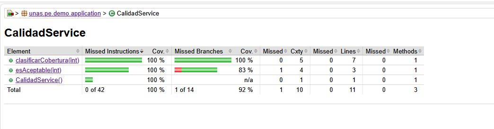
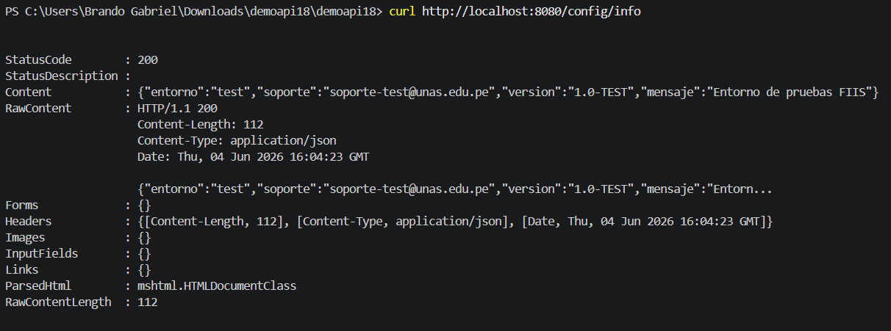
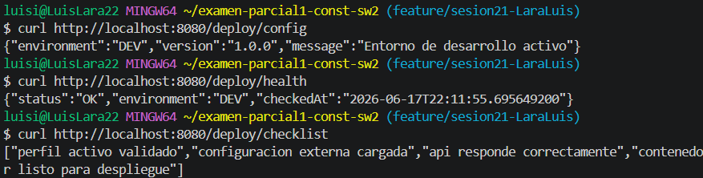

# Internacionalización

## Objetivo
Permitir que la API responda mensajes en más de un idioma.

## Idiomas soportados
- Español: es
- Inglés: en

## Endpoints

## Evidencia
Capturas de curl y ejecución de pruebas.

test de prueba 

endpoint adicional que use la cabecera HTTP Accept-Language.

endpoint evaluacion

## commit y push 

