# Reporte de Pruebas - Sesión 14

## Pruebas ejecutadas
- CalidadServiceTestt

## Resultado
BUILD SUCCESS

## Evidencias
- Captura del codigo CalidadServiceTest.java
- Captura de la terminal

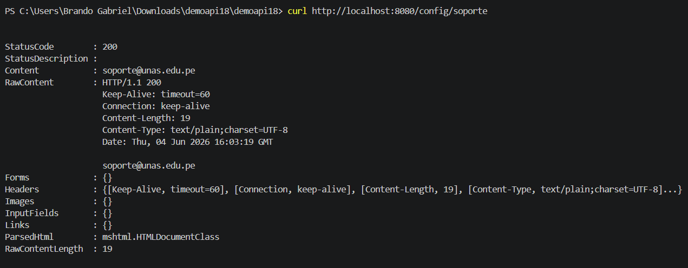
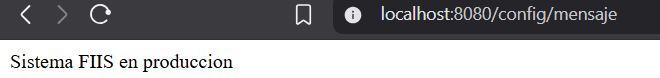

## Interpretación del reporte inicial
El paquete pe.unas.demoapi.presentation tiene mayor cobertura (83%), por eso predomina el color verde.
El paquete pe.unas.demoapi.application tiene cobertura intermedia (55%), mostrando mezcla de verde y rojo.
El paquete pe.unas.demoapi tiene baja cobertura (37%), predominando el rojo.

Resultado general
Cobertura total de instrucciones: 59%
Cobertura total de ramas: 45%
Más de la mitad del código fue ejecutado por las pruebas.
Todavía existe una cantidad importante de código sin probar.
Se requieren más pruebas para mejorar la calidad y confiabilidad del sistema.

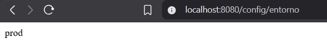

Se procederá a mejorar el código de las pruebas

Resultados:

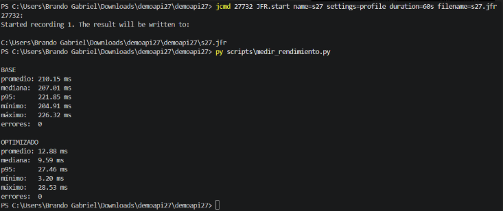

El paquete pe.unas.demoapi.presentation tiene mayor cobertura (83%), por eso predomina el color verde.
El paquete pe.unas.demoapi.application tiene cobertura por encima de la media (63%).
El paquete pe.unas.demoapi tiene baja cobertura (37%), predominando el rojo.

Resultado general
Cobertura total de instrucciones:65%
Cobertura total de ramas: 70%

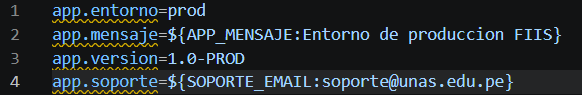

Se agregaron pruebas adicionales

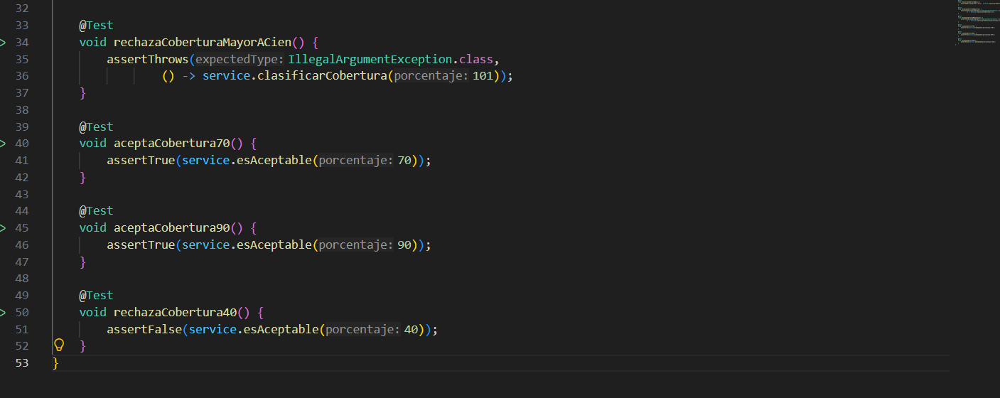
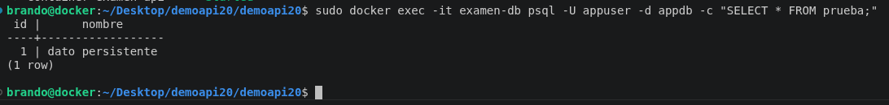

Dio como resultado BUILD SUCESS

Se restauraron pruebas anteriores que fueron eliminadas
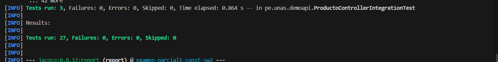

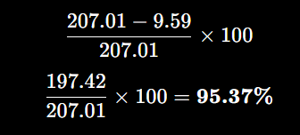

El paquete pe.unas.demoapi.presentation tiene mayor cobertura (100%).
El paquete pe.unas.demoapi.application tiene mucha cobertura (96%).
El paquete pe.unas.demoapi tiene baja cobertura (37%), predominando el rojo.

Resultado general
Cobertura total de instrucciones:95%
Cobertura total de ramas: 88%

ProductoService alcanzó 100% de cobertura tanto en instrucciones como en ramas, por lo que todos sus métodos y condiciones fueron ejecutados correctamente por las pruebas.
NotaService también tiene 100% de instrucciones, aunque solo 83% de ramas, lo que significa que aún existen algunas condiciones lógicas que no fueron probadas completamente.
CalidadService presenta la menor cobertura del paquete, con 88% de instrucciones y 85% de ramas. Esto indica que algunas líneas o decisiones todavía no fueron cubiertas por pruebas unitarias.
Se aumentó las pruebas de CalculadoraService,muestra una cobertura de 100% por lo que todos sus métodos y condiciones fueron ejecutados correctamente por las pruebas.
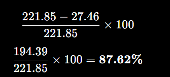
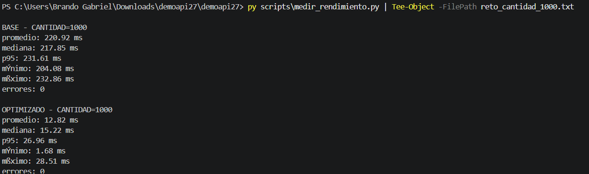

El paquete tiene 100% de cobertura en instrucciones.
ProductoController fue completamente probado, ya que todas sus líneas y métodos fueron ejecutados durante las pruebas.
No aparecen ramas (n/a) porque probablemente el controlador no contiene estructuras condicionales complejas (if, switch, etc.).
Esto demuestra que las pruebas de integración o controlador validaron correctamente todos los endpoints implementados.
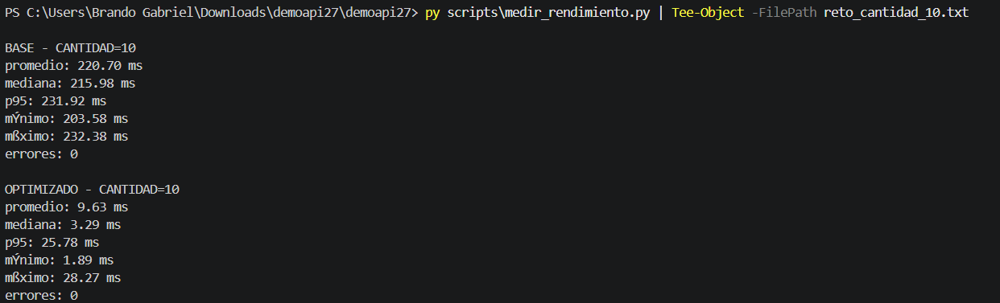

