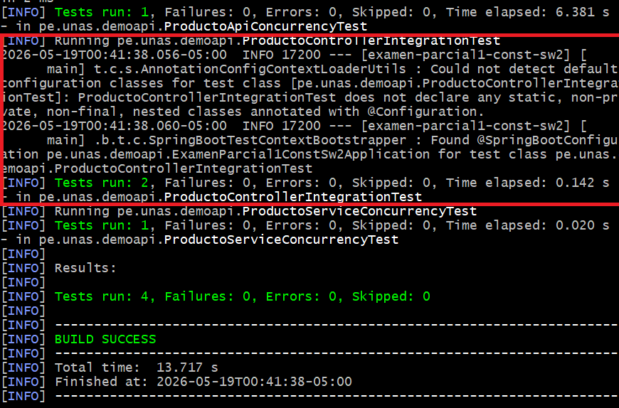
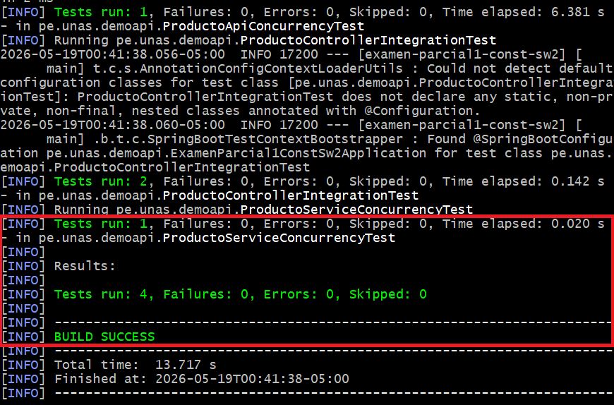
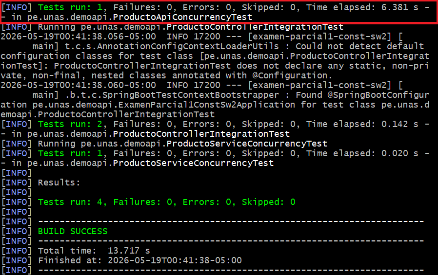

# Pruebas Ejecutadas


## 1️⃣ ProductoControllerIntegrationTest

Esta prueba valida la integración entre el controlador y los endpoints de la API REST.





## 2️⃣ ProductoServiceConcurrencyTest

Esta prueba valida el comportamiento concurrente del servicio utilizando múltiples hilos.




## 3️⃣ ProductoApiConcurrencyTest

Esta prueba valida solicitudes concurrentes directamente sobre la API REST.




# 🚀 Resultado General

```bash
Tests run: 4
Failures: 0
Errors: 0

BUILD SUCCESS