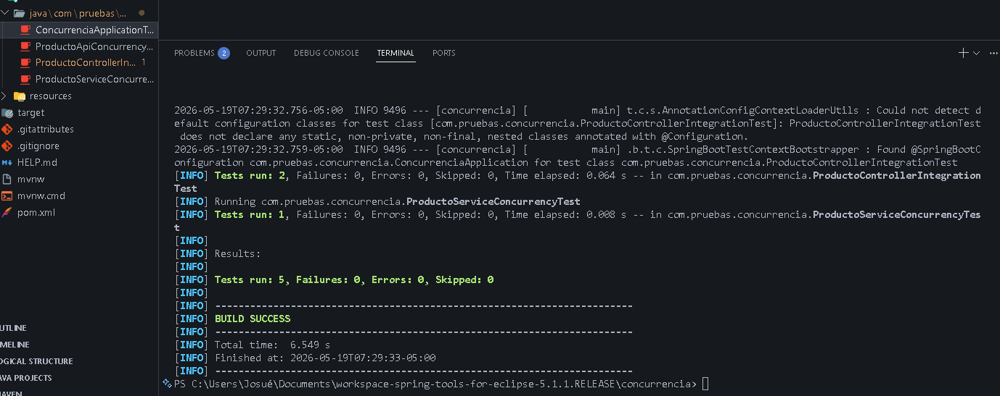
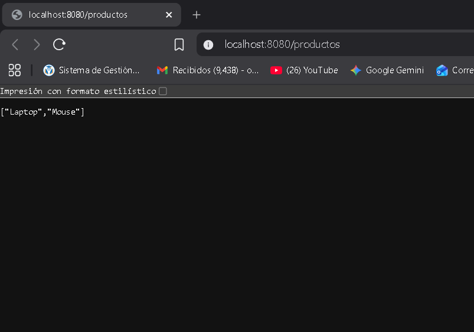
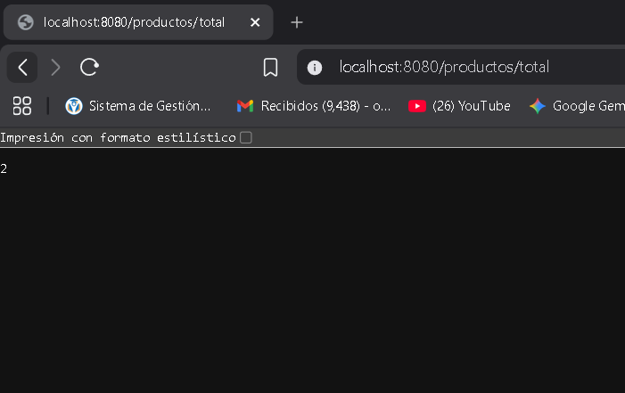

# Reporte de Pruebas - Sesión 11: Concurrencia e Integración

## Objetivo
Implementar y ejecutar pruebas de integración y pruebas de concurrencia para una API REST construida con Spring Boot, validando el comportamiento del sistema bajo múltiples solicitudes simultáneas y comprobando la correcta integración entre el Controller, el Service y la configuración de Spring.

## Arquitectura Implementada
Para mantener un orden adecuado y buenas prácticas, el proyecto se organizó en capas:
- **Capa Application (`ProductoService`)**: Maneja la lógica de la aplicación. Se implementó `CopyOnWriteArrayList` para prevenir problemas de acceso concurrente (*thread-safe*).
- **Capa Presentation (`ProductoController`)**: Responde a peticiones HTTP comunicándose con el servicio.

## Pruebas Ejecutadas

| Nombre de la Prueba | Tipo | Descripción y Propósito |
| :--- | :---: | :--- |
| `ProductoControllerIntegrationTest` | **Integración** | Levanta el contexto real de Spring Boot en un puerto aleatorio, usando `TestRestTemplate` para validar la correcta comunicación entre el Endpoint REST y el Service. |
| `ProductoServiceConcurrencyTest` | **Concurrencia** | Utiliza `ExecutorService` con 20 hilos simultáneos apuntando directamente a los métodos del `ProductoService` para verificar que ninguna escritura se pierda por choques de memoria. |
| `ProductoApiConcurrencyTest` | **Concurrencia API** | Simula múltiples usuarios haciendo peticiones `POST` de forma concurrente mediante hilos. (Reto adicional superado exitosamente). |

## Resultados de Ejecución (`mvn test`)
Todas las pruebas pasaron satisfactoriamente sin generar condiciones de carrera:

```text
[INFO] Results:
[INFO] 
[INFO] Tests run: 5, Failures: 0, Errors: 0, Skipped: 0
[INFO] 
[INFO] ------------------------------------------------------------------------
[INFO] BUILD SUCCESS
[INFO] ------------------------------------------------------------------------
```

## Evidencias
- Captura de consola mostrando el `BUILD SUCCESS` tras ejecutar las pruebas:
  

- Captura de pantalla validando el endpoint `/productos`:
  

- Captura de pantalla validando el endpoint `/productos/total`:
  

## Conclusión
El endpoint REST responde con los códigos HTTP esperados (2xx) y valida exitosamente su integración. Gracias al reemplazo de estructuras de datos no seguras por colecciones preparadas para concurrencia (`CopyOnWriteArrayList`), el servicio principal logra mantener consistencia íntegra aun recibiendo el impacto de múltiples peticiones en paralelo.