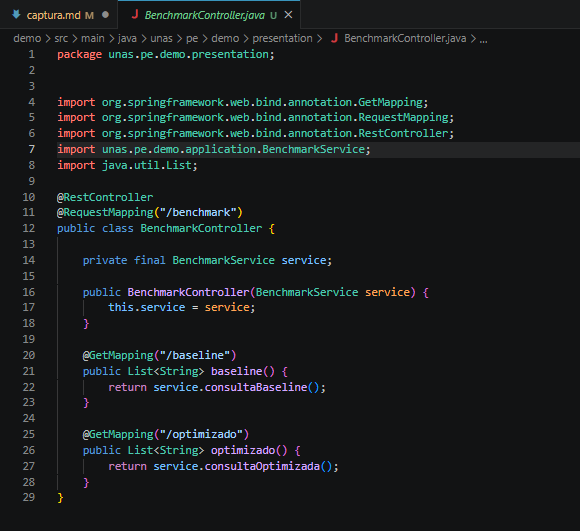

•	Captura de terminal con BUILD SUCCESS.
-- primera prueba

-- prueba mejorada cobertura

•	Captura de target/site/jacoco/index.html.
-- index.html primera prueba

--index.html prueba mejorada

•	Captura de pruebas agregadas en el editor.
--CalidadServiceTest

•	Breve interpretación: qué método tenía menor cobertura y cómo se mejoró.
--El método clasificarCobertura() tenía cobertura parcial porque solo se evaluaba un caso. La cobertura se mejoró agregando pruebas para diferentes escenarios y validando también el método esAceptable(), logrando mayor porcentaje de código cubierto en JaCoCo.
