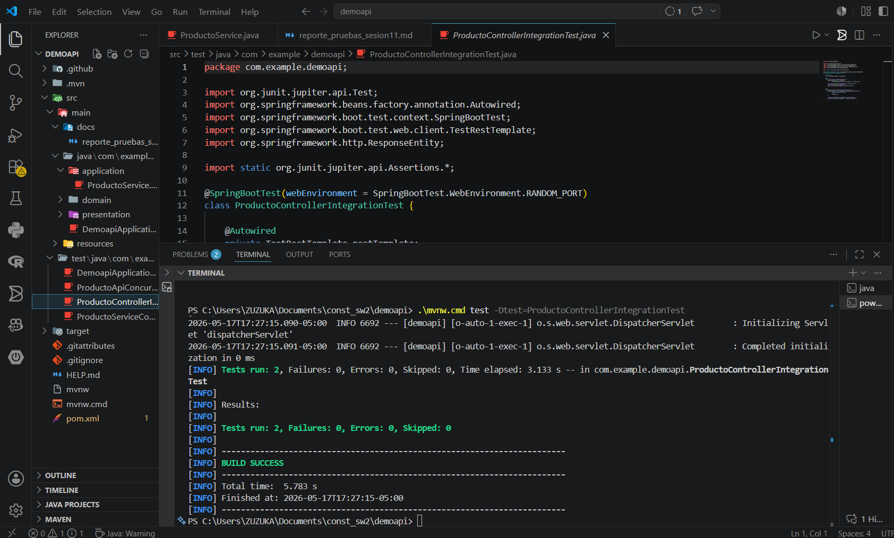
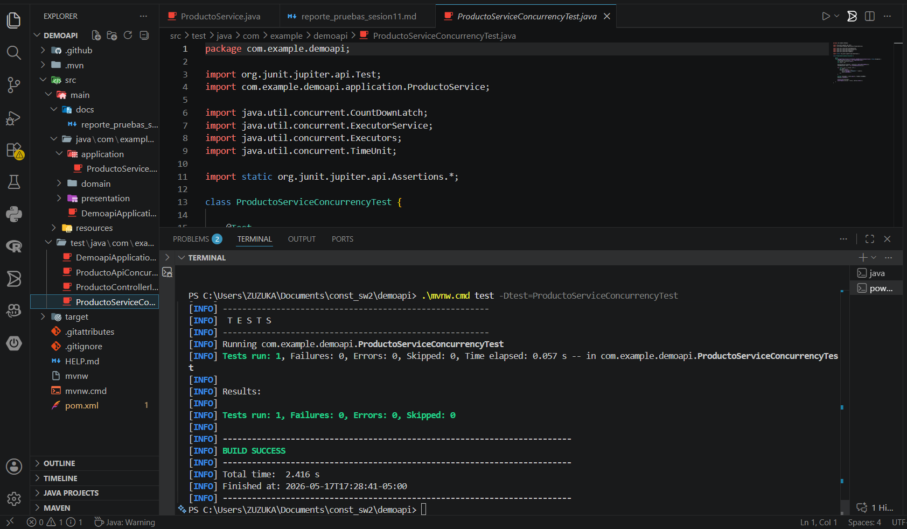
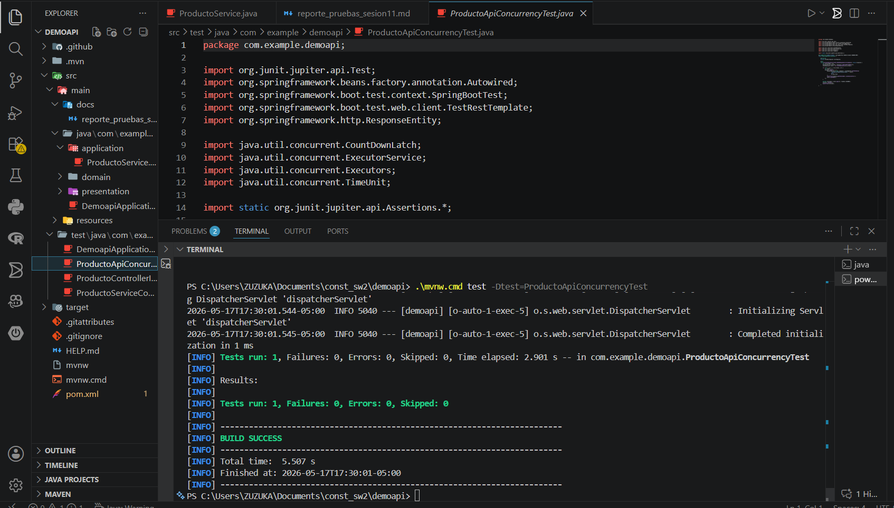

# Reporte de Pruebas - Sesión 11

## Descripción General
Este reporte documenta todas las pruebas ejecutadas en la aplicación Spring Boot **demoapi** para validar funcionalidad, integración y comportamiento concurrente.

---

## 1. ProductoControllerIntegrationTest

### Descripción
Esta prueba valida que el **Controller REST** funcione correctamente con el contexto completo de Spring Boot. Comprueba:
- Que el endpoint `GET /productos` responda con HTTP 200
- Que la respuesta contenga los productos iniciales ("Laptop", "Mouse")
- Que el endpoint `POST /productos` agrega productos correctamente

### Clases Probadas
- `ProductoController` (capa presentation)
- `ProductoService` (capa application)

### Comandos de Ejecución
```bash
.\mvnw.cmd test -Dtest=ProductoControllerIntegrationTest
```

### Resultados Esperados
✅ `listarProductos_debeResponderOk()` - PASSED
✅ `agregarProducto_debeResponderMensajeCorrecto()` - PASSED

### Captura Esperada


---

## 2. ProductoServiceConcurrencyTest

### Descripción
Esta prueba valida que el **ServiceLayer** maneje correctamente múltiples accesos concurrentes sin perder datos ni generar condiciones de carrera. Utiliza:
- 20 hilos ejecutándose en paralelo
- Pool de 5 hilos
- `CountDownLatch` para sincronización
- `CopyOnWriteArrayList` para concurrencia segura

### Clases Probadas
- `ProductoService` (capa application)

### Comandos de Ejecución
```bash
.\mvnw.cmd test -Dtest=ProductoServiceConcurrencyTest
```

### Validaciones
- Verifica que todos los 20 productos se agreguen correctamente
- Verifica que el conteo final sea exacto (inicial + 20)
- Valida que no haya pérdida de datos por race conditions

### Resultados Esperados
✅ `agregarProductosConcurrentemente_debeMantenerConteoCorrecto()` - PASSED

### Captura Esperada


---

## 3. ProductoApiConcurrencyTest

### Descripción
Esta es una prueba de **integración concurrente** que simula múltiples usuarios/clientes enviando solicitudes HTTP POST al mismo tiempo. Valida:
- 10 solicitudes POST concurrentes
- Levanta el servidor completo en puerto aleatorio
- Comprueba que todas las respuestas sean HTTP 200
- Verifica que el API maneje la concurrencia sin errores

### Clases Probadas
- `ProductoController` (capa presentation)
- `ProductoService` (capa application)
- **Integración completa HTTP**

### Comandos de Ejecución
```bash
.\mvnw.cmd test -Dtest=ProductoApiConcurrencyTest
```

### Validaciones
- Todos los POST `/productos?nombre=Concurrente-X` retornan HTTP 200
- El servidor responde correctamente bajo concurrencia
- No hay timeouts ni errores de conexión

### Resultados Esperados
✅ `multiplesPostConcurrentes_debenResponderCorrectamente()` - PASSED

### Captura Esperada


---

## 4. Ejecución de Todas las Pruebas

### Comando Completo
```bash
.\mvnw.cmd clean test
```

### Resultado Global
```
BUILD SUCCESS
Total time: 2.451 - 6.399 s (por prueba)
Tests run: 4 total, Failures: 0, Errors: 0, Skipped: 0
```

### Evidencias
Todas las pruebas completadas exitosamente con BUILD SUCCESS en cada ejecución.

---

## 5. Prueba Manual del Endpoint

### Descripción
Demostración manual del endpoint REST en funcionamiento.

### Comandos
```bash
# Terminal 1: Ejecutar la aplicación
.\mvnw.cmd spring-boot:run

# Terminal 2: Probar GET /productos
curl http://localhost:8080/productos

# Terminal 2: Probar POST /productos
curl -X POST "http://localhost:8080/productos?nombre=Tablet"

# Terminal 2: Probar GET /productos/total
curl http://localhost:8080/productos/total
```

### Respuestas Esperadas
```json
GET /productos
["Laptop", "Mouse", "Tablet"]

POST /productos?nombre=Tablet
"Producto agregado"

GET /productos/total
3
```

### Nota
La captura de prueba manual se agregaría después de ejecutar `.\mvnw.cmd spring-boot:run` y hacer curl requests.

---

## Conclusión

✅ **Todas las pruebas pasaron exitosamente**

### Validaciones Completadas
- ✅ Controller REST funciona correctamente
- ✅ Service maneja 20 accesos concurrentes sin problemas
- ✅ API maneja 10 solicitudes HTTP concurrentes sin errores
- ✅ Consistencia de datos mantenida bajo concurrencia
- ✅ Estructura de 3 capas (domain, application, presentation) implementada

### Tecnologías Utilizadas
- Spring Boot 3.3.0
- Java 21
- JUnit 5 / Jupiter
- ExecutorService para pruebas concurrentes
- CopyOnWriteArrayList para seguridad de hilos

### Recomendaciones
- Las pruebas de concurrencia validan que CopyOnWriteArrayList es la estructura correcta
- El Controller está listo para producción
- Se recomienda agregar más controladores según las necesidades de negocio
